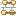
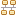
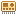

## Eclipse 4diac™ IDE Icon

finden Sie hier eine Legende: 
https://eclipse.dev/4diac/en_news.php?s=09#en_news_20210621

Hier die Icons nochmal wiedergegeben, damit Sie diese auch in der Volltextsuche finden.

This is the list of icons already redesigned.

<h3 id="function-blocks">Function Blocks</h3>
<ul>
<li> Application</li>
<li> Basic Function Block</li>
<li> Composite Function Block</li>
<li> Service Interface Function Block</li>
<li> Simple Function Block</li>
<li> Subapplication typed Function Block</li>
<li> Subapplication untyped Function Block</li>
<li> Type Library</li>
<li> Data Type</li>
</ul>
<h3 id="system">System</h3>
<ul>
<li> System</li>
<li> System Configuration</li>
</ul>
<h3 id="device">Device</h3>
<ul>
<li> Device</li>
<li> Resource</li>
</ul>
<h3 id="event-data-adapters">Event/Data/Adapters</h3>
<ul>
<li> Event</li>
<li> Event in </li>
<li> Event Out</li>
<li> Data</li>
<li> Data In </li>
<li> Data Out</li>
<li> Adapter</li>
<li> Adapter In</li>
<li> Adapter Out</li>
<li> Interface</li>
</ul>
<h3 id="ecc">ECC</h3>
<ul>
<li> ECC</li>
<li> ECC Action</li>
<li> ECC State</li>
<li> ECC Add State</li>
<li> ECC Algorithm</li>
</ul>
