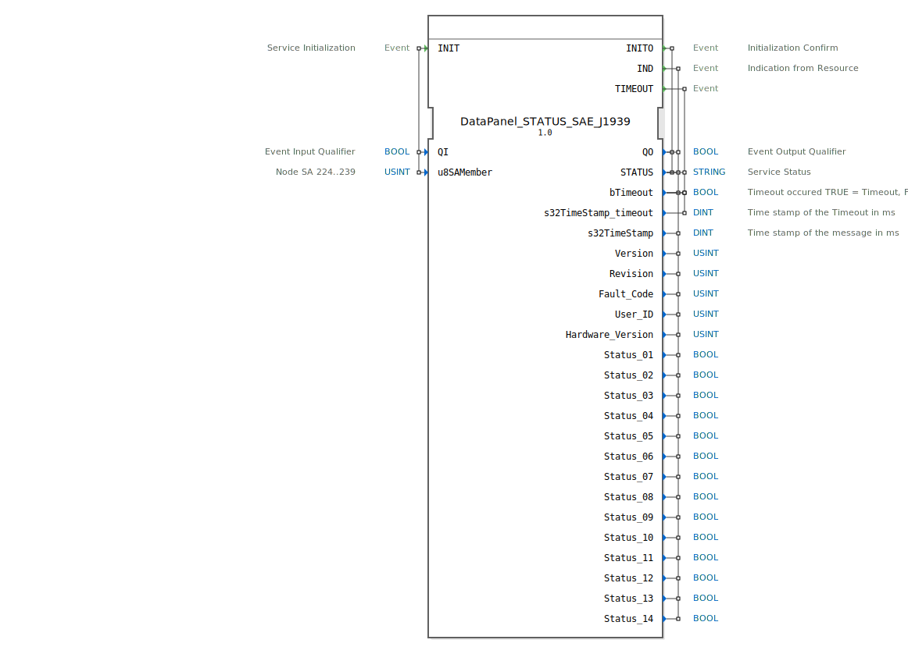

# DataPanel_STATUS_SAE_J1939

```{index} single: DataPanel_STATUS_SAE_J1939
```

Status Output of 1 DataPanel Node

## Interface

### Event Inputs

| Name | Comment | With |
| :--- | :--- | :--- |
| INIT | Service Initialization | QI, u8SAMember |

### Event Outputs

| Name | Comment | With |
| :--- | :--- | :--- |
| INITO | Initialization Confirm | QO, STATUS |
| IND | Indication from Resource | QO, s32TimeStamp, STATUS, bTimeout, Version, Revision, Fault_Code, User_ID, Hardware_Version, Status_01, Status_02, Status_03, Status_04, Status_05, Status_06, Status_07, Status_08, Status_09, Status_10, Status_11, Status_12, Status_13, Status_14 |
| TIMEOUT | | bTimeout, s32TimeStamp_timeout, STATUS, bTimeout |

### Input Vars

| Name | Type | Initial Value | Comment |
| :--- | :--- | :--- | :--- |
| QI | BOOL | | Event Input Qualifier |
| u8SAMember | USINT | MI::MI_00 | Node SA 224..239 |

### Output Vars

| Name | Type | Initial Value | Comment |
| :--- | :--- | :--- | :--- |
| QO | BOOL | | Event Output Qualifier |
| STATUS | STRING | | Service Status |
| bTimeout | BOOL | FALSE | Timeout occured TRUE = Timeout, FALSE = no Timeout |
| s32TimeStamp_timeout | DINT | | Time stamp of the Timeout in ms |
| s32TimeStamp | DINT | | Time stamp of the message in ms |
| Version | USINT | | |
| Revision | USINT | | |
| Fault_Code | USINT | | |
| User_ID | USINT | | |
| Hardware_Version | USINT | | |
| Status_01 | BOOL | | |
| Status_02 | BOOL | | |
| Status_03 | BOOL | | |
| Status_04 | BOOL | | |
| Status_05 | BOOL | | |
| Status_06 | BOOL | | |
| Status_07 | BOOL | | |
| Status_08 | BOOL | | |
| Status_09 | BOOL | | |
| Status_10 | BOOL | | |
| Status_11 | BOOL | | |
| Status_12 | BOOL | | |
| Status_13 | BOOL | | |
| Status_14 | BOOL | | |