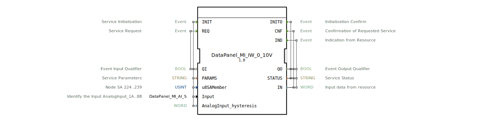

# DataPanel_MI_IW_0_10V

* * * * * * * * * *

## Einleitung

Der Funktionsblock **DataPanel_MI_IW_0_10V** ist ein service-orientierter Schnittstellenbaustein (SIFB) zur Erfassung eines analogen 0‑10 V‑Eingangssignals. Er ist als Bestandteil des **HR Agrartechnik DataPanel MI**‑Systems konzipiert und ermöglicht die parametrierbare Initialisierung sowie den zyklischen oder ereignisgesteuerten Abruf von Messwerten.

## Schnittstellenstruktur

### **Ereignis-Eingänge**

| Ereignis | Typ | Mitgeführte Daten | Beschreibung |
|----------|-----|-------------------|--------------|
| `INIT` | `EInit` | `QI`, `PARAMS`, `u8SAMember`, `Input`, `AnalogInput_hysteresis` | Dienstinitialisierung: Konfiguration der Hardware-Anbindung |
| `REQ` | `Event` | `QI` | Dienstanforderung: Auslösen einer Messwertabfrage |

### **Ereignis-Ausgänge**

| Ereignis | Typ | Mitgeführte Daten | Beschreibung |
|----------|-----|-------------------|--------------|
| `INITO` | `EInit` | `QO`, `STATUS` | Bestätigung der Initialisierung |
| `CNF` | `Event` | `QO`, `STATUS`, `IN` | Bestätigung der Messwertabfrage |
| `IND` | `Event` | `QO`, `STATUS`, `IN` | Asynchrone Anzeige (z. B. spontane Messwertaktualisierung aus der Ressource) |

### **Daten-Eingänge**

| Name | Typ | Initialwert | Beschreibung |
|------|-----|-------------|--------------|
| `QI` | `BOOL` | – | Eingangsqualifizierer (steuert die Ausführung) |
| `PARAMS` | `STRING` | – | Dienstparameter (z. B. Kommunikationskonfiguration) |
| `u8SAMember` | `USINT` | `MI::MI_00` | Knoten‑SA-Adresse (gültiger Bereich 224…239) |
| `Input` | `DataPanel::io::MI::AI::DataPanel_MI_AI_S` | `Invalid` | Auswahl des analogen Eingangs (z. B. `AnalogInput_1A` … `AnalogInput_8B`) |
| `AnalogInput_hysteresis` | `WORD` | – | Hysteresewert für die Signalglättung |

### **Daten-Ausgänge**

| Name | Typ | Beschreibung |
|------|-----|--------------|
| `QO` | `BOOL` | Ausgangsqualifizierer (zeigt gültige Verarbeitung an) |
| `STATUS` | `STRING` | Dienststatus (Fehler-/Erfolgsmeldung) |
| `IN` | `WORD` | Digitalisierter Analogwert (0…10 V, roher WORD‑Wert) |

### **Adapter**

Keine Adapter vorhanden.

## Funktionsweise

1. **Initialisierung (`INIT`)**  
   Der Baustein wird mit den Parametern `PARAMS`, der Knotenadresse `u8SAMember`, dem ausgewählten Eingang `Input` und der Hysterese `AnalogInput_hysteresis` konfiguriert. Bei erfolgreicher Initialisierung wird der Ausgang `INITO` mit `QO = TRUE` und einem positiven `STATUS` gesendet.

2. **Messwertabfrage (`REQ`)**  
   Durch Anlegen eines Ereignisses an `REQ` wird eine neue Messung angefordert. Das Ergebnis steht am Ausgang `IN` zur Verfügung, sobald das Ereignis `CNF` ausgelöst wird. Der Qualifizierer `QO` und der `STATUS` geben die Gültigkeit des Werts an.

3. **Asynchrone Anzeige (`IND`)**  
   Der Baustein kann auch ohne explizite Anforderung von der Hardware ein Ereignis `IND` empfangen (z. B. bei einer spontanen Wertänderung oder einem periodischen Update). Auch hier werden `IN`, `QO` und `STATUS` aktualisiert.

Der digitalisierte Analogwert wird als 16‑Bit‑Wort (`WORD`) auf dem Ausgang `IN` bereitgestellt. Die Skalierung (z. B. 0 V → 0, 10 V → 65535) ist abhängig von der angeschlossenen Hardware und muss applikativ interpretiert werden.

## Technische Besonderheiten

- **HR Agrartechnik‑spezifisch**: Der FB ist für die DataPanel‑MI‑Familie vorgesehen und verwendet vordefinierte Konstanten aus den Paketen `DataPanel::io::MI::const::MI` und `DataPanel::io::MI::AI::DataPanel_MI_AI`.
- **Hysterese**: Mit dem Parameter `AnalogInput_hysteresis` kann eine Rauschunterdrückung oder Entprellung des Signals eingestellt werden.
- **Adressierung**: Über `u8SAMember` (USINT, Bereich 224–239) wird der Busknoten ausgewählt, Standard ist `MI::MI_00`.
- **Compiler‑Integration**: Der Baustein ist als SIFB in das 4diac‑IDE‑Ökosystem eingebunden und besitzt einen eindeutigen Typ‑Hash (`eclipse4diac::core::TypeHash`).

## Zustandsübersicht

Da es sich um einen service‑orientierten Baustein handelt, wird die interne Zustandsmaschine durch die Ereignisse gesteuert:

- **IDLE** – Nach erfolgreicher Initialisierung (oder nach Reset) wartet der Baustein auf `REQ` oder ein externes `IND`.
- **BUSY** – Nach einem `REQ` wird die Hardwareabfrage durchgeführt; während dieser Zeit ist kein weiterer `REQ` möglich. Nach Abschluss wird `CNF` gesendet und der Zustand geht zurück nach IDLE.
- **ERROR** – Tritt ein Fehler während der Initialisierung oder Messung auf, wird `STATUS` entsprechend gesetzt und `QO = FALSE` signalisiert.

Eine detaillierte Zustandsmaschine (ECC) liegt im XML‑Modell nicht vor, das beschriebene Verhalten ist jedoch typisch für service‑orientierte SIFBs.

## Anwendungsszenarien

- **Agrartechnik**: Erfassung von Sensorsignalen (z. B. Druck, Temperatur, Füllstand) über 0‑10 V‑Schnittstellen an HR‑Datenpanels.
- **Industrielle Steuerung**: Integration analoger Messwerte in eine SPS‑Umgebung über 4diac‑Anwendungen.
- **Parametrierbare Messstellen**: Mehrere Kanäle eines MI‑Moduls können durch unterschiedliche `Input`‑Werte abgefragt werden.

## Vergleich mit ähnlichen Bausteinen

| Baustein | Spannungsbereich | Plattform | Besonderheiten |
|----------|------------------|-----------|----------------|
| `DataPanel_MI_IW_0_10V` | 0‑10 V | HR DataPanel MI | Hysterese, SA‑Adressierung |
| `DataPanel_MI_IW_4_20mA` | 4‑20 mA | HR DataPanel MI | Analoge Stromeingänge |
| `GenericAnalogInput` | variabel | Standard IEC 61131 | Allgemeiner Eingang, keine Hysterese |

Der vorliegende Baustein ist speziell für die DataPanel‑MI‑Hardware optimiert und bietet eine enge Kopplung an die gerätespezifischen Parameter.

## Fazit

Der **DataPanel_MI_IW_0_10V**‑Funktionsblock stellt eine robuste und flexibel konfigurierbare Schnittstelle zur Erfassung analoger 0‑10 V‑Signale im HR Agrartechnik DataPanel‑System dar. Durch die Möglichkeit der Kanalkonfiguration, Adressierung und Hysterese eignet er sich für präzise Messaufgaben in der landwirtschaftlichen Automatisierungstechnik.