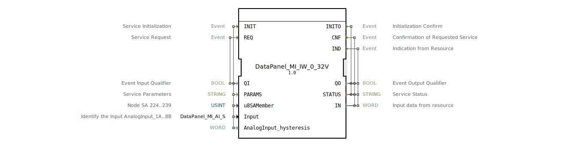

# DataPanel_MI_IW_0_32V

* * * * * * * * * *

## Einleitung

Der Funktionsblock **DataPanel_MI_IW_0_32V** ist ein Service-Interface-Funktionsblock (SIFB) gemäß IEC 61499. Er dient dem Einlesen eines analogen Spannungssignals im Bereich 0–32 V über ein DataPanel-MI-Modul. Der Baustein übernimmt die Initialisierung des Kommunikationskanals, die Konfiguration eines Analog-Eingangs (z. B. AnalogInput_1A bis 8B) sowie die zyklische Abfrage oder den Empfang von Messwerten. Die Ausgabe erfolgt als **WORD**‑Wert; der Status wird über **STATUS** und das Event **CNF** bzw. **IND** signalisiert.

## Schnittstellenstruktur

### **Ereignis-Eingänge**

| Event | Kommentar | Mit (With) |
|-------|-----------|------------|
| **INIT** | Service-Initialisierung | QI, PARAMS, u8SAMember, Input, AnalogInput_hysteresis |
| **REQ** | Service-Anforderung (Messwertabruf) | QI |

### **Ereignis-Ausgänge**

| Event | Kommentar | Mit (With) |
|-------|-----------|------------|
| **INITO** | Bestätigung der Initialisierung | QO, STATUS |
| **CNF** | Bestätigung der angeforderten Serviceleistung | QO, STATUS, IN |
| **IND** | Indikation eines neuen Messwerts von der Ressource | QO, STATUS, IN |

### **Daten-Eingänge**

| Name | Typ | Initialwert | Kommentar |
|------|-----|-------------|-----------|
| **QI** | BOOL | – | Ereignis-Eingangsqualifizierer |
| **PARAMS** | STRING | – | Service-Parameter (z. B. Adressen, Baudrate) |
| **u8SAMember** | USINT | `MI::MI_00` | Knoten‑SA‑Adresse (224..239) |
| **Input** | DataPanel::io::MI::AI::DataPanel_MI_AI_S | `Invalid` | Auswahl des analogen Eingangs (AnalogInput_1A … 8B) |
| **AnalogInput_hysteresis** | WORD | – | Hysterese für den Analogwert (Konfiguration) |

### **Daten-Ausgänge**

| Name | Typ | Kommentar |
|------|-----|-----------|
| **QO** | BOOL | Ereignis-Ausgangsqualifizierer |
| **STATUS** | STRING | Dienststatus (z. B. Fehler-/Erfolgsmeldungen) |
| **IN** | WORD | Gemessener Analogwert (0..32 V skaliert als WORD) |

### **Adapter**

Keine Adapter vorhanden.

## Funktionsweise

Der Baustein wird durch das **INIT**‑Ereignis gestartet. Dabei werden die übergebenen Parameter (Knotenadresse, Auswahl des analogen Eingangs und Hysterese) an die Hardware weitergegeben. Nach erfolgreicher Initialisierung wird **INITO** mit `QO = TRUE` ausgelöst.

Ein **REQ**‑Ereignis löst die Abfrage des aktuellen Analogwerts aus. Der Messwert wird über den Ausgang **IN** als **WORD** bereitgestellt und über das **CNF**‑Ereignis quittiert. Die Ressource kann auch spontan einen neuen Wert senden, der dann über das **IND**‑Ereignis signalisiert wird – ebenfalls mit aktuellem **IN** und **STATUS**.

**STATUS** liefert bei `"OK"` einen gültigen Wert; bei Fehlern (z. B. Kommunikationsfehler, ungültiger Kanal) wird eine Fehlermeldung ausgegeben und `QO` auf `FALSE` gesetzt.

## Technische Besonderheiten

- **Spannungsbereich:** 0 V bis 32 V, dargestellt als WORD – die Skalierung erfolgt hardwareabhängig.
- **Hysterese-Konfiguration:** Der Parameter `AnalogInput_hysteresis` erlaubt das Einstellen einer Schwelle, um Rauschen oder kleine Spannungsschwankungen zu unterdrücken.
- **Initialisierung:** Der Eingang `u8SAMember` muss eine gültige Knotenadresse (224–239) enthalten; `Input` wählt den konkreten analogen Kanal aus. Voreingestellt ist `MI::MI_00` (Adresse des ersten MI‑Moduls) und `Invalid`, d. h. vor dem ersten INIT muss ein gültiger Kanal gesetzt werden.
- **Service-Interface-Baustein:** Der FB kommuniziert direkt mit der Hardware und ist nicht durch eine ECC‑Zustandsmaschine modelliert – die Ereignissteuerung erfolgt ereignisgesteuert nach dem Pattern von SIFBs.

## Zustandsübersicht

Da es sich um einen Service‑Interface‑FB handelt, wird die interne Logik der Hardware überlassen. Aus Sicht des IEC‑61499‑Modells ergeben sich folgende typischen Phasen:

- **IDLE:** Nach dem Systemstart, bevor ein INIT ausgelöst wurde.
- **INITIATE:** Während der INIT‑Bearbeitung (Hardware‑Parametrierung).
- **OPERATIONAL:** Nach erfolgreichem INIT – REQ‑ und IND‑Ereignisse werden verarbeitet.
- **ERROR:** Bei fehlerhafter Initialisierung oder Kommunikationsverlust – STATUS enthält Fehlertext.

## Anwendungsszenarien

- **Spannungsüberwachung:** Erfassung von Sensorsignalen (z. B. Drucksensoren, Füllstandssensoren) mit einem Ausgangssignal von 0…10 V oder 0…32 V.
- **Analogwerterfassung in der Landtechnik:** Integration in ein DataPanel‑Steuersystem zur Aufnahme von Analogwerten an verschiedenen Maschinenkomponenten.
- **Hysterese‑gesteuerte Schwellwertauswertung:** Direkte Nutzung des IN‑Wertes in einer nachgeschalteten Logik, die auf Über‑/Unterschreitung von Schwellen reagiert.

## Vergleich mit ähnlichen Bausteinen

Im Gegensatz zu generischen analogen Eingangsbausteinen (z. B. `AI_BASIC`) ist der **DataPanel_MI_IW_0_32V** speziell für die DataPanel‑MI‑Hardware optimiert. Typische Unterschiede:

- **Parametrierung:** Spezifische Knotenadresse (`u8SAMember`) und Kanalauswahl (`Input`) statt generischer Konfigurationsstrings.
- **Hysterese:** Expliziter Eingang für die Hysterese – bei Standard‑Bausteinen wird dies oft über Parametrierung des Kommunikationstreibers geregelt.
- **Spannungsbereich:** Fest auf 0–32 V ausgelegt; andere Bausteine bieten möglicherweise eine Konfiguration des Messbereichs.

## Fazit

Der **DataPanel_MI_IW_0_32V** ist ein praktischer, für die DataPanel‑Plattform maßgeschneiderter Funktionsblock zur Erfassung von Analogsignalen im Bereich 0–32 V. Durch die klare Schnittstelle (Initialisierung, Abruf, spontane Indikation) und die integrierte Hysterese eignet er sich hervorragend für den Einsatz in landtechnischen Steuerungen und anderen industriellen Applikationen mit DataPanel‑Komponenten. Die einfache Bedienung über die Events INIT und REQ sowie die standardisierte Status‑Rückmeldung ermöglichen eine schnelle Integration in IEC‑61499‑Projekte.