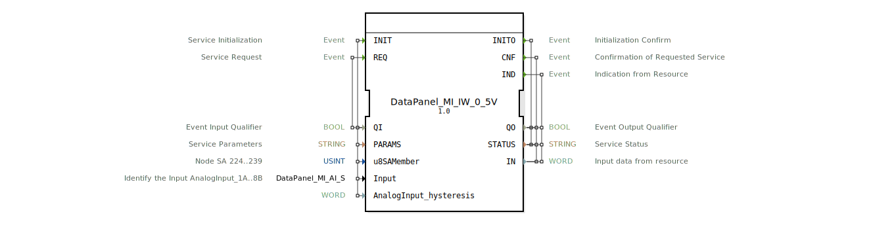

# DataPanel_MI_IW_0_5V

* * * * * * * * * *
## Einleitung

Der Funktionsblock **DataPanel_MI_IW_0_5V** ist ein Service‑Interface‑Funktionsblock (SIFB) zur Erfassung analoger Eingangssignale im Spannungsbereich **0 ... 5 V**. Er stellt die Schnittstelle zu einem analogen Eingangskanal der DataPanel‑MI‑IW‑Reihe dar und ermöglicht die Initialisierung, die zyklische Abfrage sowie den asynchronen Empfang von Messwerten über ein Bussystem. Der Baustein ist als IEC 61499‑konformer FB realisiert und verwendet systemspezifische Datentypen aus dem Package `DataPanel::io::MI::AI`.

## Schnittstellenstruktur

### **Ereignis-Eingänge**

| Ereignis | Typ | Beschreibung | Mit Variablen |
|----------|-----|--------------|---------------|
| `INIT` | EInit | Initialisiert die Service‑Verbindung | `QI`, `PARAMS`, `u8SAMember`, `Input`, `AnalogInput_hysteresis` |
| `REQ` | Event | Fordert einen aktuellen Messwert an | `QI` |

### **Ereignis-Ausgänge**

| Ereignis | Typ | Beschreibung | Mit Variablen |
|----------|-----|--------------|---------------|
| `INITO` | EInit | Bestätigung der Initialisierung | `QO`, `STATUS` |
| `CNF` | Event | Bestätigung einer abgeschlossenen Anforderung | `QO`, `STATUS`, `IN` |
| `IND` | Event | Asynchrone Indikation eines Messwerts von der Ressource | `QO`, `STATUS`, `IN` |

### **Daten-Eingänge**

| Variable | Typ | Beschreibung | Initialwert |
|----------|-----|--------------|-------------|
| `QI` | BOOL | Qualifizierer für Ereignis‑Eingänge | – |
| `PARAMS` | STRING | Service‑Parameter (z. B. Kommunikationsadresse) | – |
| `u8SAMember` | USINT | Knoten‑SA‑Adresse (224 … 239) | `MI::MI_00` |
| `Input` | DataPanel::io::MI::AI::DataPanel_MI_AI_S | Auswahl des analogen Eingangskanals (z. B. AnalogInput_1A … 8B) | `Invalid` |
| `AnalogInput_hysteresis` | WORD | Hysteresewert für die Signalauswertung | – |

### **Daten-Ausgänge**

| Variable | Typ | Beschreibung |
|----------|-----|--------------|
| `QO` | BOOL | Ausgangsqualifizierer (zeigt gültigen Status an) |
| `STATUS` | STRING | Statusmeldung des Service (z. B. Fehlertext) |
| `IN` | WORD | Gemessener Analogwert (Rohwert) aus der Ressource |

### **Adapter**

Keine Adapter‑Schnittstellen vorhanden.

## Funktionsweise

Der Funktionsblock arbeitet nach dem **Service‑Interface‑Prinzip**: Er kommuniziert über Ereignisse mit einer darunterliegenden Hardware‑Ressource (z. B. einem Bussystem oder I/O‑Modul).

1. **Initialisierung (`INIT`)**  
   Ein `INIT`‑Ereignis (mit gesetztem `QI`) startet die Verbindung. Die Parameter `PARAMS`, `u8SAMember`, `Input` und `AnalogInput_hysteresis` legen die Zieladresse und die Kanalkonfiguration fest. Nach erfolgreicher Initialisierung wird `INITO` ausgelöst und `QO` auf `TRUE` sowie `STATUS` auf einen entsprechenden Text gesetzt.

2. **Messwertanforderung (`REQ`)**  
   Sobald der FB initialisiert ist, kann über `REQ` ein aktueller Messwert angefordert werden. Der FB sendet die Anfrage an die Ressource und signalisiert nach Erhalt des Ergebnisses mit `CNF`. Der Rohwert wird in der Ausgangsvariable `IN` (Typ `WORD`) bereitgestellt.

3. **Asynchrone Indikation (`IND`)**  
   Die Ressource kann eigenständig Messwertänderungen oder Alarme melden. Diese werden über das `IND`‑Ereignis mit dem zugehörigen Wert in `IN` gemeldet.

Bei negativem `QI` oder Fehlersituationen werden `QO` auf `FALSE` und `STATUS` auf eine Fehlerbeschreibung gesetzt.

## Technische Besonderheiten

- **Systemspezifische Typen**  
  Der FB verwendet die benutzerdefinierten Strukturen `DataPanel_MI_AI_S` (Kanalauswahl) und die Konstanten `MI::MI_00` (Adressvorgabe). Diese sind im Package `DataPanel::io::MI::AI` definiert.
- **Hysterese**  
  Über den Eingang `AnalogInput_hysteresis` kann eine Hysterese als `WORD`‑Wert vorgegeben werden, um das Rauschen des analogen Signals zu unterdrücken.
- **Kanaladressierung**  
  Die Auswahl des analogen Eingangskanals erfolgt über den `Input`‑Parameter. Gültige Werte sind z. B. `AnalogInput_1A` bis `AnalogInput_8B`; der Initialwert `Invalid` muss vor der ersten Nutzung durch einen gültigen Kanal ersetzt werden.

## Zustandsübersicht

Da die XML‑Definition keine ECC (Execution Control Chart) enthält, ergibt sich die Zustandslogik aus dem typischen Verhalten eines SIFB. Eine abstrakte Zustandsmaschine lässt sich wie folgt beschreiben:

| Zustand | Beschreibung | Ereignis | Aktion |
|---------|--------------|----------|--------|
| **IDLE** | Warten auf Initialisierung | `INIT` (QI=TRUE) | Starte Verbindungsaufbau |
| **INIT** | Initialisierung läuft | – | Warte auf Bestätigung der Ressource |
| **READY** | Bereit für Anforderungen | `INITO` | Setze QO=TRUE |
| **BUSY** | Messwertanforderung läuft | `REQ` | Sende Anfrage an Ressource |
| **DONE** | Antwort empfangen | `CNF` | Lade `IN` und setze QO=TRUE |
| **ERROR** | Fehlerzustand | – | Setze QO=FALSE, STATUS=Fehlertext |

Asynchrone `IND`‑Ereignisse können in den Zuständen **READY** oder **BUSY** eintreten und führen zur sofortigen Bereitstellung des Werts.

## Anwendungsszenarien

- **Landwirtschaftliche Sensorik** (z. B. Füllstandsensoren, Drucksensoren, Temperatursensoren mit 0‑5 V Ausgang)
- **Datenerfassung in Stationärmotoren** oder **Fahrzeugsteuerungen** der DataPanel‑Familie
- **Mehrkanal‑Analogwerterfassung** durch parallele Instanzen des FB mit unterschiedlichen `Input`‑ und `u8SAMember`‑Werten

## Vergleich mit ähnlichen Bausteinen

| Merkmal | DataPanel_MI_IW_0_5V | Generischer Analogeingang (z. B. IEC 61499‑Standard) |
|---------|----------------------|------------------------------------------------------|
| Spannungsbereich | 0 – 5 V | Meist konfigurierbar (0‑10 V, 4‑20 mA u. a.) |
| Kanalauswahl | Spezifischer Typ `DataPanel_MI_AI_S` | Meist `INT`‑ oder `STRING`‑Parameter |
| Hysterese | Separate Variable (`WORD`) | Oft nicht enthalten |
| Busanbindung | Proprietär (DataPanel‑MI‑IW) | Abstrakte Kommunikationsschnittstelle |

Der FB ist stark auf die DataPanel‑Hardware zugeschnitten und bietet daher weniger Flexibilität als ein generischer Analogeingang, dafür aber eine direkte, optimierte Anbindung.

## Fazit

Der **DataPanel_MI_IW_0_5V** ist ein spezialisierter Service‑Interface‑Funktionsblock für die Erfassung von 0–5 V‑Analogsignalen im DataPanel‑Umfeld. Er kapselt die komplexe Buskommunikation und bietet eine einfache, ereignisgesteuerte Schnittstelle zur Anwendungslogik. Dank der integrierten Hysterese und der klaren Kanaladressierung eignet er sich besonders für robuste Messaufgaben in der landtechnischen Automatisierung.