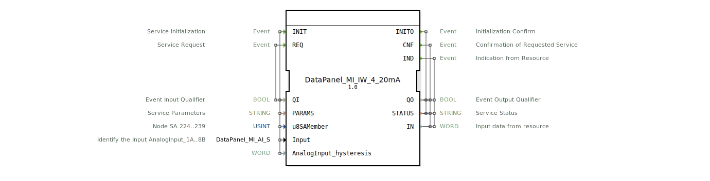

# DataPanel_MI_IW_4_20mA

* * * * * * * * * *
## Einleitung

Der Funktionsblock **DataPanel_MI_IW_4_20mA** ist ein Service-Interface-Funktionsblock (SIFB) zur Erfassung analoger Eingangsdaten im 4‑20 mA Bereich. Er dient als Schnittstelle zwischen dem Automatisierungssystem und einem hardwarenahen analogen Eingabemodul. Der Baustein übernimmt die Initialisierung der Kommunikation (z. B. Bus‑Anbindung), die zyklische Messwertanforderung sowie die Bereitstellung der gemessenen Rohdaten über Ausgangsereignisse.

* * * * * * * * * *
## Schnittstellenstruktur

### **Ereignis-Eingänge**

| Ereignis | Typ   | Beschreibung                                    | Mitgeführte Variablen                        |
|----------|-------|------------------------------------------------|---------------------------------------------|
| `INIT`   | EInit | Initialisierung des Servicebausteins           | QI, PARAMS, u8SAMember, Input, AnalogInput_hysteresis |
| `REQ`    | Event | Anforderung einer Messwertaktualisierung       | QI                                          |

### **Ereignis-Ausgänge**

| Ereignis | Typ   | Beschreibung                                        | Mitgeführte Variablen      |
|----------|-------|----------------------------------------------------|---------------------------|
| `INITO`  | EInit | Bestätigung der erfolgreichen Initialisierung        | QO, STATUS                 |
| `CNF`    | Event | Bestätigung einer angeforderten Messung              | QO, STATUS, IN             |
| `IND`    | Event | Asynchrone Anzeige eines eingehenden Messwerts       | QO, STATUS, IN             |

### **Daten-Eingänge**

| Variable               | Typ          | Beschreibung                                               | Initialwert                       |
|------------------------|--------------|-----------------------------------------------------------|-----------------------------------|
| `QI`                   | BOOL         | Qualifikator für den Ereigniseingang                      | –                                 |
| `PARAMS`               | STRING       | Parameter für die Serviceinitialisierung                  | –                                 |
| `u8SAMember`           | USINT        | Node‑Adresse (224…239) des Slave‑Geräts                   | `MI::MI_00` (224)                 |
| `Input`                | *DataPanel::io::MI::AI::DataPanel_MI_AI_S* | Identifikation des analogen Eingangskanals (z. B. AnalogInput_1A..8B) | `Invalid`                         |
| `AnalogInput_hysteresis` | WORD       | Hysteresewert für die Signalglättung                     | –                                 |

### **Daten-Ausgänge**

| Variable | Typ    | Beschreibung                                    |
|----------|--------|-------------------------------------------------|
| `QO`     | BOOL   | Qualifikator für den Ereignisausgang            |
| `STATUS` | STRING | Statusmeldung (z. B. Fehler, Initialisierung)   |
| `IN`     | WORD   | Gelesener Rohwert des analogen Eingangs         |

### **Adapter**

*Keine Adapter definiert.*

* * * * * * * * * *
## Funktionsweise

Der Funktionsblock realisiert eine asynchrone Kommunikation mit einem Slave‑Gerät (z. B. einem Analog‑Eingangsmodul mit 4‑20 mA Schnittstelle) über einen proprietären Bus.

1. **Initialisierung** (`INIT`):  
   Die Parameter `PARAMS` (z. B. Baudrate, Protokoll‑Einstellungen), die Knotenadresse (`u8SAMember`) und der konkrete analoge Eingangskanal (`Input`) werden gesetzt. Eine Hysterese (`AnalogInput_hysteresis`) kann zur Stabilisierung des Rohwerts angegeben werden. Nach erfolgreicher Verbindung wird `INITO` mit `QO = TRUE` gesendet.

2. **Messwertanforderung** (`REQ`):  
   Der Baustein fordert den aktuellen Messwert des konfigurierten Kanals an. Die Antwort wird asynchron über den Ausgang `CNF` (bei erfolgreicher Anforderung) oder ggf. über `IND` (bei spontanen Wertänderungen oder zyklischen Meldungen des Slaves) geliefert. Der gelesene Wert erscheint in der Ausgangsvariablen `IN` als 16‑Bit‑Rohwert.

3. **Asynchrone Indikation** (`IND`):  
   Falls das Slave‑Gerät selbstständig (z. B. bei Überschreitung einer Schwelle) Daten sendet, wird `IND` ausgelöst. Dadurch können auch nicht angeforderte Messwerte erfasst werden.

Die Ausgänge `QO` und `STATUS` geben Aufschluss über den Erfolg der Operationen (z. B. Initialisierungsfehler, Kommunikationsfehler).

* * * * * * * * * *
## Technische Besonderheiten

- **Zielplattform**: Der Baustein ist für das „DataPanel“‑System der HR Agrartechnik GmbH (Version 1.0, Jahr 2026) ausgelegt.
- **Knotenadressbereich**: Die Slave‑Adressen `u8SAMember` sind auf den Bereich 224–239 beschränkt; der Initialwert `MI::MI_00` entspricht der kleinsten Adresse (224).
- **Eingangskanal‑Identifikation**: Der Datentyp `DataPanel_MI_AI_S` definiert mögliche Kanäle (`AnalogInput_1A … 8B`). Der Initialwert `Invalid` zeigt an, dass vor der ersten Initialisierung kein Kanal ausgewählt ist.
- **Hysterese**: Der `AnalogInput_hysteresis`‑Wert wird als 16‑Bit‑Wort übergeben und wirkt als digitaler Filter zur Vermeidung von Rauschen oder Pendeln.
- **Typ‑Hash**: Ein Attribut `eclipse4diac::core::TypeHash` ist enthalten, wird aber mit leerem String initialisiert – kann später zur Laufzeit gesetzt werden.

* * * * * * * * * *
## Zustandsübersicht

Da es sich um einen Service‑Interface‑FB handelt, ist das Verhalten durch die Ereignislogik und das zugrundeliegende Kommunikations‑Protokoll bestimmt. Ein interner Zustandsautomat wird nicht in der XML‑Definition abgebildet, typischerweise existieren jedoch folgende Phasen:

- **OFF / UNINITIALIZED**: Vor dem ersten `INIT`‑Ereignis. Keine Kommunikation aktiv.
- **INIT**‑Phase: Nach Empfang von `INIT`, bis `INITO` gesendet wird. Konfiguration des Slaves.
- **IDLE** (bereit): Nach erfolgreicher Initialisierung. Der FB kann `REQ`‑Ereignisse annehmen.
- **BUSY** (Anforderung läuft): Nach `REQ` bis zum Eintreffen der Antwort (gefolgt von `CNF`).
- **INDICATION**‑Zustand: Bei asynchron eintreffenden Daten wird `IND` ausgelöst, danach kehrt der FB in den IDLE‑Zustand zurück.

Fehlerzustände (z. B. Kommunikationsabbruch) werden über `STATUS` gemeldet.

* * * * * * * * * *
## Anwendungsszenarien

- **4‑20 mA Sensoranbindung**: Ein Drucksensor, Füllstandssensor oder Temperaturfühler mit 4‑20 mA Ausgang wird an das DataPanel‑System angeschlossen. Der FB liest zyklisch oder auf Anforderung den Messwert.
- **Mehrkanal‑Erfassung**: Über verschiedene Instanzen des Bausteins (mit unterschiedlichen `Input`‑Parametern) können mehrere analoge Kanäle parallel bedient werden.
- **Datenlogger‑System**: Kombiniert mit einem FB zur Datenaufzeichnung kann der `IND`‑Ausgang genutzt werden, um Statusänderungen oder Alarme zu protokollieren.
- **Landtechnische Steuerung**: In der Agrartechnik (HR Agrartechnik GmbH) werden so z. B. Flüssigkeitsstände, Durchflüsse oder Achslasten erfasst.

* * * * * * * * * *
## Vergleich mit ähnlichen Bausteinen

Im Vergleich zu einem allgemeinen analogen Eingangs‑FB (z. B. einem FB für standardisierte Feldbusse wie PROFIBUS oder IO‑Link) zeichnet sich dieser Baustein durch folgende Punkte aus:

- **Spezifische Hardware‑Zuordnung**: Er ist direkt auf das „DataPanel::io::MI::AI“‑Protokoll zugeschnitten.
- **Knotenadressierung**: Die Begrenzung auf 224–239 und die vordefinierten Konstanten aus `MI::MI_xx` erleichtern die Konfiguration in festen Netzwerken.
- **Ereignis‑Modell**: `IND` neben `CNF` erlaubt sowohl synchrone als auch asynchrone Messwerterfassung – flexibler als ein reines Polling‑Modell.
- **Hysterese‑Parameter**: Bietet eine einfache Entprellung auf FB‑Ebene, die in vielen generischen Bausteinen nicht vorhanden ist.

* * * * * * * * * *
## Fazit

Der Funktionsblock **DataPanel_MI_IW_4_20mA** stellt eine robuste und kompakte Lösung für die Erfassung von 4‑20 mA‑Signalen in einem proprietären DataPanel‑System dar. Die klare Trennung von Initialisierung, Anforderung und spontaner Indikation sowie die integrierte Hysterese machen ihn für den praktischen Einsatz in der Agrartechnik geeignet. Durch die Parametrierbarkeit von Knotenadresse und Kanal ist er flexibel einsetzbar und in bestehende Automatisierungsnetzwerke integrierbar.