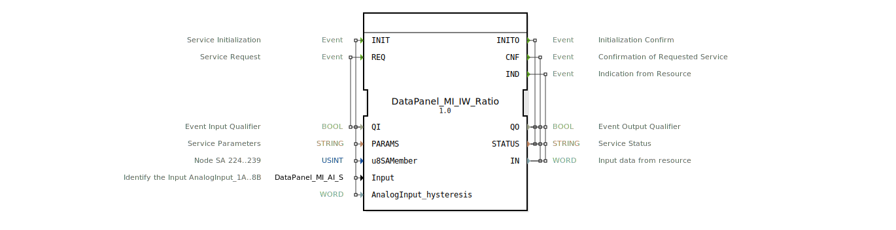

# DataPanel_MI_IW_Ratio

* * * * * * * * * *

## Einleitung

Der Funktionsblock **DataPanel_MI_IW_Ratio** ist ein Service-Interface-Funktionsblock (SIFB) zur Erfassung analoger Eingangsdaten mit ratiometrischer Wandlung. Er stellt die Schnittstelle zu einem Sensor dar, der an einem Knoten (SA 224..239) angeschlossen ist und dessen Messwert als 16‑Bit‑Wort (WORD) ausgegeben wird. Der Baustein ist Teil der Bibliothek `DataPanel::io::MI::AI` und wird typischerweise in der Automatisierungstechnik, insbesondere im Bereich der Agrartechnik, eingesetzt.

## Schnittstellenstruktur

### **Ereignis-Eingänge**

| Ereignis | Typ | Mit-Variablen | Kommentar |
|----------|-----|---------------|-----------|
| INIT | EInit | QI, PARAMS, u8SAMember, Input, AnalogInput_hysteresis | Service Initialization |
| REQ | Event | QI | Service Request |

### **Ereignis-Ausgänge**

| Ereignis | Typ | Mit-Variablen | Kommentar |
|----------|-----|---------------|-----------|
| INITO | EInit | QO, STATUS | Initialization Confirm |
| CNF | Event | QO, STATUS, IN | Confirmation of Requested Service |
| IND | Event | QO, STATUS, IN | Indication from Resource |

### **Daten-Eingänge**

| Variable | Typ | Initialwert | Kommentar |
|----------|-----|-------------|-----------|
| QI | BOOL | – | Event Input Qualifier |
| PARAMS | STRING | – | Service Parameters |
| u8SAMember | USINT | MI::MI_00 | Node SA 224..239 |
| Input | DataPanel::io::MI::AI::DataPanel_MI_AI_S | Invalid | Identify the Input AnalogInput_1A..8B |
| AnalogInput_hysteresis | WORD | – | (keine Angabe) |

### **Daten-Ausgänge**

| Variable | Typ | Kommentar |
|----------|-----|-----------|
| QO | BOOL | Event Output Qualifier |
| STATUS | STRING | Service Status |
| IN | WORD | Input data from resource |

### **Adapter**

Keine Adapter vorhanden.

## Funktionsweise

Der Baustein arbeitet als zustandsgesteuerter Service-Interface-Block:

1. **Initialisierung (INIT)**:  
   Über das INIT‑Ereignis wird der Funktionsblock konfiguriert. Die Eingänge `PARAMS`, `u8SAMember`, `Input` und `AnalogInput_hysteresis` legen die Bus‑/Knotenadresse, den analogen Kanal und die Hysterese fest. Der `QI`-Eingang muss auf TRUE gesetzt sein, um die Initialisierung zu starten. Nach erfolgreicher Konfiguration wird das INITO‑Ereignis mit `QO = TRUE` und `STATUS = "OK"` (o. ä.) ausgegeben.

2. **Messwertanforderung (REQ)**:  
   Mit dem REQ‑Ereignis wird eine neue Messung des Sensors angefordert. Der Baustein wertet die Hardware aus und liefert das Ergebnis über das CNF‑Ereignis am Ausgang `IN` zurück. Auch hier zeigt `QO` die Gültigkeit des Wertes an.

3. **Indikation (IND)**:  
   Falls die Hardware asynchrone Ereignisse (z. B. zyklische Aktualisierungen) unterstützt, wird das IND‑Ereignis verwendet, um den aktuellen Messwert unaufgefordert zu melden.

Der Messwert wird als 16‑Bit‑Wort (WORD) im ratiometrischen Format ausgegeben. Dies bedeutet, dass der digitale Wert direkt proportional zum Verhältnis der gemessenen Spannung zur Referenzspannung ist.

## Technische Besonderheiten

- **Ratiometrische Messung**: Der Funktionsblock ist speziell für ratiometrische Sensoren ausgelegt, bei denen der Ausgang proportional zur Versorgungsspannung ist. Dadurch werden Messfehler durch Spannungsschwankungen minimiert.
- **Konfiguration über Konstanten**: Der initiale Wert von `u8SAMember` (`MI::MI_00`) und der Datentyp `DataPanel_MI_AI_S` stammen aus importierten Bibliotheken (`DataPanel::io::MI::const::MI` und `DataPanel::io::MI::AI::DataPanel_MI_AI`). Der gültige Adressbereich für den Knoten liegt zwischen 224 und 239 (Node SA 224..239).
- **Hysterese**: Mit `AnalogInput_hysteresis` kann ein Schwellwert-Hystereseverhalten implementiert werden; der genaue Effekt ist vom zugrundeliegenden Treiber abhängig.
- **TypeHash-Attribut**: Das Attribut `eclipse4diac::core::TypeHash` dient der eindeutigen Typidentifikation im Laufzeitsystem.

## Zustandsübersicht

Da der Baustein als Service-Interface-Funktionsblock realisiert ist, besitzt er eine interne Zustandsmaschine. Die typischen Zustände sind:

- **IDLE**: Warten auf INIT‑Ereignis.
- **INIT**: Ausführung der Initialisierung (Parametrierung, Hardwarezugriff).
- **READY**: Initialisierung abgeschlossen, auf REQ oder IND wartend.
- **REQ**: Verarbeitung einer Messanforderung.
- **IND**: Asynchrone Indikation wird bearbeitet.

Im Fehlerfall wird `QO = FALSE` gesetzt und `STATUS` enthält einen entsprechenden Fehlertext.

## Anwendungsszenarien

- **Landmaschinen**: Erfassung von Sensorwerten (z. B. Füllstände, Druck, Position) über den ratiometrischen Eingang eines Datenpanels.
- **Industrielle Automatisierung**: Anbindung von analogen Sensoren mit Spannungsausgang (0…5 V, 0…10 V), die ratiometrisch arbeiten.
- **Frühe Prototypen**: Der Baustein kann direkt aus der 4diac-IDE in eine Steuerung eingebunden und mit beliebigen Parametern getestet werden.

## Vergleich mit ähnlichen Bausteinen

| Baustein | Merkmal |
|----------|---------|
| `DataPanel_MI_AI` | Standardanaloger Eingang ohne explizite ratiometrische Auslegung. |
| `DataPanel_MI_IW_Voltage` | Spannungsmessung mit absoluten Werten (z. B. mV). |
| **DataPanel_MI_IW_Ratio** | Speziell für ratiometrische Sensoren optimiert. |

Der hier beschriebene Baustein unterscheidet sich vor allem durch die Verwendung des ratiometrischen Messprinzips, das bei vielen modernen Sensoren (z. B. Hallgebern, Potentiometern) zum Einsatz kommt.

## Fazit

Der `DataPanel_MI_IW_Ratio` ist ein spezialisierter Service-Interface-Funktionsblock für die zuverlässige Erfassung ratiometrischer Analogsignale. Mit seiner klar definierten Schnittstelle (INIT/REQ/IND) und den konfigurierbaren Parametern eignet er sich ideal für den Einsatz in agrar- und automatisierungstechnischen Anwendungen. Die Einbindung in die 4diac-IDE erfolgt über die Bibliothek `DataPanel::io::MI::AI`.