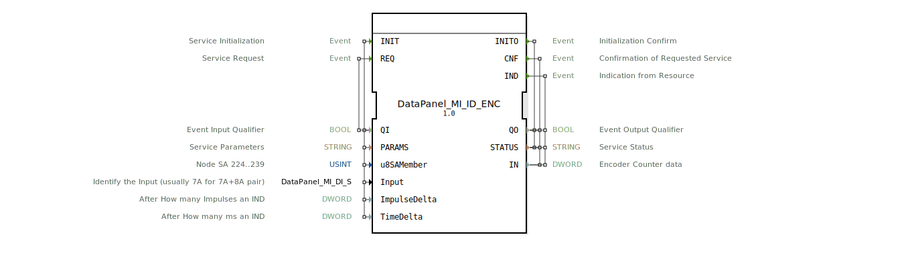

# DataPanel_MI_ID_ENC

* * * * * * * * * *
## Einleitung
Der Funktionsblock **DataPanel_MI_ID_ENC** ist ein Eingangs-Service-Interface-Funktionsblock zur Erfassung von Encoder-Impulsdaten. Er ist für die Verarbeitung eines 7A+8A-Encoder-Paares ausgelegt und gibt den aktuellen Zählerstand sowie Statusinformationen aus. Die Initialisierung erfolgt über Parameter wie die Knotenadresse (SA-Member), die Eingangskonfiguration sowie Schwellwerte für impuls- und zeitbasierte Ereignisauslösung.

## Schnittstellenstruktur

### **Ereignis-Eingänge**
| Ereignis | Beschreibung | Mitgeführte Daten |
|----------|--------------|-------------------|
| INIT | Service-Initialisierung | QI, PARAMS, u8SAMember, Input, ImpulseDelta, TimeDelta |
| REQ | Service-Anforderung | QI |

### **Ereignis-Ausgänge**
| Ereignis | Beschreibung | Mitgeführte Daten |
|----------|--------------|-------------------|
| INITO | Bestätigung der Initialisierung | QO, STATUS |
| CNF | Bestätigung der angeforderten Aktion | QO, STATUS, IN |
| IND | Asynchrone Anzeige eines Ereignisses (Impuls- oder Zeitüberschreitung) | QO, STATUS, IN |

### **Daten-Eingänge**
| Name | Typ | Initialwert | Beschreibung |
|------|-----|-------------|--------------|
| QI | BOOL | – | Ereignis-Eingangsqualifizierer |
| PARAMS | STRING | – | Service-Parameter |
| u8SAMember | USINT | MI::MI_00 | Knotenadresse (Bereich 224..239) |
| Input | DataPanel::io::MI::DI::DataPanel_MI_DI_S | Invalid | Identifikation des Eingangs (üblicherweise 7A für 7A+8A-Paar) |
| ImpulseDelta | DWORD | – | Anzahl der Impulse, nach denen ein IND ausgelöst wird |
| TimeDelta | DWORD | – | Zeit in Millisekunden, nach der ein IND ausgelöst wird |

### **Daten-Ausgänge**
| Name | Typ | Beschreibung |
|------|-----|--------------|
| QO | BOOL | Ereignis-Ausgangsqualifizierer |
| STATUS | STRING | Servicestatus |
| IN | DWORD | Aktueller Encoder-Zählerwert |

### **Adapter**
Keine.

## Funktionsweise
1. **Initialisierung (INIT → INITO)**  
   Der Baustein wird mit den Parametern `PARAMS`, der Knotenadresse `u8SAMember`, der Eingangsspezifikation `Input` sowie den Schwellwerten `ImpulseDelta` und `TimeDelta` konfiguriert. Nach erfolgreicher Initialisierung wird das Ereignis `INITO` mit `QO` und `STATUS` quittiert.

2. **Anforderung (REQ → CNF)**  
   Mit `REQ` wird eine gezielte Abfrage des aktuellen Zählerstands ausgelöst. Der Baustein antwortet mit `CNF` und liefert den aktuellen Encoderwert über `IN` sowie Statusinformationen.

3. **Asynchrone Ereignisse (IND)**  
   Unabhängig von einer expliziten Anforderung wird `IND` ausgelöst, sobald entweder die in `ImpulseDelta` festgelegte Anzahl von Encoder-Impulsen überschritten wurde oder die in `TimeDelta` definierte Zeitspanne abgelaufen ist. Dies ermöglicht eine ereignisgesteuerte Verarbeitung ohne ständiges Pollen.

Der Ausgang `IN` enthält zu jedem Ereignis (CNF und IND) den aktuellen 32-Bit-Zählerwert des Encoders.

## Technische Besonderheiten
- **Benutzerdefinierte Typen**: Der Eingang `Input` basiert auf dem Datentyp `DataPanel_MI_DI_S`, der eine spezifische Eingangskonfiguration (z. B. 7A) erwartet. Der Konstantwert `Invalid` dient als Platzhalter für nicht definierte Eingänge.
- **Konfigurierbare Ereignisauslösung**: Durch kombinierte Nutzung von `ImpulseDelta` und `TimeDelta` kann das System entweder nach einer bestimmten Impulsanzahl, nach einer Zeitspanne oder nach dem zuerst eintretenden Ereignis (UND-Verknüpfung) einen IND auslösen.
- **Knotenadressierung**: Über `u8SAMember` (Wertebereich 224–239) wird der physikalische Knoten im Bus-System ausgewählt. Der Initialwert `MI::MI_00` verweist auf eine Konstante des Moduls `MI`.

## Zustandsübersicht
| Zustand | Beschreibung |
|---------|--------------|
| IDLE | Warten auf INIT oder REQ |
| INIT | Initialisierung läuft, Parametrierung wird übernommen |
| ACTIVE | Initialisierung abgeschlossen, bereit für REQ und IND |
| ERROR | Fehlerzustand (z. B. fehlerhafte Initialisierung) |

Die tatsächliche Zustandsmaschine ist im vorliegenden Code nicht explizit abgebildet; die dargestellten Zustände leiten sich aus dem typischen Verhalten von Service-Interface-FBs ab.

## Anwendungsszenarien
- **Landmaschinensteuerung**: Erfassung von Drehzahlen an Antriebswellen über Inkrementalgeber (7A+8A-Paar) zur Überwachung und Regelung von Arbeitsprozessen.
- **Positionserfassung**: Verwendung als Impulszähler zur Wegmessung, z. B. für Fahrantriebe oder Stellglieder.
- **Ereignisgesteuerte Datenerfassung**: Durch die konfigurierbaren IND-Schwellen können Lastspitzen im Datenverkehr vermieden und Logging-Aufgaben optimiert werden.

## Vergleich mit ähnlichen Bausteinen
Gegenüber einfachen Encoder-Zählern bietet der DataPanel_MI_ID_ENC:
- **Flexible Auslösekriterien**: Statt nur auf Polling angewiesen zu sein, können Impuls- oder Zeit-Schwellwerte gesetzt werden.
- **Strukturierte Initialisierung**: Die Verwendung eines benutzerdefinierten Typs (`DataPanel_MI_DI_S`) ermöglicht eine klare Zuordnung zu spezifischen Hardware-Eingängen.
- **Ereignisbasierte Ausgabe**: Die Trennung von `CNF` (synchron zur Anfrage) und `IND` (asynchron) erlaubt eine entkoppelte Verarbeitung in höheren Steuerungsebenen.

## Fazit
Der Funktionsblock **DataPanel_MI_ID_ENC** ist ein leistungsfähiger Service-Interface-Baustein für die Encoder-Datenerfassung in industriellen Steuerungssystemen. Durch seine parametrierbaren Schwellwerte und die Unterstützung sowohl synchroner als auch asynchroner Ereignisse eignet er sich besonders für Echtzeitanwendungen in der Landtechnik. Die klare Schnittstellendefinition und die Verwendung spezifischer Datentypen ermöglichen eine einfache Integration in bestehende Automatisierungsumgebungen.