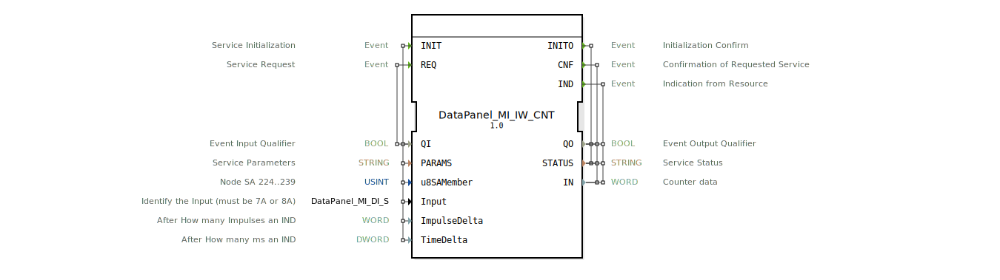

# DataPanel_MI_IW_CNT

* * * * * * * * * *

## Einleitung

Der **DataPanel_MI_IW_CNT** ist ein Service-Interface-Funktionsblock aus der DataPanel-Familie der HR Agrartechnik GmbH. Er dient der Erfassung von **Impulszählerdaten** über die speziellen Hardware-Eingänge 7A und 8A des zugrunde liegenden Bussystems. Der Baustein kapselt die Initialisierung, die zyklische Abfrage und die ereignisgesteuerte Ausgabe der Zählerwerte. Typische Einsatzbereiche sind landtechnische Anwendungen, in denen Impulsgeber (z. B. Drehzahl‑, Durchfluss- oder Positionssensoren) ausgewertet werden müssen. Der FB ist für die IEC 61499‑konforme 4diac IDE ausgelegt und nutzt die dort definierten Service-Interface-Muster.

## Schnittstellenstruktur

### **Ereignis-Eingänge**

| Event  | Typ   | Beschreibung                                      |
|--------|-------|---------------------------------------------------|
| INIT   | EInit | Initialisiert den Kanal (setzt Hardware-Parameter) |
| REQ    | Event | Fordert einen aktuellen Zählerwert an             |

### **Ereignis-Ausgänge**

| Event | Typ   | Beschreibung                                              |
|-------|-------|-----------------------------------------------------------|
| INITO | EInit | Quittierung der erfolgreichen Initialisierung             |
| CNF   | Event | Bestätigung einer angeforderten REQ‑Operation             |
| IND   | Event | Asynchrone Indikation (ausgelöst durch Impuls- oder Zeitintervall) |

### **Daten-Eingänge**

| Name          | Typ      | Beschreibung                                                                 |
|---------------|----------|-----------------------------------------------------------------------------|
| QI            | BOOL     | Qualifiziert das INIT- / REQ-Ereignis                                       |
| PARAMS        | STRING   | Service-Parameter (herstellerabhängige Konfiguration)                       |
| u8SAMember    | USINT    | Knoten‑SA (224..239); Default = `MI::MI_00`                                 |
| Input         | DataPanel_MI_DI_S | Identifikation des Eingangs (muss „7A“ oder „8A“ sein); Default = `Invalid` |
| ImpulseDelta  | WORD     | Impulsschwelle für asynchrone IND‑Auslösung (Anzahl Impulse)                |
| TimeDelta     | DWORD    | Zeitschwelle für asynchrone IND‑Auslösung (in ms)                           |

### **Daten-Ausgänge**

| Name   | Typ    | Beschreibung                                  |
|--------|--------|-----------------------------------------------|
| QO     | BOOL   | Qualifiziert die Ereignisausgänge              |
| STATUS | STRING | Statusmeldung (z. B. „OK“ oder Fehlercode)    |
| IN     | WORD   | Aktueller 16‑Bit‑Zählerwert (Impulszähler)    |

### **Adapter**

Keine Adapter-Schnittstellen definiert.

## Funktionsweise

Der **DataPanel_MI_IW_CNT** arbeitet als Service-Interface-FB und kommuniziert direkt mit der Hardware‑Schnittstelle des DataPanel‑Systems. Nach dem Start muss über das **INIT**-Ereignis der Kanal initialisiert werden. Dabei werden die Parameter (SA-Adresse, Eingangsnummer, Impuls- und Zeitkonfiguration) übergeben. Der FB versucht, den entsprechenden Hardware-Kanal zu belegen und bereitzustellen.

Nach erfolgreicher Initialisierung (signalisiert durch **INITO**) kann der Zählerstand über das **REQ**-Ereignis abgefragt werden. Die Antwort wird über **CNF** geliefert: `IN` enthält den aktuellen Zählerwert, `STATUS` den Betriebszustand.

Zusätzlich kann der Baustein asynchron eine **IND**-Indikation ausgeben, wenn entweder die eingestellte Anzahl an Impulsen (`ImpulseDelta`) erreicht wurde oder die Zeitspanne (`TimeDelta`) verstrichen ist. Dies erlaubt eine ereignisgesteuerte Verarbeitung ohne zyklische Abfragen.

Die Fehlerbehandlung erfolgt über den `STATUS`‑Ausgang und das `QO`‑Flag. Tritt ein Fehler auf (z. B. ungültige Eingangskonfiguration, Hardware nicht erreichbar), wird `QO` auf `FALSE` gesetzt und ein entsprechender Fehlertext in `STATUS` ausgegeben.

## Technische Besonderheiten

- **Eingangsidentifikation:** Der Parameter `Input` muss auf einen gültigen DataPanel‑Eingangstyp gesetzt werden (7A oder 8A). Der Defaultwert `Invalid` verhindert eine fehlerhafte Initialisierung.
- **Knoten‑SA (`u8SAMember`):** Definiert die Slave‑Adresse des DataPanel‑Teilnehmers. Gültig sind Werte von 224 bis 239. Der vordefinierte Wert `MI::MI_00` steht für den ersten Slave.
- **Asynchrone Indikation:** Durch `ImpulseDelta` und `TimeDelta` kann der FB selbstständig **IND**‑Ereignisse erzeugen. Beide Schwellen können unabhängig voneinander aktiv sein. Überschreitet einer der Werte den konfigurierten Schwellwert, wird ein IND ausgelöst. Dies reduziert die Buslast im Vergleich zu zyklischen Polling.
- **Datenformat:** Der Zählerwert `IN` ist ein 16‑Bit-Word und ermöglicht Werte von 0 bis 65535. Bei Überlauf wird der Zähler auf 0 zurückgesetzt.
- **Copyright & Version:** Der Baustein ist unter der Version 1.0 für das Jahr 2026 von HR Agrartechnik GmbH veröffentlicht.

## Zustandsübersicht

Der FB durchläuft klassische Service-Interface-Zustände:

| Zustand     | Beschreibung                                                    |
|-------------|-----------------------------------------------------------------|
| **IDLE**    | Warten auf INIT oder REQ. Hardware ist noch nicht belegt.      |
| **INIT**    | INIT empfangen – Parametrierung und Hardware‑Reservierung laufen. |
| **ACTIVE**  | Initialisierung erfolgreich – Kanal betriebsbereit.            |
| **REQUEST** | REQ empfangen – Abfrage des aktuellen Zählerstands.            |
| **INDICATE**| Asynchrone Bedingung erfüllt – Senden eines IND‑Ereignisses.   |
| **ERROR**   | Fehler aufgetreten (z. B. falscher Parameter, Hardware-Fehler). |

Nach einem Fehler kann nur ein erneutes INIT den FB zurück in den IDLE‑Zustand versetzen.

## Anwendungsszenarien

1. **Drehzahlmessung:** Ein Radarsensor oder magnetischer Impulsgeber liefert Rechteckimpulse. Der Baustein zählt die Impulse und gibt den Wert auf CNF oder IND aus. `TimeDelta` kann für eine zeitbasierte Drehzahlberechnung genutzt werden.
2. **Durchflusserfassung:** In der landtechnischen Beregnung werden Impulsdurchflussmesser (z. B. Hall-Effekt) eingesetzt. `ImpulseDelta` erzeugt ein Ereignis nach jeder definierten Flüssigkeitsmenge.
3. **Positionserfassung:** Mit einem Inkrementalgeber werden Wegstrecken gemessen. Durch die Kombination von Impuls- und Zeitüberwachung kann sowohl die Position als auch die Geschwindigkeit ermittelt werden.

## Vergleich mit ähnlichen Bausteinen

- **DataPanel_MI_DI:** Ein reiner Digital-Eingangs‑FB (Status 0/1) ohne Zählfunktion. Der IW_CNT erweitert ihn um die Impulszählung und asynchrone Ereignisauslösung.
- **DataPanel_MI_AI:** Ein Analog-Eingangs‑FB für Spannungs- oder Stromsignale. Im Gegensatz dazu verarbeitet der IW_CNT ausschließlich Impulse (diskret) und keinen kontinuierlichen Wert.
- **CTUD** (IEC 61499‑Standard‑Zähler): Dieser Standardbaustein kann vorwärts/rückwärts zählen, benötigt aber keine hardwarenahe Initialisierung. Der DataPanel_MI_IW_CNT ist speziell an die DataPanel‑Hardware angebunden und bietet die IND‑Funktion, die in Standardbausteinen oft fehlt.

## Fazit

Der **DataPanel_MI_IW_CNT** ist ein leistungsfähiger Service-Interface-Funktionsblock für die flexible Erfassung von Impulszählerdaten in landtechnischen Steuerungen. Seine integrierte asynchrone Indikation auf Basis von Impuls‑ oder Zeitschwellen reduziert die Reaktionszeit und entlastet das Steuerungssystem. Dank der klar strukturierten Schnittstelle und der spezifischen Konfigurationsmöglichkeiten (SA‑Adresse, Eingangswahl) lässt er sich nahtlos in das DataPanel‑Ökosystem einbinden. Er stellt damit eine zuverlässige Komponente für Anwendungen dar, die eine präzise Impulsauswertung auf Systemebene erfordern.