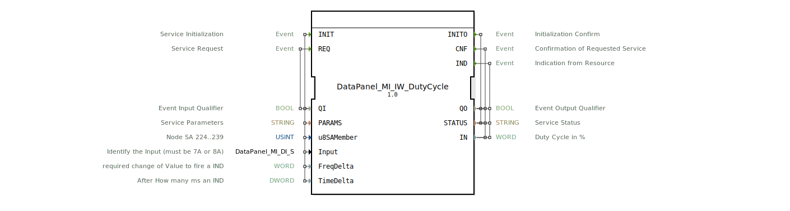

# DataPanel_MI_IW_DutyCycle

Kein Bild verfügbar.

* * * * * * * * * *

## Einleitung

Der Funktionsblock `DataPanel_MI_IW_DutyCycle` ist ein Service-Interface-FB zur Erfassung und Verarbeitung von Frequenzeingangssignalen (Typ 7A/8A) im Hardwaresystem. Er berechnet aus dem eingehenden Frequenzsignal das Tastverhältnis (Duty Cycle) und gibt dieses als Prozentwert aus. Der Baustein unterstützt eine initiale Parametrierung sowie ereignisgesteuerte Ausgaben bei signifikanten Wertänderungen oder zeitgesteuerten Abfragen.

## Schnittstellenstruktur

### **Ereignis-Eingänge**

| Ereignis | Typ | Mit Variablen | Kommentar |
|----------|-----|---------------|-----------|
| `INIT` | EInit | QI, PARAMS, u8SAMember, Input, FreqDelta, TimeDelta | Initialisierung des Dienstes |
| `REQ` | Event | QI | Dienstanforderung |

### **Ereignis-Ausgänge**

| Ereignis | Typ | Mit Variablen | Kommentar |
|----------|-----|---------------|-----------|
| `INITO` | EInit | QO, STATUS | Bestätigung der Initialisierung |
| `CNF` | Event | QO, STATUS, IN | Bestätigung der angeforderten Aktion |
| `IND` | Event | QO, STATUS, IN | Indikation vom Ressourcen (bei Wertänderung/Timer) |

### **Daten-Eingänge**

| Variable | Typ | Kommentar |
|----------|-----|-----------|
| `QI` | BOOL | Ereignis-Eingangsqualifizierer |
| `PARAMS` | STRING | Dienstparameter (z. B. Konfigurationsstring) |
| `u8SAMember` | USINT | Knotenadresse (SA 224..239, Standard: MI::MI_00) |
| `Input` | DataPanel_MI_DI_S | Identifikation des Eingangs (muss 7A oder 8A sein, Initialwert: Invalid) |
| `FreqDelta` | WORD | Erforderliche Wertänderung in %, um eine IND auszulösen |
| `TimeDelta` | DWORD | Zeitintervall in ms, nach dem eine IND ausgelöst wird |

### **Daten-Ausgänge**

| Variable | Typ | Kommentar |
|----------|-----|-----------|
| `QO` | BOOL | Ereignis-Ausgangsqualifizierer |
| `STATUS` | STRING | Dienststatus (Fehler-/Erfolgsmeldung) |
| `IN` | WORD | Gemessenes Tastverhältnis (Duty Cycle) in Prozent (0..100) |

### **Adapter**

Keine Adapter definiert.

## Funktionsweise

Der Baustein initialisiert sich über das Ereignis `INIT`. Dabei werden die Parameter `QI` (Aktivierung), `PARAMS` (allgemeine Konfiguration), die Knotenadresse `u8SAMember`, der physikalische Eingang (`Input`), das Änderungsdelta `FreqDelta` und das Zeitintervall `TimeDelta` übergeben. Nach erfolgreicher Initialisierung wird `INITO` mit gültigem `QO` und `STATUS` ausgegeben.

Ein `REQ`-Ereignis löst eine sofortige Abfrage des aktuellen Duty-Cycle aus. Das Ergebnis wird über `CNF` mit dem aktuellen Wert in `IN` ausgegeben.

Der Baustein überwacht den Eingang kontinuierlich. Ändert sich der gemessene Duty-Cycle um mehr als den in `FreqDelta` angegebenen Betrag, so wird ein `IND`-Ereignis mit dem neuen Wert gesendet. Zusätzlich wird nach Ablauf von `TimeDelta` Millisekunden (sofern keine zwischenzeitliche Änderung erfolgte) ebenfalls ein `IND` ausgelöst, um eine regelmäßige Aktualisierung zu gewährleisten.

## Technische Besonderheiten

- Der Baustein ist für den Anschluss an Frequenzeingänge vom Typ 7A oder 8A ausgelegt. Der Eingang wird über die Struktur `DataPanel_MI_DI_S` identifiziert – standardmäßig auf `Invalid` gesetzt, bis eine gültige Initialisierung erfolgt.
- Die Knotenadresse (SA) ist auf den Bereich 224–239 beschränkt. Voreingestellt ist `MI::MI_00`.
- Die Parameter `FreqDelta` und `TimeDelta` ermöglichen eine flexible Konfiguration des Meldeverhaltens: Entweder reine Änderungsauslösung, reine Zeitauslösung oder eine Kombination beider.
- Der Status `QO` zeigt die Gültigkeit der Ausgangsdaten an; `STATUS` enthält detaillierte Fehler- oder Erfolgsmeldungen.
- Compiler-Importe verweisen auf die Pakete `DataPanel::io::MI::const::MI` und `DataPanel::io::MI::DI::DataPanel_MI_DI::Invalid` sowie auf `eclipse4diac::core::TypeHash`.

## Zustandsübersicht

Eine explizite Zustandsmaschine ist im XML nicht definiert. Aus dem Verhalten der Ereignisse lässt sich jedoch folgender Ablauf ableiten:

1. **Initialisierungszustand** – Nach `INIT` wird der Baustein konfiguriert und geht in den Betriebszustand über. Fehler führen zu `INITO` mit negativem `QO`.
2. **Betriebszustand** – Auf `REQ` folgt `CNF` mit dem aktuellen Duty-Cycle. Bei Änderungen oder Timerablauf wird `IND` gesendet.
3. **Fehlerzustand** – Bei ungültigen Parametern oder Hardwarefehlern wird `STATUS` entsprechend gesetzt und `QO` auf `FALSE`.

## Anwendungsszenarien

- **Drehzahlerfassung in Landmaschinen** – Überwachung von Frequenzsignalen (z. B. von Drehzahlsensoren) und Ausgabe des Tastverhältnisses als Indikator für Motordrehzahl oder Fördergeschwindigkeit.
- **Pulsweitenmodulation (PWM)‑Analyse** – Messung des Duty-Cycle eines PWM-Signals zur Steuerung von Aktoren oder zur Rückmeldung über den Füllstand.
- **Schwingungs‑/Frequenzüberwachung** – Erfassung von periodischen Signalen mit konfigurierbarer Empfindlichkeit (FreqDelta) und Aktualisierungsrate (TimeDelta).

## Vergleich mit ähnlichen Bausteinen

- **`DataPanel_MI_DI`**: Ein digitaler Eingangsbaustein ohne Frequenz- oder Duty-Cycle-Berechnung. Liefert nur binäre Zustände.
- **`DataPanel_MI_AI`**: Analoger Eingangsbaustein für Spannungs- oder Stromsignale; nicht für Frequenzsignale optimiert.
- **`DataPanel_MI_IW_Frequency`**: Misst die absolute Frequenz, nicht das Tastverhältnis. `DataPanel_MI_IW_DutyCycle` ergänzt diesen um die prozentuale Ein-/Aus-Zeit.

## Fazit

Der Funktionsblock `DataPanel_MI_IW_DutyCycle` bietet eine robuste und konfigurierbare Schnittstelle zur Erfassung von Tastverhältnissen aus Frequenzeingängen im Bereich 7A/8A. Durch die Parameter `FreqDelta` und `TimeDelta` kann das Meldeverhalten flexibel an die Anwendung angepasst werden. Er eignet sich besonders für den Einsatz in der Agrartechnik und industriellen Steuerungen, bei denen eine zuverlässige Duty-Cycle-Überwachung erforderlich ist.