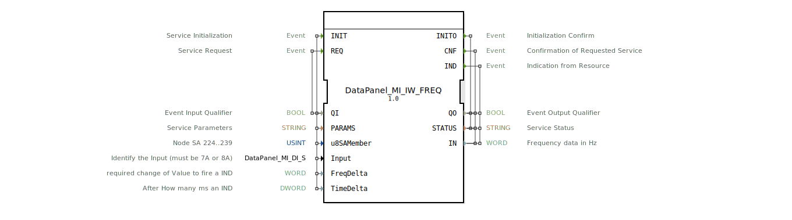

# DataPanel_MI_IW_FREQ

*Kein Bild verfügbar.*

* * * * * * * * * *

## Einleitung

Der Funktionsblock **DataPanel_MI_IW_FREQ** ist ein Service-Interface-Funktionsblock (SIFB), der den Zugriff auf einen Frequenzeingang eines Datenpanels (Typ 7A/8A) kapselt. Er dient der Initialisierung, der zyklischen oder ereignisgesteuerten Abfrage sowie der asynchronen Benachrichtigung bei Frequenzänderungen. Der FB ist Teil einer modularen Steuerungsumgebung für landwirtschaftliche Maschinen (MI – Maschineninterface).

## Schnittstellenstruktur

### **Ereignis-Eingänge**

| Ereignis | Beschreibung | Mit |
|----------|--------------|-----|
| **INIT** | Service-Initialisierung | `QI`, `PARAMS`, `u8SAMember`, `Input`, `FreqDelta`, `TimeDelta` |
| **REQ** | Service-Anforderung (aktuelle Frequenz auslesen) | `QI` |

### **Ereignis-Ausgänge**

| Ereignis | Beschreibung | Mit |
|----------|--------------|-----|
| **INITO** | Bestätigung der Initialisierung | `QO`, `STATUS` |
| **CNF** | Bestätigung einer angeforderten Abfrage | `QO`, `STATUS`, `IN` |
| **IND** | Asynchrone Indikation (Frequenzänderung oder Zeitablauf) | `QO`, `STATUS`, `IN` |

### **Daten-Eingänge**

| Name | Typ | Anfangswert | Beschreibung |
|------|-----|-------------|--------------|
| `QI` | BOOL | – | Ereignis-Eingangsqualifizierer (Steuert die Verarbeitung) |
| `PARAMS` | STRING | – | Service-Parameter (gerätespezifische Konfiguration) |
| `u8SAMember` | USINT | `MI::MI_00` | Knotenadresse (SA) des Datensammelmoduls (Wertebereich 224…239) |
| `Input` | `DataPanel::io::MI::DI::DataPanel_MI_DI_S` | `Invalid` | Identifiziert den physikalischen Eingang (muss `7A` oder `8A` sein) |
| `FreqDelta` | WORD | – | Schwellwert der Frequenzänderung [Hz], der eine `IND` auslöst |
| `TimeDelta` | DWORD | – | Zeitintervall [ms], nach dem eine `IND` gesendet wird (auch ohne Änderung) |

### **Daten-Ausgänge**

| Name | Typ | Beschreibung |
|------|-----|--------------|
| `QO` | BOOL | Ereignis-Ausgangsqualifizierer (zeigt erfolgreiche Ausführung an) |
| `STATUS` | STRING | Servicestatus (z. B. Fehlermeldungen oder Bestätigungstexte) |
| `IN` | WORD | Aktuelle Frequenz in Hz |

### **Adapter**

Keine vorhanden.

## Funktionsweise

1. **Initialisierung** – Durch das Ereignis `INIT` wird die Verbindung zum konfigurierten Frequenzeingang hergestellt. Die Parameter `PARAMS`, `u8SAMember`, `Input`, `FreqDelta` und `TimeDelta` werden übernommen. Nach erfolgreicher Initialisierung wird das Ausgangsereignis `INITO` mit `QO = TRUE` und einem positiven `STATUS` ausgelöst.

2. **Abfrage (REQ/CNF)** – Ein `REQ`-Ereignis fordert den aktuellen Frequenzwert an. Der FB sendet die Anfrage an das Datenpanel und liefert bei Antwort das Ereignis `CNF` mit dem aktuellen Wert in `IN`. `QO` zeigt an, ob die Abfrage erfolgreich war.

3. **Asynchrone Indikation (IND)** – Der FB überwacht den Frequenzeingang kontinuierlich. Eine `IND` wird ausgelöst, wenn:
   - sich der Frequenzwert um mindestens `FreqDelta` [Hz] ändert, oder
   - seit der letzten `IND` die in `TimeDelta` [ms] festgelegte Zeitspanne verstrichen ist.
  
   Dies ermöglicht sowohl schwellwertbasierte als auch zeitgesteuerte Aktualisierungen.

Die Ereignisse `INIT` und `REQ` werden nur ausgeführt, wenn der zugehörige Qualifizierer `QI` den Wert `TRUE` hat. Die Ausgangsqualifizierer `QO` signalisieren die erfolgreiche Durchführung.

## Technische Besonderheiten

- **Typabhängigkeit**: Der FB verwendet spezielle Typen aus dem Paket `DataPanel::io::MI::DI`, die eine typsichere Konfiguration des Eingangs (z. B. `DataPanel_MI_DI_S`) sowie Konstanten (`MI::MI_00`) ermöglichen.
- **Initialisierung des Eingangs**: Der Daten-Eingang `Input` ist standardmäßig auf `Invalid` gesetzt. Vor dem ersten `INIT` muss dieser auf einen gültigen Wert (`7A` oder `8A`) gesetzt werden, sonst schlägt die Initialisierung fehl.
- **Frequenzdarstellung**: Die gemessene Frequenz wird als 16‑Bit-Wert (`WORD`) in Hz ausgegeben.
- **Ereignisgesteuerter Abruf**: Der `INIT`-Dienst muss vor der Nutzung von `REQ` oder dem Empfang von `IND` einmal erfolgreich ausgeführt werden.
- **Attribut-Hash**: Ein `eclipse4diac::core::TypeHash`-Attribut ist vorhanden, jedoch ohne Wert gesetzt – dient der Laufzeitoptimierung in 4diac.

## Zustandsübersicht

Der FB durchläuft intern folgende logische Zustände:

| Zustand | Beschreibung |
|---------|--------------|
| **IDLE** | Warten auf `INIT` – keine Verbindung |
| **INIT** | Verbindung zum Eingang aufbauen und Parameter anwenden |
| **RUN** | Betriebsbereit – wartet auf `REQ` oder sendet `IND` bei Änderungen/Zeitablauf |
| **ERROR** | Fehlerzustand (z. B. falscher `Input`, Kommunikationsfehler) – `STATUS` enthält Fehlermeldung |

Ein Wechsel in den Fehlerzustand erfolgt, wenn die Initialisierung fehlschlägt. Aus dem Fehlerzustand kann nur durch erneutes `INIT` zurückgekehrt werden.

## Anwendungsszenarien

- **Drehzahlmessung** an einer landwirtschaftlichen Maschine: Ein Frequenzsensor (z. B. magnetischer Geber) liefert Impulse, die über das Datenpanel erfasst werden. Mit `FreqDelta = 5 Hz` und `TimeDelta = 100 ms` erhält die Steuerung sowohl bei wesentlichen Drehzahländerungen als auch regelmäßig aktuelle Werte.
- **Überwachung einer konstanten Frequenz**: Bei niedriger Änderungsschwelle (`FreqDelta = 1 Hz`) und kurzem Zeitintervall (`TimeDelta = 50 ms`) eignet sich der FB zur Echtzeitüberwachung kritischer Prozesse.
- **Redundante Frequenzerfassung**: Zwei parallele Instanzen des FBs auf unterschiedlichen Eingängen (7A und 8A) ermöglichen eine Plausibilisierung der Messwerte.

## Vergleich mit ähnlichen Bausteinen

| Funktionsblock | Typ | Besonderheit |
|----------------|-----|--------------|
| `DataPanel_MI_IW_FREQ` | Frequenzeingang (SIFB) | Ereignisgesteuert, asynchrone IND, parametrierbare Schwell- und Zeitwerte |
| `DataPanel_MI_DI` | Digitaleingang (SIFB) | Nur binäre Zustände, keine frequenzabhängigen Auslöser |
| Generischer `SIFB` mit INIT/REQ/IND | Allgemein | Keine eingebauten Frequenzfunktionen, muss selbst entwickelt werden |

Der **DataPanel_MI_IW_FREQ** ist speziell für die Verarbeitung von Frequenzsignalen optimiert, während andere Bausteine entweder nur diskrete Zustände oder generische Schnittstellen bereitstellen.

## Fazit

Der **DataPanel_MI_IW_FREQ** ist ein leistungsfähiger und flexibler Service-Interface-Funktionsblock für die Erfassung von Frequenzdaten über ein Datenpanel (Typ 7A/8A). Durch die Kombination aus schwellwertbasierter und zeitgesteuerter Indikation eignet er sich sowohl für einfache Messaufgaben als auch für sicherheitskritische Überwachungen. Die typsichere Konfiguration und die klare Ereignisschnittstelle erleichtern die Integration in Automatisierungslösungen der Landtechnik.