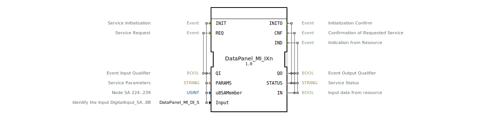

# DataPanel_MI_IXn

* * * * * * * * * *
## Einleitung
Der Funktionsblock DataPanel_MI_IXn ist ein serviceorientierter Eingangsbaustein für digitale Binäreingänge (Ground Switching / npn). Er dient zum Auslesen eines einzelnen booleschen Eingangssignals über das MI‑Protokoll (Module Interface) aus einem DataPanel‑System. Der Baustein wird typischerweise in der 4diac‑IDE verwendet, um Feldgeräte wie Schalter oder Sensoren anzubinden.

## Schnittstellenstruktur
### **Ereignis-Eingänge**
- **INIT** (EInit): Initialisiert den Baustein. Die Parameter QI, PARAMS, u8SAMember und Input werden übergeben.
- **REQ** (Event): Fordert das Lesen des aktuellen Eingangswerts an. Qualifiziert durch QI.

### **Ereignis-Ausgänge**
- **INITO** (EInit): Bestätigt die erfolgreiche Initialisierung. Liefert QO und STATUS.
- **CNF** (Event): Bestätigung einer ausgeführten Anforderung (REQ). Enthält QO, STATUS und den gelesenen Wert IN.
- **IND** (Event): Zeigt eine asynchrone Änderung des Eingangssignals vom Ressourcentreiber an. Enthält QO, STATUS und IN.

### **Daten-Eingänge**
- **QI** (BOOL): Qualifizierer für die Ereigniseingänge; typischerweise auf TRUE gesetzt, um die Verarbeitung zu aktivieren.
- **PARAMS** (STRING): Dienstspezifische Parameter zur Konfiguration (z. B. Adressierung oder Protokolleinstellungen).
- **u8SAMember** (USINT): Node‑SA‑Adresse (Subscriber Address) des Geräts im Bereich 224…239. Initialwert: MI::MI_00.
- **Input** (DataPanel::io::MI::DI::DataPanel_MI_DI_S): Identifikation des digitalen Eingangs (z. B. DigitalInput_5A…8B). Initialwert: Invalid.

### **Daten-Ausgänge**
- **QO** (BOOL): Ausgangsqualifizierer; zeigt an, ob die Ausgangsdaten gültig sind.
- **STATUS** (STRING): Statusmeldung des Dienstes (z. B. Fehler oder Erfolgsmeldung).
- **IN** (BOOL): Der gelesene Binäreingangswert vom angeschlossenen Sensor oder Schalter.

### **Adapter**
Keine Adapter definiert.

## Funktionsweise
Der Baustein kommuniziert über das MI‑Protokoll mit einem DataPanel‑Modul. Nach dem Start wird der Baustein mit INIT initialisiert, wobei die Kommunikationsparameter (PARAMS, u8SAMember, Input) konfiguriert werden. Bei erfolgreicher Initialisierung wird INITO ausgelöst. Anschließend kann über REQ der aktuelle Zustand des konfigurierten digitalen Eingangs abgefragt werden; die Antwort wird über CNF mit dem Wert IN geliefert. Zusätzlich kann der Baustein asynchrone Ereignisse (IND) empfangen, wenn sich der Eingangszustand ohne explizite Anforderung ändert (z. B. durch Interrupts der Hardware). Der Ausgang QO zeigt die Gültigkeit der Daten an, STATUS liefert diagnostische Informationen.

## Technische Besonderheiten
- Der Baustein ist als Service‑Interface‑FB (SIFB) realisiert und erwartet eine hardwarenahe Implementierung in der 4diac‑Runtime.
- Die Eingangskonfiguration (Input) verwendet einen benutzerdefinierten Strukturtyp `DataPanel_MI_DI_S`, der die genaue Kanalzuordnung ermöglicht.
- Der Parameter `u8SAMember` ist auf Werte 224..239 beschränkt; dies entspricht typischen SA‑Adressen für MI‑basierte Subsysteme.
- Die Initialisierung kann nur mit gültigen Parametern erfolgen; bei ungültigem Input (z. B. Invalid) schlägt die Initialisierung fehl.

## Zustandsübersicht
Eine explizite Zustandsmaschine ist im XML nicht hinterlegt. Typischerweise durchläuft der Baustein folgende Zustände:
1. **IDLE** – nach dem Start, wartet auf INIT.
2. **INIT** – Initialisierung wird durchgeführt, Konfiguration des Hardwarekanals.
3. **OPERATE** – Bereit für REQ und Empfang von IND‑Ereignissen.
4. **ERROR** – bei fehlgeschlagener Initialisierung oder Kommunikationsfehlern.
Alternative Zustände können je nach Implementierung des Kommunikationstreibers abweichen.

## Anwendungsszenarien
- **Feldgeräteanbindung**: Ein binärer Näherungssensor (npn) wird an einen DataPanel-Eingang angeschlossen. Der Baustein liest den Schaltzustand aus und stellt ihn in der Steuerungsapplikation zur Verfügung.
- **Schalterabfrage**: Ein handbetätigter Schalter (Ground Switching) wird über den FB überwacht; Änderungen werden asynchron über IND gemeldet.
- **Diagnose**: Über STATUS können Fehler wie Drahtbruch oder Adresskonflikte erkannt werden.

## Vergleich mit ähnlichen Bausteinen
Ähnliche Bausteine wie `DataPanel_MI_DI_Xn` (für andere Eingangsgruppen) oder `DataPanel_MI_DO_Xn` (Ausgänge) teilen das gleiche Interface, unterscheiden sich jedoch in der Anzahl der Kanäle oder der Datenrichtung. Der vorliegende Baustein fokussiert auf einen einzelnen digitalen Eingang und eignet sich für punktgenaue Überwachung.

## Fazit
Der Funktionsblock `DataPanel_MI_IXn` bietet eine standardisierte Schnittstelle zum Auslesen eines Binäreingangs in DataPanel‑Systemen über das MI‑Protokoll. Durch die serviceorientierte Struktur (INIT/REQ/IND) lässt er sich flexibel in ereignisgesteuerte Automatisierungslösungen integrieren. Die Konfiguration über dedizierte Parameter sorgt für eine einfache und robuste Anbindung.