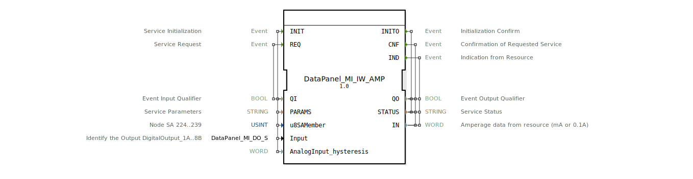

# DataPanel_MI_IW_AMP

* * * * * * * * * *

## Einleitung

Der Funktionsblock DataPanel_MI_IW_AMP ist ein Eingangs-Schnittstellenbaustein (Service Interface Function Block) für die Erfassung der Stromrückmeldung (Amperage) eines einzelnen Kanals. Er dient zur Integration von Strommesswerten in die 4diac-IDE und ermöglicht die Kommunikation mit einer übergeordneten Steuerung oder einem Datenpanel. Der Baustein initialisiert die hardwarenahe Kommunikation und liefert bei jeder Anforderung den aktuellen Messwert als WORD aus.

## Schnittstellenstruktur

### **Ereignis-Eingänge**

- `INIT (EInit)` – Initialisierung des Dienstes. Wird ausgelöst, um den FB zu konfigurieren und die Verbindung zur Hardware herzustellen. Mit diesem Ereignis werden die Parameter QI, PARAMS, u8SAMember, Input und AnalogInput_hysteresis übernommen.
- `REQ (Event)` – Dienstanforderung. Löst eine neue Messwertabfrage aus. Der FB antwortet mit dem Ereignis CNF und liefert den aktuellen Amperage-Wert auf dem Ausgang IN.

### **Ereignis-Ausgänge**

- `INITO (EInit)` – Bestätigung der Initialisierung. Wird nach erfolgreicher Initialisierung gesendet. Gibt den Status QO und STATUS aus.
- `CNF (Event)` – Bestätigung der Dienstanforderung. Wird als Antwort auf REQ gesendet und enthält den aktuellen Messwert IN sowie die Statusinformationen QO und STATUS.
- `IND (Event)` – Indikation von der Ressource. Wird bei asynchronen Ereignissen von der Hardware (z. B. spontane Wertänderung) ausgelöst. Liefert ebenfalls den aktuellen Messwert IN.

### **Daten-Eingänge**

- `QI (BOOL)` – Eingangsqualifizierer. Steuert, ob der FB aktiv ist (TRUE) oder nicht (FALSE).
- `PARAMS (STRING)` – Dienstparameter. Enthält Konfigurationsdaten für die Initialisierung, z. B. Busschnittstelle oder Adressierung.
- `u8SAMember (USINT)` – Knoten‑SA (Source Address) im Bereich 224..239. Definiert die eindeutige Adresse des angeschlossenen Geräts. Initialwert: `MI::MI_00`.
- `Input (DataPanel_MI_DO_S)` – Identifiziert den digitalen Ausgang, dessen Strom gemessen werden soll (z. B. DigitalOutput_1A..8B). Initialwert: `Invalid`.
- `AnalogInput_hysteresis (WORD)` – Hysterese für den analogen Eingang. Kann zur Vermeidung von Flanken bei geringen Schwankungen genutzt werden.

### **Daten-Ausgänge**

- `QO (BOOL)` – Ausgangsqualifizierer. Zeigt an, ob der FB korrekt arbeitet (TRUE) oder ein Fehler vorliegt (FALSE).
- `STATUS (STRING)` – Dienststatus. Enthält Fehlermeldungen oder Hinweise zum Betriebszustand.
- `IN (WORD)` – Gemessener Stromwert in Einheiten von mA oder 0,1 A (abhängig von der Konfiguration). Liefert den aktuellen Amperage-Wert des ausgewählten Kanals.

### **Adapter**

Keine Adapter definiert.

## Funktionsweise

Der FB agiert als Dienst-Schnittstelle zwischen der Applikation und der Hardwareebene. Bei Auslösen von `INIT` werden die Konfigurationsparameter (Adresse, Kanalzuordnung, Hysterese) an die Hardware übergeben. Nach erfolgreicher Initialisierung wird `INITO` gesendet. Ein `REQ`-Ereignis löst eine sofortige Abfrage des Strommesswerts aus, der auf dem Ausgang `IN` bereitgestellt und mit `CNF` bestätigt wird. Zusätzlich kann die Hardware bei Änderungen ein `IND`-Ereignis generieren, um die Applikation asynchron zu informieren.

Die Werte von `QI` und `QO` steuern den Aktivitätszustand: Nur wenn `QI`=TRUE und `QO`=TRUE kann der FB Daten liefern. Bei einem Fehler wird `QO` auf FALSE gesetzt und eine Fehlermeldung in `STATUS` hinterlegt.

## Technische Besonderheiten

- Der FB ist als generischer Dienst-Schnittstellenbaustein konzipiert und erfordert eine hardwareabhängige Implementierung der Servicefunktionen.
- Die Adressierung über `u8SAMember` folgt einem vordefinierten Konstanten‑Set (z. B. `MI::MI_00` … `MI::MI_15`), was eine einfache Konfiguration mehrerer Kanäle ermöglicht.
- Der Ausgangstyp `DataPanel_MI_DO_S` dient zur Auswahl eines spezifischen digitalen Ausgangs; der FB wird nur dann korrekt arbeiten, wenn dieser Wert gültig ist (nicht `Invalid`).
- Die Hysterese (`AnalogInput_hysteresis`) kann verwendet werden, um Messrauschen zu unterdrücken und unnötige Ereignisse zu vermeiden.
- Die Amperage-Ausgabe erfolgt als WORD, je nach Konfiguration in mA (z. B. 0–65535 mA) oder in 0,1 A-Schritten.

## Zustandsübersicht

Der FB durchläuft typischerweise folgende Zustände:

1. **IDLE** – Ruhezustand nach dem Start, wartet auf INIT.
2. **INIT** – Initialisierung wird durchgeführt; nach Erfolg Übergang zu OPERATIONAL, dann INITO.
3. **OPERATIONAL** – Betriebsbereit; REQ‑Ereignisse werden bearbeitet, Messwerte via CNF geliefert; asynchrone IND möglich.
4. **ERROR** – Fehlerzustand (z. B. Kommunikationsfehler, ungültige Parameter); QO = FALSE, STATUS enthält Fehlertext; Rücksetzung nur durch erneutes INIT.

Eine detaillierte Zustandsmaschine ist in der Implementierung des Dienstes hinterlegt.

## Anwendungsszenarien

- **Stromüberwachung einzelner Ausgänge** in einer Maschinensteuerung, z. B. zur Erkennung von Laständerungen oder Defekten.
- **Einbindung von Analog-Eingangsmodulen** eines Datenpanels, um pro Kanal die Stromaufnahme zu messen.
- **Parametrierung über INIT** ermöglicht den flexiblen Einsatz in verschiedenen Hardware-Konfigurationen.

## Vergleich mit ähnlichen Bausteinen

Im Vergleich zu einem reinen Digital-Eingangs-FB bietet dieser Baustein eine analoge Messwertrückmeldung (Amperage), die mehr Informationen über den Lastzustand liefert. Ähnliche Bausteine für Spannungs- oder Temperaturmessung nutzen ein vergleichbares Interface-Schema (INIT/REQ/IND) mit anderen physikalischen Einheiten. Der Vorteil von `DataPanel_MI_IW_AMP` liegt in der spezifischen Optimierung für Strommessung und der Integration in die DataPanel-Familie.

## Fazit

Der Funktionsblock `DataPanel_MI_IW_AMP` stellt eine standardisierte und flexible Schnittstelle zur Erfassung von Stromwerten in Automatisierungssystemen dar. Durch die klar definierten Ereignisse und Parameter lässt er sich einfach in 4diac-Projekte einbinden und bietet sowohl synchrone als auch asynchrone Benachrichtigungen über Messwertänderungen. Die detaillierte Konfiguration mittels Adresse, Kanal und Hysterese ermöglicht eine anpassungsfähige Nutzung in unterschiedlichen Hardware-Umgebungen.