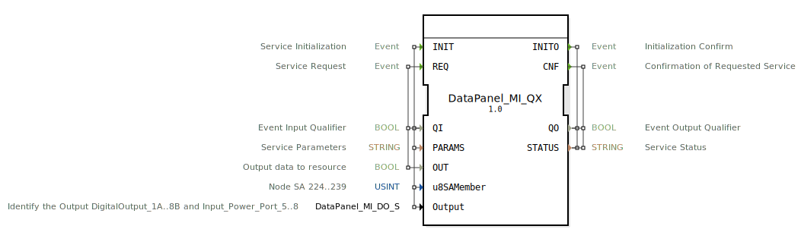

# DataPanel_MI_QX

```{index} single: DataPanel_MI_QX
```


* * * * * * * * * *

## Einleitung
Der DataPanel_MI_QX ist ein Service Interface Function Block für die Ausgabe von booleschen Daten an eine Ressource. Dieser Baustein dient als Schnittstelle zwischen der Steuerungslogik und den physischen Ausgängen eines DataPanel MI-Systems und ermöglicht die Konfiguration und Steuerung von digitalen Ausgängen.



## Schnittstellenstruktur

### **Ereignis-Eingänge**
- **INIT**: Service-Initialisierungsereignis
- **REQ**: Service-Anfrageereignis

### **Ereignis-Ausgänge**
- **INITO**: Initialisierungsbestätigung
- **CNF**: Bestätigung der angeforderten Service-Operation

### **Daten-Eingänge**
- **QI** (BOOL): Ereignis-Eingangsqualifikator
- **PARAMS** (STRING): Service-Parameter
- **OUT** (BOOL): Ausgabedaten zur Ressource
- **u8SAMember** (USINT): Node SA 224..239, Initialwert: MI::MI_00
- **Output** (DataPanel_MI_DO_S): Identifiziert den Ausgang (DigitalOutput_1A..8B und Input_Power_Port_5..8), Initialwert: Invalid

### **Daten-Ausgänge**
- **QO** (BOOL): Ereignis-Ausgangsqualifikator
- **STATUS** (STRING): Service-Status

### **Adapter**
Keine Adapter-Schnittstellen vorhanden.

## Funktionsweise
Der DataPanel_MI_QX Function Block verwaltet die Kommunikation mit den digitalen Ausgängen eines DataPanel MI-Systems. Bei der Initialisierung (INIT-Ereignis) werden die Service-Parameter konfiguriert und die Hardware-Schnittstelle eingerichtet. Das REQ-Ereignis triggert die Ausgabe der booleschen Daten an die spezifizierte Ressource. Der Baustein bestätigt sowohl Initialisierungs- als auch Service-Operationen über die entsprechenden Ausgangsereignisse.

## Technische Besonderheiten
- Unterstützt die Konfiguration von SA-Nodes im Bereich 224-239
- Ermöglicht die Identifikation spezifischer digitaler Ausgänge (1A bis 8B) und Power-Ports (5-8)
- Verwendet einen speziellen Datentyp (DataPanel_MI_DO_S) zur Ausgangsidentifikation
- Implementiert eine robuste Fehlerbehandlung durch STATUS-Ausgabe

## Zustandsübersicht
Der Function Block durchläuft folgende Zustände:
1. **Nicht initialisiert**: Wartet auf INIT-Ereignis
2. **Initialisiert**: Bereit für Service-Anfragen
3. **Service-Ausführung**: Verarbeitet REQ-Ereignisse
4. **Bestätigung**: Sendet CNF/INITO-Ereignisse mit Statusinformationen

## Anwendungsszenarien
- Steuerung von digitalen Ausgängen in Industrieautomationssystemen
- Anbindung von DataPanel MI-Hardwarekomponenten
- Implementierung von sicheren Ausgabeprotokollen
- Integration in größere Steuerungssysteme mit mehreren Ausgabekanälen

## Vergleich mit ähnlichen Bausteinen
Im Vergleich zu einfachen digitalen Ausgabeblöcken bietet DataPanel_MI_QX erweiterte Funktionalitäten wie:
- Parametrierbare SA-Node-Konfiguration
- Spezifische Hardware-Identifikation für DataPanel MI-Systeme
- Detaillierte Statusrückmeldungen
- Flexible Ausgangskonfiguration über den Output-Parameter

## Fazit
Der DataPanel_MI_QX Function Block stellt eine leistungsstarke und flexible Lösung für die Ansteuerung digitaler Ausgänge in DataPanel MI-Systemen dar. Durch seine umfangreiche Parametrierbarkeit und detaillierte Statusrückmeldungen eignet er sich besonders für komplexe Automatisierungsanwendungen, die eine zuverlässige und konfigurierbare Ausgabeschnittstelle erfordern.