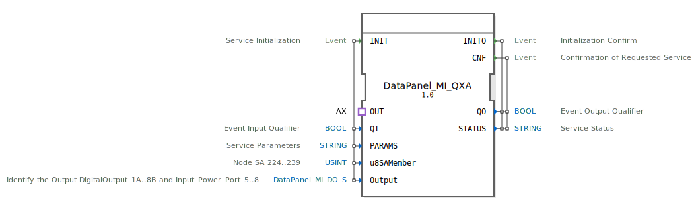

# DataPanel_MI_QXA

```{index} single: DataPanel_MI_QXA
```


* * * * * * * * * *

## Einleitung
Der DataPanel_MI_QXA ist ein Composite-Funktionsblock zur Steuerung von booleschen Ausgabedaten in Automatisierungssystemen. Dieser Baustein dient als Schnittstelle für digitale Ausgänge und ermöglicht die Konfiguration und Ansteuerung von Ausgangskanälen über standardisierte Service-Parameter.



## Schnittstellenstruktur

### **Ereignis-Eingänge**
- **INIT**: Service-Initialisierungsereignis mit den zugehörigen Daten QI, PARAMS, u8SAMember und Output

### **Ereignis-Ausgänge**
- **INITO**: Initialisierungsbestätigung mit QO und STATUS
- **CNF**: Bestätigung des angeforderten Services mit QO und STATUS

### **Daten-Eingänge**
- **QI** (BOOL): Ereignis-Eingangsqualifizierer
- **PARAMS** (STRING): Service-Parameter
- **u8SAMember** (USINT): Knoten-SA-Adresse im Bereich 224-239, initialisiert mit MI::MI_00
- **Output** (DataPanel_MI_DO_S): Identifizierung des Ausgangs (DigitalOutput_1A..8B und Input_Power_Port_5..8), initialisiert mit Invalid

### **Daten-Ausgänge**
- **QO** (BOOL): Ereignis-Ausgangsqualifizierer
- **STATUS** (STRING): Service-Status

### **Adapter**
- **OUT**: Unidirektionaler Adapter vom Typ AX für die Ausgabesteuerung

## Funktionsweise
Der Composite-Funktionsblock DataPanel_MI_QXA kapselt die Funktionalität des DataPanel_MI_QX-Bausteins und erweitert diesen um eine Adapter-Schnittstelle. Bei Initialisierung werden die Konfigurationsparameter an den internen QX-Baustein weitergeleitet. Der Adapter OUT ermöglicht die externe Steuerung der Ausgabefunktionen über standardisierte Schnittstellen.

## Technische Besonderheiten
- Unterstützt SA-Adressen im Bereich 224-239
- Verwendet spezifische Ausgangsidentifikation für digitale Ausgänge und Power-Ports
- Integrierte Fehlerbehandlung durch Invalid-Initialisierung
- Unidirektionale Adapter-Architektur für saubere Schnittstellentrennung

## Zustandsübersicht
Der Baustein durchläuft folgende Zustände:
1. **Initialisierungsphase**: INIT-Ereignis verarbeitet Konfigurationsparameter
2. **Bereitschaftszustand**: Wartet auf Steuerungsanforderungen über Adapter OUT
3. **Aktiver Betrieb**: Verarbeitet Ausgabebefehle und generiert CNF-Bestätigungen

## Anwendungsszenarien
- Steuerung digitaler Ausgänge in Industrieautomation
- Anbindung von Power-Port-Steuerungen
- Integration in modulare Steuerungssysteme mit SA-Adressierung
- Einsatz in verteilten Automatisierungssystemen

## Vergleich mit ähnlichen Bausteinen
Im Vergleich zu einfachen digitalen Ausgabebausteinen bietet DataPanel_MI_QXA:
- Erweiterte Parametrierungsmöglichkeiten über STRING-Parameter
- SA-Adressierungsunterstützung für Netzwerkintegration
- Composite-Architektur mit Adapter-Schnittstelle
- Umfassende Statusrückmeldungen


## Zugehörige Übungen

* [Uebung_003b2_sub_AX](../../../../../../training1/Ventilsteuerung/4diacIDE-workspace/test_AX/Uebungen_doc/Uebung_003b2_sub_AX.md)
* [Uebung_003b3_sub_AX](../../../../../../training1/Ventilsteuerung/4diacIDE-workspace/test_AX/Uebungen_doc/Uebung_003b3_sub_AX.md)
* [Uebung_010a4_AX](../../../../../../training1/Ventilsteuerung/4diacIDE-workspace/test_AX/Uebungen_doc/Uebung_010a4_AX.md)

## Fazit
Der DataPanel_MI_QXA ist ein leistungsstarker Composite-Funktionsblock für die Steuerung boolescher Ausgabedaten in komplexen Automatisierungsumgebungen. Durch seine modulare Architektur und standardisierten Schnittstellen eignet er sich ideal für den Einsatz in verteilten Steuerungssystemen mit hohen Anforderungen an Flexibilität und Wartbarkeit.