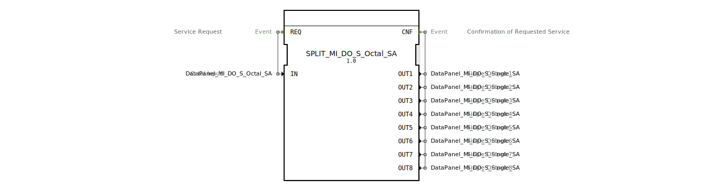

# SPLIT_MI_DO_S_Octal_SA

* * * * * * * * * *
## Einleitung
Der Funktionsblock **SPLIT_MI_DO_S_Octal_SA** dient dazu, einen einzelnen Datenwert vom Typ `DataPanel_MI_DO_S_Octal_SA` in acht separate Ausgänge vom Typ `DataPanel_MI_DO_S_Single_SA` aufzuteilen. Dabei wird der gemeinsame Anteil (`u8SAMember`) unverändert übernommen und die jeweiligen Port‑Informationen aus dem oktalen Eingang auf die einzelnen Ausgänge verteilt.

## Schnittstellenstruktur
### **Ereignis-Eingänge**

| Ereignis | Kommentar |
|----------|-----------|
| `REQ`    | Service‑Anforderung; die Verarbeitung wird gestartet, sobald das Ereignis eintritt. Der Benutzer muss den Daten‑Eingang `IN` vorher gültig setzen. |

### **Ereignis-Ausgänge**

| Ereignis | Kommentar |
|----------|-----------|
| `CNF`    | Bestätigung der abgeschlossenen Verarbeitung. Signalisiert, dass alle acht Ausgänge aktualisiert wurden. |

### **Daten-Eingänge**

| Name | Typ                              | Kommentar                          |
|------|----------------------------------|------------------------------------|
| `IN` | `DataPanel_MI_DO_S_Octal_SA`     | Oktaler Eingabewert (Port 1…8 und gemeinsamer `u8SAMember`) |

### **Daten-Ausgänge**

| Name | Typ                               | Kommentar                |
|------|-----------------------------------|--------------------------|
| `OUT1` | `DataPanel_MI_DO_S_Single_SA`   | Einzelausgang 1          |
| `OUT2` | `DataPanel_MI_DO_S_Single_SA`   | Einzelausgang 2          |
| `OUT3` | `DataPanel_MI_DO_S_Single_SA`   | Einzelausgang 3          |
| `OUT4` | `DataPanel_MI_DO_S_Single_SA`   | Einzelausgang 4          |
| `OUT5` | `DataPanel_MI_DO_S_Single_SA`   | Einzelausgang 5          |
| `OUT6` | `DataPanel_MI_DO_S_Single_SA`   | Einzelausgang 6          |
| `OUT7` | `DataPanel_MI_DO_S_Single_SA`   | Einzelausgang 7          |
| `OUT8` | `DataPanel_MI_DO_S_Single_SA`   | Einzelausgang 8          |

### **Adapter**
Keine Adapter vorhanden.

## Funktionsweise
Der Baustein implementiert einen einfachen, ereignisgesteuerten Ablauf:
1. Ein eingehendes `REQ`-Ereignis löst die Ausführung des Algorithmus `REQ` aus.
2. Der Algorithmus kopiert das Feld `u8SAMember` aus dem Eingang `IN` in jeden der acht Ausgänge (`OUT1` … `OUT8`).
3. Jeder Ausgang erhält zusätzlich den zugehörigen Port-Wert aus dem oktalen Eingang:  
   - `OUT1.Port := IN.Port1`  
   - `OUT2.Port := IN.Port2`  
   - …  
   - `OUT8.Port := IN.Port8`
4. Nach Abschluss wird das Ereignis `CNF` gesendet, das alle acht Ausgänge als gültig kennzeichnet.

## Technische Besonderheiten
- Der Baustein ist als **SimpleFB** (einfacher Funktionsblock) realisiert und arbeitet ohne Zustandsmaschine mit mehreren Zuständen – die Verarbeitung erfolgt in einem Schritt.
- Es gibt keine Nebenläufigkeit oder zeitkritische Abläufe; die Aufteilung erfolgt synchron zum `REQ`-Ereignis.
- Die Typen `DataPanel_MI_DO_S_Octal_SA` und `DataPanel_MI_DO_S_Single_SA` müssen im gleichen Daten‑Namespace (hier `DataPanel::io::MI::DQ`) definiert sein.

## Zustandsübersicht
Der Baustein besitzt genau einen Zustand `REQ`:
- **Eintritt** durch `REQ`-Ereignis.
- **Aktion**: Ausführen des Algorithmus `REQ`.
- **Ausgang**: Senden des `CNF`-Ereignisses (alle Ausgänge werden gleichzeitig mitgeführt).

Es gibt keine weiteren Zustände, die auf Verzögerung oder Fehlerbehandlung hinweisen.

## Anwendungsszenarien
- Aufteilung eines oktalen Daten‑Busses (z.B. eines Moduls mit acht gleichartigen digitalen Ausgängen) in einzelne logische Kanäle.
- Schnittstelle zwischen einem oktalen Sensor‑/Aktor‑Panel und einer Steuerung, die einzelne Ausgänge separat verarbeitet.
- Vorverarbeitung in der Automatisierungstechnik, wenn ein Datenpaket mehrere Ports enthält, die getrennt weitergereicht werden sollen.

## Vergleich mit ähnlichen Bausteinen
Vergleichbare Bausteine existieren für andere Datenstrukturen (z.B. `SPLIT_MI_DO_S_Octal_SA` für spezifische Panel‑Typen). Der grundlegende Mechanismus – Aufteilen eines Verbunddatentyps in seine Bestandteile – ist universell, unterscheidet sich jedoch je nach Datenfeld‑Namen und Typ.

## Fazit
Der `SPLIT_MI_DO_S_Octal_SA` ist ein kompakter und klar strukturierter Funktionsblock zur Zerlegung eines oktalen Daten‑Pakets in acht Einzelsignale. Er erleichtert die Modularisierung von Automatisierungssoftware, indem er komplexe Datentypen in handhabbare Einheiten aufteilt und die Port‑Zuweisung direkt aus der Quellstruktur übernimmt.