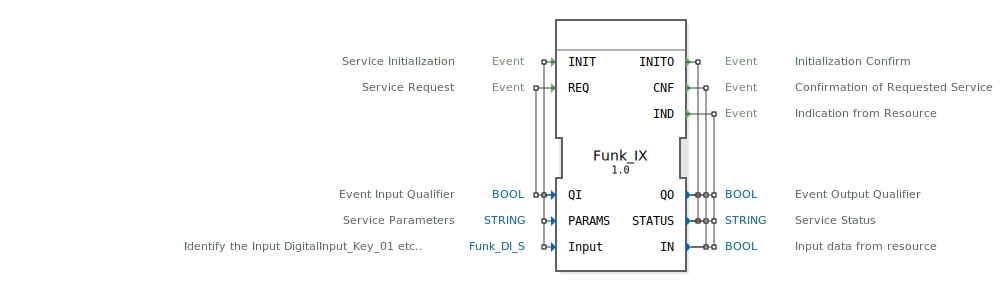

# Funk_IX

```{index} single: Funk_IX
```


* * * * * * * * * *

## Einleitung
Der Funk_IX ist ein Service Interface Function Block für boolesche Eingabedaten. Er dient als Schnittstelle zur Kommunikation mit digitalen Eingängen in verteilten Automatisierungssystemen und ermöglicht die Initialisierung, Abfrage und asynchrone Benachrichtigung von Eingangssignalen.



## Schnittstellenstruktur

### **Ereignis-Eingänge**
- **INIT**: Service Initialisierung
  - Verknüpft mit: QI, PARAMS, Input
- **REQ**: Service Request
  - Verknüpft mit: QI

### **Ereignis-Ausgänge**
- **INITO**: Initialisierungsbestätigung
  - Verknüpft mit: QO, STATUS
- **CNF**: Bestätigung des angeforderten Services
  - Verknüpft mit: QO, STATUS, IN
- **IND**: Indikation von der Ressource
  - Verknüpft mit: QO, STATUS, IN

### **Daten-Eingänge**
- **QI**: Event Input Qualifier (BOOL) - Qualifizierer für Ereigniseingänge
- **PARAMS**: Service Parameters (STRING) - Serviceparameter
- **Input**: Identifiziert den Eingang (Funk::io::DI::Funk_DI_S) - Identifiziert den digitalen Eingang (z.B. DigitalInput_Key_01)

### **Daten-Ausgänge**
- **QO**: Event Output Qualifier (BOOL) - Qualifizierer für Ereignisausgänge
- **STATUS**: Service Status (STRING) - Servicestatus
- **IN**: Input data from resource (BOOL) - Eingangsdaten von der Ressource

### **Adapter**
Keine Adapter-Schnittstellen vorhanden.

## Funktionsweise
Der Funk_IX Function Block implementiert ein Service Interface Pattern für digitale Eingänge. Bei der Initialisierung (INIT-Event) werden die Service-Parameter konfiguriert und der spezifische digitale Eingang identifiziert. Über das REQ-Event können Eingangswerte abgefragt werden, was zu einer CNF-Antwort mit dem aktuellen Eingangswert führt. Zusätzlich unterstützt der Baustein asynchrone IND-Ereignisse, die bei Zustandsänderungen des Eingangssignals ausgelöst werden.

## Technische Besonderheiten
- Verwendet den speziellen Datentyp `Funk::io::DI::Funk_DI_S` zur Identifikation digitaler Eingänge
- Initialwert für Input ist auf "Invalid" gesetzt
- Unterstützt sowohl synchrone Abfragen (REQ/CNF) als auch asynchrone Benachrichtigungen (IND)
- Enthält umfangreiche Statusrückmeldungen über den STATUS-Ausgang

## Zustandsübersicht
Der Function Block durchläuft folgende Zustände:
1. **Nicht initialisiert**: Vor INIT-Event
2. **Initialisiert**: Nach erfolgreicher INIT/INITO-Sequenz
3. **Abfragebereit**: Bereit für REQ/CNF-Zyklen
4. **Benachrichtigungsbereit**: Bereit für asynchrone IND-Ereignisse

## Anwendungsszenarien
- Überwachung von digitalen Sensoren und Schaltern
- Integration in verteilte Steuerungssysteme
- Anbindung von Feldgeräten in Industrieautomation
- Zustandsüberwachung von Maschinen und Anlagen

## Vergleich mit ähnlichen Bausteinen
Im Vergleich zu einfachen digitalen Eingangsbausteinen bietet Funk_IX erweiterte Service-Funktionalität mit Parametrierbarkeit, Statusrückmeldungen und asynchronen Benachrichtigungen. Die spezielle Eingangsidentifikation ermöglicht eine präzise Adressierung in komplexen Systemen.


## Zugehörige Übungen

* [Uebung_003b2_sub](../../../../../training1/Ventilsteuerung/4diacIDE-workspace/test_B/Uebungen_doc/Uebung_003b2_sub.md)

## Fazit
Der Funk_IX Function Block stellt eine leistungsfähige und flexible Lösung für die Integration digitaler Eingänge in 4diac-basierte Automatisierungssysteme dar. Seine Service-orientierte Architektur mit Initialisierungs-, Abfrage- und Benachrichtigungsfunktionen macht ihn besonders geeignet für anspruchsvolle industrielle Anwendungen.