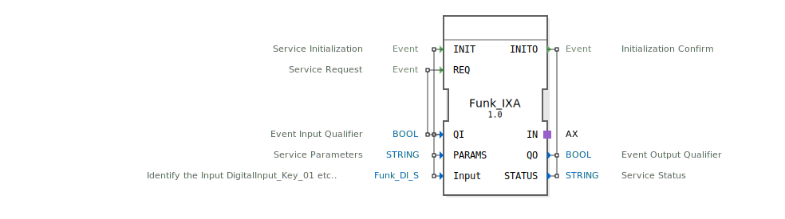

# Funk_IXA

```{index} single: Funk_IXA
```


* * * * * * * * * *

## Einleitung
Der Funktionsblock **Funk_IXA** ist ein Composite-Funktionsblock zur Verarbeitung von booleschen Eingangsdaten. Er dient als Schnittstelle für digitale Eingänge und ermöglicht die Initialisierung und Abfrage von Eingangssignalen über eine standardisierte Schnittstelle.



## Schnittstellenstruktur

### **Ereignis-Eingänge**
- **INIT**: Service-Initialisierung (mit QI, PARAMS, Input)
- **REQ**: Service-Anfrage (mit QI)

### **Ereignis-Ausgänge**
- **INITO**: Initialisierungsbestätigung (mit QO, STATUS)

### **Daten-Eingänge**
- **QI**: Ereignis-Eingangsqualifizierer (BOOL)
- **PARAMS**: Service-Parameter (STRING)
- **Input**: Identifizierung des digitalen Eingangs (Funk_DI_S, Initialwert: Invalid)

### **Daten-Ausgänge**
- **QO**: Ereignis-Ausgangsqualifizierer (BOOL)
- **STATUS**: Service-Status (STRING)

### **Adapter**
- **IN**: Unidirektionaler Adapter vom Typ AX

## Funktionsweise
Der Funk_IXA-Block fungiert als Wrapper für den zugrundeliegenden Funk_IX-Block. Bei der INIT-Initialisierung werden die Parameter QI, PARAMS und Input an den internen IX-Block weitergeleitet. Die REQ-Anfrage triggert die Abfrage des aktuellen Eingangszustands. Der Adapter IN ermöglicht die Kommunikation mit externen Systemen.

## Technische Besonderheiten
- Verwendet den spezifischen Datentyp Funk_DI_S zur Identifikation digitaler Eingänge
- Implementiert eine Invalid-Initialisierung für den Input-Parameter
- Unterstützt String-basierte Parameterübergabe für flexible Konfiguration
- Bietet Statusrückmeldungen über den STATUS-Ausgang

## Zustandsübersicht
Der Block durchläuft folgende Zustände:
1. **Nicht initialisiert**: Vor INIT-Aufruf
2. **Initialisiert**: Nach erfolgreicher INIT-Verarbeitung
3. **Bereit**: Kann REQ-Anfragen verarbeiten
4. **Aktiv**: Während der REQ-Verarbeitung

## Anwendungsszenarien
- Anbindung digitaler Eingänge in Automatisierungssystemen
- Integration in verteilte Steuerungssysteme
- Verwendung in landwirtschaftlichen Maschinensteuerungen
- Schnittstelle für Sensor-Datenerfassung

## ⚖️ Vergleich mit ähnlichen Bausteinen
Im Vergleich zu einfachen digitalen Eingangsblöcken bietet Funk_IXA:
- Erweiterte Parameterisierungsmöglichkeiten
- Statusrückmeldungen
- Adapter-Schnittstelle für erweiterte Kommunikation
- Typisierte Eingangsidentifikation


## 🛠️ Zugehörige Übungen

* [Uebung_003b2_sub_AX](../../../../../training1/Ventilsteuerung/4diacIDE-workspace/test_AX/Uebungen_doc/Uebung_003b2_sub_AX.md)
* [Uebung_003b3_sub_AX](../../../../../training1/Ventilsteuerung/4diacIDE-workspace/test_AX/Uebungen_doc/Uebung_003b3_sub_AX.md)

## Fazit
Der Funk_IXA-Funktionsblock stellt eine robuste und flexible Lösung für die Verarbeitung digitaler Eingangssignale dar. Durch seine Composite-Struktur und die Verwendung standardisierter Schnittstellen eignet er sich besonders für komplexe Automatisierungsanwendungen, die zuverlässige Datenerfassung und Statusüberwachung erfordern.