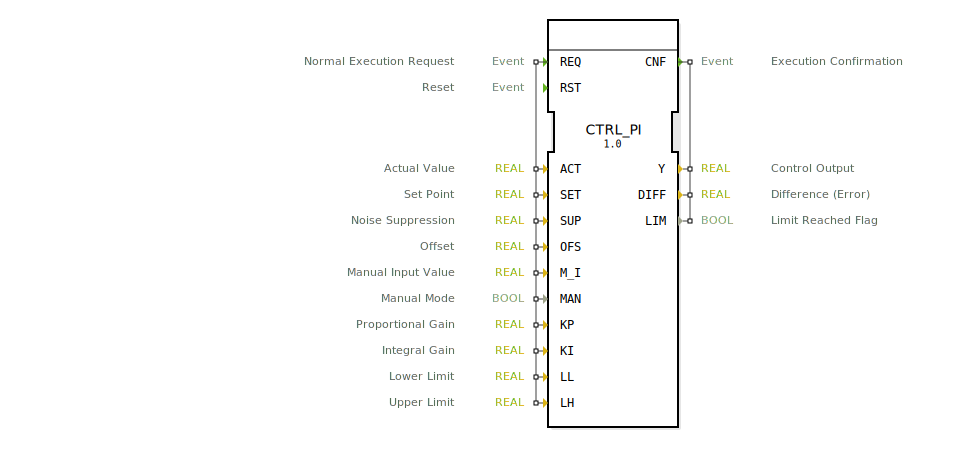

# CTRL_PI

```{index} single: CTRL_PI
```

FT_PI is a PI controller with manual functionality.

version 2.0	30. jun 2008
programmer 	hugo
tested by	oscat

FT_PI is a PI controller with manual functionality.
The PID controller works according to the fomula Y = e *(KP+ KI * INTEG(e) ) + offset, while e = set_point - actual.
a rst will reset all internal data, while a switch to manual will cause the controller to follow the function Y = manual_in + offset.
limit_h and Limit_l set the possible output range of Y.
the output flags lim will signal that the output limits are active and overflow will signal that the integrator has reached its limits.

since rev 1.1 the "trapezregel is used for more accuracy.
rev 1.2 added selective integratin which means the integrative component is only active within a small range of the target value
this avoids the integrator to go to limits while an input setpoint change happened and is only causing overshoots.
the int_band is by default 100 which means the int is active all the time and if set to for example to 0.1 the integrator is only active
while the input is between 0.9 and 1.1 of the set_point value.

default values for KP = 1, TN = 1, TV = 1, LIMIT_L = -1000, LIMIT_H = +1000.

## Interface

### Event Inputs

| Name | Comment | With |
| :--- | :--- | :--- |
| REQ | Normal Execution Request | ACT, SET, SUP, OFS, M_I, MAN, KP, KI, LL, LH |
| RST | Reset | |

### Event Outputs

| Name | Comment | With |
| :--- | :--- | :--- |
| CNF | Execution Confirmation | Y, DIFF, LIM |

### Input Vars

| Name | Type | Initial Value | Comment |
| :--- | :--- | :--- | :--- |
| ACT | REAL | | Actual Value |
| SET | REAL | | Set Point |
| SUP | REAL | | Noise Suppression |
| OFS | REAL | | Offset |
| M_I | REAL | | Manual Input Value |
| MAN | BOOL | | Manual Mode |
| KP | REAL | 1.0 | Proportional Gain |
| KI | REAL | 1.0 | Integral Gain |
| LL | REAL | -1000.0 | Lower Limit |
| LH | REAL | 1000.0 | Upper Limit |

### Output Vars

| Name | Type | Comment |
| :--- | :--- | :--- |
| Y | REAL | Control Output |
| DIFF | REAL | Difference (Error) |
| LIM | BOOL | Limit Reached Flag |