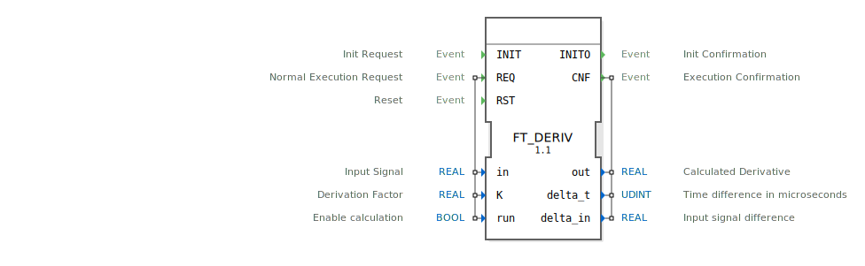

# FT_DERIV

```{index} single: FT_DERIV
```

Calculate derivative over signal 'in' with Factor 'K'

## Interface

### Event Inputs

| Name | Comment | With |
| :--- | :--- | :--- |
| INIT | Init Request | |
| REQ | Normal Execution Request | in, K, run |
| RST | Reset | |

### Event Outputs

| Name | Comment | With |
| :--- | :--- | :--- |
| INITO | Init Confirmation | |
| CNF | Execution Confirmation | out, delta_t, delta_in |

### Input Vars

| Name | Type | Initial Value | Comment |
| :--- | :--- | :--- | :--- |
| in | REAL | | Input Signal |
| K | REAL | 1.0 | Derivation Factor |
| run | BOOL | 1 | Enable calculation |

### Output Vars

| Name | Type | Comment |
| :--- | :--- | :--- |
| out | REAL | Calculated Derivative |
| delta_t | UDINT | Time difference in microseconds |
| delta_in | REAL | Input signal difference |


## Zugehörige Übungen

* [Uebung_151](../../../../../../../training1/Ventilsteuerung/4diacIDE-workspace/test_B/Uebungen_doc/Uebung_151.md)
* [Uebung_151_AX](../../../../../../../training1/Ventilsteuerung/4diacIDE-workspace/test_AX/Uebungen_doc/Uebung_151_AX.md)

