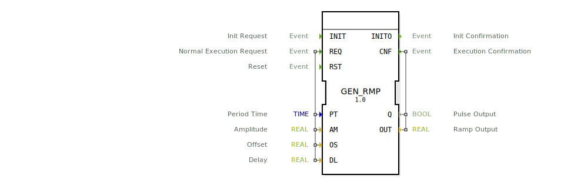

# GEN_RMP

```{index} single: GEN_RMP
```

this signal generator generates a ramp wave output

this signal generator generates a ramp wave output. The ramp wave signal is defined by period time (PT),
amplitude (AM), offset (OS) and a specific delay for the output signal (DL).
The Output waveform will have its minimum peak at OS and its maximum peak at AM + OS.
The delay input can delay a signal up to PT, this can be useful to synchronize different generators
and generate interleaving signals.
in addition to the analog output Out there is a second boolean output Q with is true for one cycle when the ramp starts.

## Interface

### Event Inputs

| Name | Comment | With |
| :--- | :--- | :--- |
| INIT | Init Request | |
| REQ | Normal Execution Request | PT, AM, OS, DL |
| RST | Reset | |

### Event Outputs

| Name | Comment | With |
| :--- | :--- | :--- |
| INITO | Init Confirmation | |
| CNF | Execution Confirmation | Q, OUT |

### Input Vars

| Name | Type | Initial Value | Comment |
| :--- | :--- | :--- | :--- |
| PT | TIME | T#1s | Period Time |
| AM | REAL | 1.0 | Amplitude |
| OS | REAL | | Offset |
| DL | REAL | | Delay |

### Output Vars

| Name | Type | Comment |
| :--- | :--- | :--- |
| Q | BOOL | Pulse Output |
| OUT | REAL | Ramp Output |