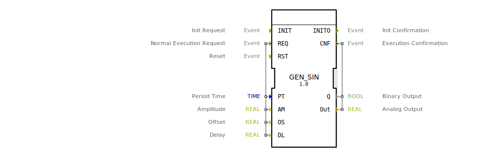

# GEN_SIN

```{index} single: GEN_SIN
```

this signal generator generates a sine wave output

this signal generator generates a sine wave output. The sine wave signal is defined by period time (PT),
amplitude (AM), offset (OS) and a specific delay for the output signal (DL).
The Output waveform will have its max peak at AM/2 + OS and its minimum peak at -AM/2 + OS.
The delay input can delay a signal up to PT, this can be useful to synchronize different generators
and generate interleaving signals. A Cos wave can be generated accordingly.
in addition to a analog output Out there is a second boolean output Q with the corresponding binary signal.

## Interface

### Event Inputs

| Name | Comment | With |
| :--- | :--- | :--- |
| INIT | Init Request | |
| REQ | Normal Execution Request | PT, AM, OS, DL |
| RST | Reset | |

### Event Outputs

| Name | Comment | With |
| :--- | :--- | :--- |
| INITO | Init Confirmation | |
| CNF | Execution Confirmation | Q, Out |

### Input Vars

| Name | Type | Initial Value | Comment |
| :--- | :--- | :--- | :--- |
| PT | TIME | | Period Time |
| AM | REAL | 1.0 | Amplitude |
| OS | REAL | | Offset |
| DL | REAL | | Delay |

### Output Vars

| Name | Type | Comment |
| :--- | :--- | :--- |
| Q | BOOL | Binary Output |
| Out | REAL | Analog Output |


## Zugehörige Übungen

* [Uebung_126b2_sub](../../../../../../../training1/Ventilsteuerung/4diacIDE-workspace/test_B/Uebungen_doc/Uebung_126b2_sub.md)
* [Uebung_126b_sub](../../../../../../../training1/Ventilsteuerung/4diacIDE-workspace/test_B/Uebungen_doc/Uebung_126b_sub.md)

