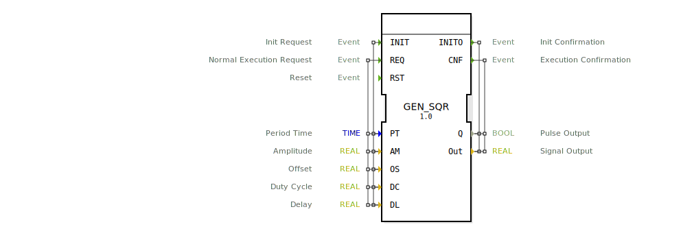

# GEN_SQR

```{index} single: GEN_SQR
```

this signal generator generates a square wave output

this signal generator generates a square wave output. The square wave signal is defined by period time (PT),
amplitude (AM), offset (OS), duty cycle (DC) and a specific delay for the output signal (DL).
The Output waveform will switch between AM/2 + OS and -AM/2 + OS. The DC input specifies ther duty cycle,
DC = 0 means output is low at all times and 1 means output is high at all times.
The delay input can delay a signal up to PT, this can be useful to synchronize different generators and generate interleaving signals.
in addition to a analog output Out there is a second boolean output Q.

## Interface

### Event Inputs

| Name | Comment | With |
| :--- | :--- | :--- |
| INIT | Init Request | PT, AM, OS, DC, DL |
| REQ | Normal Execution Request | PT, AM, OS, DC, DL |
| RST | Reset | |

### Event Outputs

| Name | Comment | With |
| :--- | :--- | :--- |
| INITO | Init Confirmation | Q, Out |
| CNF | Execution Confirmation | Q, Out |

### Input Vars

| Name | Type | Initial Value | Comment |
| :--- | :--- | :--- | :--- |
| PT | TIME | | Period Time |
| AM | REAL | 1.0 | Amplitude |
| OS | REAL | | Offset |
| DC | REAL | 0.5 | Duty Cycle |
| DL | REAL | | Delay |

### Output Vars

| Name | Type | Comment |
| :--- | :--- | :--- |
| Q | BOOL | Pulse Output |
| Out | REAL | Signal Output |