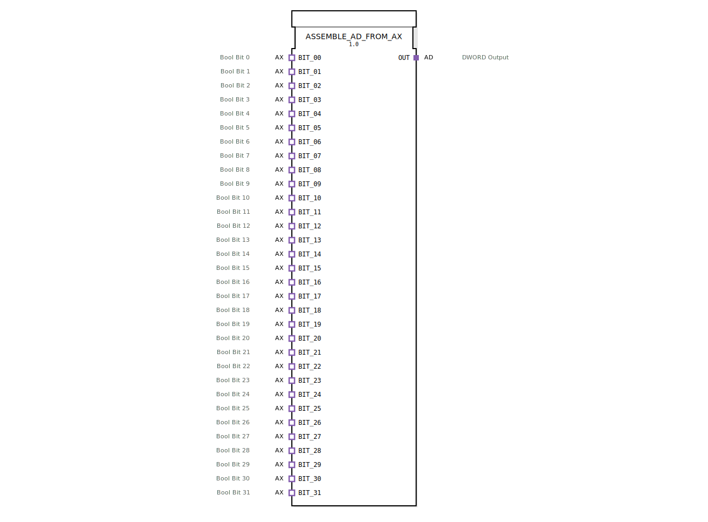

# ASSEMBLE_AD_FROM_AX

* * * * * * * * * *
## Einleitung
Der Funktionsblock **ASSEMBLE_AD_FROM_AX** dient dazu, bis zu 32 boolesche Einzelsignale, die über AX-Adapter (Typ: `adapter::types::unidirectional::AX`) bereitgestellt werden, zu einem 32-Bit-Doppelwort (DWORD) zusammenzufassen und über einen AD-Adapter (Typ: `adapter::types::unidirectional::AD`) auszugeben. Dies ermöglicht eine kompakte Übertragung mehrerer diskreter Binärsignale über eine einzige Datenverbindung.

## Schnittstellenstruktur
Der FB besitzt ausschließlich **Adapter-Schnittstellen** (Sockets und Plugs). Direkte Ereignis- oder Daten-Ein-/Ausgänge auf der obersten Ebene sind nicht vorhanden.

### **Ereignis-Eingänge**
Keine expliziten Ereignis-Eingänge. Die Ereignisse werden implizit über die AX-Adapter empfangen:
- Jeder der 32 AX-Adapter (`BIT_00 … BIT_31`) stellt einen Ereignisausgang (`E1`) bereit, der bei einer Wertänderung des zugehörigen BOOL-Signals aktiviert wird.

### **Ereignis-Ausgänge**
Keine expliziten Ereignis-Ausgänge. Der AD-Ausgangsadapter (`OUT`) löst ein Ereignis (`E1`) aus, sobald das zusammengesetzte DWORD einen neuen Wert annimmt.

### **Daten-Eingänge**
Keine expliziten Daten-Eingänge. Die booleschen Eingangswerte werden über die Datenports (`D1`) der AX-Adapter bezogen:
- `BIT_00.D1` … `BIT_31.D1`: jeweils ein **BOOL** (Bit 0 … Bit 31 des resultierenden DWORDs).

### **Daten-Ausgänge**
Keine expliziten Daten-Ausgänge. Das zusammengesetzte DWORD wird über den Datenport (`D1`) des AD-Adapter ausgegeben:
- `OUT.D1`: **DWORD** (das aus den 32 BOOL-Eingängen zusammengesetzte 32-Bit-Wort).

### **Adapter**

| Typ | Name | Richtung | Beschreibung |
|-----|------|----------|--------------|
| `adapter::types::unidirectional::AX` | `BIT_00` … `BIT_31` | Socket (Eingang) | 32 boolesche Einzelsignale, jeweils mit eigenem Ereignis (Datenänderung) |
| `adapter::types::unidirectional::AD` | `OUT` | Plug (Ausgang) | Ausgabe des zusammengesetzten Doppelworts mit Aktualisierungsereignis |

## Funktionsweise
1. **Ereignisempfang**: Sobald einer der 32 AX-Adapter eine Änderung seines booleschen Werts meldet (Ereignis `E1`), wird das Ereignis an den internen Baustein `ASSEMBLE_DWORD_FROM_BOOLS.REQ` weitergeleitet.
2. **Datenzusammenstellung**: Der interne Baustein `ASSEMBLE_DWORD_FROM_BOOLS` kombiniert alle 32 BOOL-Werte (von `BIT_00.D1` bis `BIT_31.D1`) zu einem einzigen DWORD. Bit 0 entspricht `BIT_00`, Bit 1 `BIT_01` usw.
3. **Speicherung und Ausgabe**: Das resultierende DWORD wird an den nächsten internen Baustein `E_D_FF_ANY` übergeben. Dieses flankengesteuerte Flipflop speichert den Wert und gibt ihn an seinem Ausgang `Q` aus. Gleichzeitig erzeugt es ein Ereignis (`EO`), das über den AD-Adapter (`OUT.E1`) nach außen signalisiert wird, dass ein neuer DWORD-Wert vorliegt.
4. **Pufferung**: Durch das Flipflop wird sichergestellt, dass der Ausgangswert nur bei tatsächlichen Änderungen aktualisiert wird und nicht bei jedem einzelnen Bit-Ereignis mehrmals hintereinander den gleichen Wert ausgibt.

## Technische Besonderheiten
- **Adapter-basierte Schnittstelle**: Der FB nutzt ausschließlich Adapter (AX, AD) und keine direkten Ein-/Ausgangspins. Dies erlaubt eine flexible Kopplung mit anderen Adaptern in einer serviceorientierten Architektur.
- **Ereignis-Synchronisation**: Der integrierte `E_D_FF_ANY` (E-D-Flipflop mit beliebiger Flanke) fungiert als Entprell- und Synchronisationsstufe. Er verhindert, dass bei gleichzeitiger Änderung mehrerer Bits mehrere Ausgabeereignisse generiert werden – der Ausgang wird nur einmal pro Änderungszyklus aktualisiert.
- **Bit-Reihenfolge**: Bit 0 (LSB) entspricht Adapter `BIT_00`, Bit 31 (MSB) entspricht Adapter `BIT_31`. Eine einheitliche Zuordnung ist bei der Verschaltung zu beachten.
- **Typ-Hash**: Der FB enthält ein Attribut `eclipse4diac::core::TypeHash`, das zur Validierung der Bausteindefinition dient.

## Zustandsübersicht
Der FB selbst besitzt keinen expliziten Zustandsautomaten. Das interne `E_D_FF_ANY` realisiert einen einfachen Speicherzustand:
- **Zustand 0**: Flipflop-Ausgang `Q` enthält den zuletzt geladenen DWORD-Wert.
- **Zustandsübergang**: Bei einem Ereignis von `ASSEMBLE_DWORD_FROM_BOOLS.CNF` wird der neue DWORD-Wert in das Flipflop übernommen und der Ausgang aktualisiert.

## Anwendungsszenarien
- **Zusammenfassen digitaler Eingänge**: In einer Steuerung werden 32 diskrete Sensoren (z. B. Endschalter, Lichtschranken) über AX-Adapter eingelesen. Der FB fasst deren Zustände in einem DWORD zusammen, das über einen Feldbus oder eine andere Schnittstelle als kompaktes Datenwort übertragen werden kann.
- **Parallel-Seriell-Wandlung**: Vorbereitung von parallelen Binärdaten für eine serielle Übertragung, bei der das DWORD als einzelnes Telegramm gesendet wird.
- **Statusabfrage**: Ein zentraler FB fragt regelmäßig den Ausgangsadapter ab und erhält den aktuellen Gesamtstatus aller 32 Binärstellen auf einmal.

## Vergleich mit ähnlichen Bausteinen
- **ASSEMBLE_DWORD_FROM_BOOLS**: Dieser Baustein hat direkte BOOL-Eingänge und einen DWORD-Ausgang, aber keine Adapter-Schnittstelle. `ASSEMBLE_AD_FROM_AX` kapselt diese Logik in eine Adapter-basierte Komponente und fügt eine Flipflop-Speicherung hinzu.
- **AD_TO_AX_SPLITTER**: Der umgekehrte Vorgang – Zerlegung eines DWORDs in einzelne BOOL-Signale – wird durch einen entsprechenden Splitter-Baustein ermöglicht.
- **Direkte Bit-Manipulation**: In manchen Umgebungen könnte man die Bits auch über logische Verknüpfungen zusammensetzen. Der hier beschriebene FB bietet jedoch eine standardisierte, wiederverwendbare und ereignisgesteuerte Lösung.

## Fazit
Der `ASSEMBLE_AD_FROM_AX` ist ein nützlicher Baustein, um eine Vielzahl binärer Signale effizient in ein Datenwort zu bündeln. Die Verwendung von Adaptern erlaubt eine lose Kopplung und erleichtert die Integration in serviceorientierte Automatisierungsarchitekturen. Die integrierte Flipflop-Synchronisation vermeidet unnötige Ausgabeereignisse und sorgt für einen stabilen, aktualisierten Gesamtwert. Durch seine klare Struktur eignet er sich besonders für Anwendungen, in denen viele diskrete Signale zentral erfasst und weiterverarbeitet werden müssen.