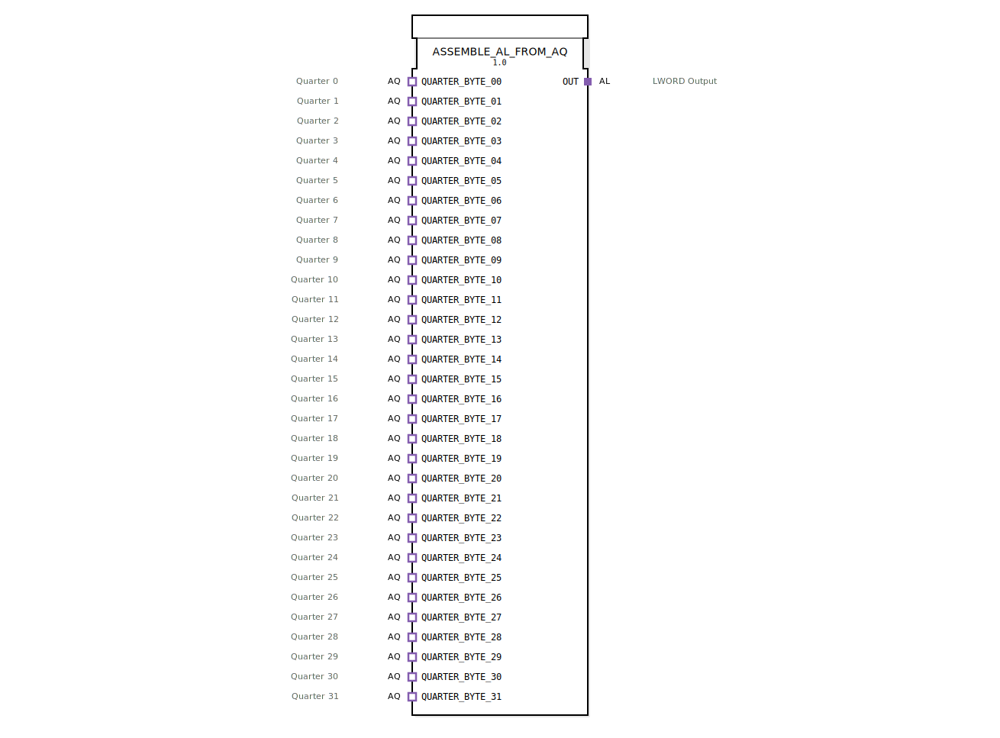

# ASSEMBLE_AL_FROM_AQ

* * * * * * * * * *
## Einleitung

Der Funktionsblock `ASSEMBLE_AL_FROM_AQ` dient dazu, 32 unidirektionale AQ‑Adapater („Quarter“) zu einem einzelnen AL‑Adapater (LWORD) zusammenzufassen.  
Er ist als reiner Kompositionsbaustein ohne eigene Ereignis- oder Datenports auf der obersten Ebene realisiert und nutzt interne Sub‑Funktionsblöcke, um die eingehenden Quarter‑Daten zu einem 64‑Bit‑Wort zu kombinieren und ausgangsseitig zu stabilisieren.

## Schnittstellenstruktur

### **Ereignis‑Eingänge**

Der Baustein besitzt auf seiner obersten Ebene **keine** eigenen Ereignis‑Eingänge.  
Die Ereignissteuerung erfolgt ausschließlich über die integrierten AQ‑Adapater (Sockets) und die interne Verschaltung.

### **Ereignis‑Ausgänge**

Es sind **keine** ereignisausgangsseitigen Ports vorhanden.  
Das Ausgangssignal wird über den AL‑Plug‑Adapater (E1) ereignisgesteuert nach außen gegeben.

### **Daten‑Eingänge**

Es existieren **keine** direkt zugänglichen Daten‑Eingänge.  
Die Daten werden über die 32 AQ‑Adapater (Socket) in den Baustein eingebracht.

### **Daten‑Ausgänge**

Es existieren **keine** direkt zugänglichen Daten‑Ausgänge.  
Das zusammengesetzte LWORD wird über den AL‑Plug‑Adapater (D1) ausgegeben.

### **Adapter**

| Typ | Name | Richtung | Beschreibung |
|-----|------|----------|--------------|
| `adapter::types::unidirectional::AQ` | `QUARTER_BYTE_00` … `QUARTER_BYTE_31` | Socket (Eingang) | 32 gleichartige Adapter, die jeweils einen 2‑Bit‑Wert („Quarter“) bereitstellen. Jeder Socket verfügt über einen Ereignisausgang (E1) und einen Datenausgang (D1). |
| `adapter::types::unidirectional::AL` | `OUT` | Plug (Ausgang) | Ausgangsadapter, der ein 64‑Bit‑LWORD (D1) sowie ein zugehöriges Ereignis (E1) weitergibt. |

## Funktionsweise

1. **Datenaufnahme** – Jeder der 32 `QUARTER_BYTE_xx`‑Sockets liefert bei einem eingehenden Ereignis (E1) seinen Datenwert (D1).  
2. **Zusammenstellung** – Das Ereignis wird an den internen Sub‑Funktionsblock `ASSEMBLE_LWORD_FROM_QUARTERS` weitergeleitet (alle 32 Ereignisse sind mit demselben `REQ`‑Eingang verbunden). Gleichzeitig werden alle 32 Quarter‑Datenwerte an die entsprechenden Eingänge dieses Sub‑Blocks geführt.  
3. **Interne Verarbeitung** – `ASSEMBLE_LWORD_FROM_QUARTERS` kombiniert die 32 2‑Bit‑Quarter zu einem 64‑Bit‑LWORD. Sein Ausgangssignal wird anschließend über ein flankengesteuertes D‑Flip‑Flop (`E_D_FF_ANY`) geleitet.  
4. **Ausgangsstabilisierung** – Das Flip‑Flop wird durch das Abschlussereignis (`CNF`) von `ASSEMBLE_LWORD_FROM_QUARTERS` getaktet. Es hält den kombinierten Wert so lange, bis ein neuer Zusammenstellungszyklus abgeschlossen ist. Der Ausgang des Flip‑Flops speist den Datenport `OUT.D1` des AL‑Plug‑Adapters, und das zugehörige Ereignis `OUT.E1` wird nach dem Takt ausgelöst.

## Technische Besonderheiten

* **Reine Adapter‑Komposition** – Der Baustein hat auf der obersten Ebene keine herkömmlichen Ein‑/Ausgangsports, sondern nutzt ausschließlich Adapter. Dies ermöglicht eine modulare Kapselung und einfache Wiederverwendung in verschiedenen Kontexten.  
* **Interne Datenaggregation** – Die 32 Quarter‑Werte (je 2 Bit) werden zu einem 64‑Bit‑LWORD zusammengefügt. Das entspricht der vollständigen Ausnutzung der LWORD‑Kapazität.  
* **Flankengesteuerte Ausgangssynchronisation** – Das D‑Flip‑Flop verhindert Flackern oder unvollständige Datenwörter am Ausgang, indem es den Wert erst nach Abschluss der Zusammenstellung und mit steigender Taktflanke weitergibt.  
* **Keine eigene Zustandslogik** – Der Baustein enthält keinen ECC (Execution Control Chart); die Logik ergibt sich vollständig aus der Verschaltung der Sub‑Blöcke.

## Zustandsübersicht

Der Baustein besitzt keinen eigenen Zustandsautomaten.  
Die Zustandslogik wird durch die internen Blöcke `ASSEMBLE_LWORD_FROM_QUARTERS` (datengesteuert) und `E_D_FF_ANY` (ereignisgesteuert) implementiert.

## Anwendungsszenarien

* **Zusammenführung von Bit‑Teilwörtern** – In der industriellen Steuerungstechnik müssen häufig Daten aus mehreren Sensoren oder Subsystemen (z. B. 32 Schaltzustände, die jeweils 2 Bit codieren) zu einem zusammenhängenden Datenwort vereint werden.  
* **Abfrage paralleler Datenquellen** – Wenn 32 unabhängige Module jeweils ein 2‑Bit‑Signal über Adapter liefern, kann `ASSEMBLE_AL_FROM_AQ` diese in einem Schritt zu einem 64‑Bit‑Wort zusammenfassen und ereignisgesteuert bereitstellen.  
* **Plattform‑unabhängige Adapter‑Schnittstellen** – Dank der reinen Adapternutzung eignet sich der Baustein für den Einsatz in heterogenen Systemen, bei denen die Datentypen durch die Adapterdefinitionen abstrahiert werden.

## Vergleich mit ähnlichen Bausteinen

| Baustein | Funktionsprinzip | Anzahl Eingänge | Ausgangstyp | Besonderheit |
|----------|------------------|----------------|-------------|--------------|
| `ASSEMBLE_AL_FROM_AQ` | Adapter‑basierte Zusammenstellung | 32 × 2‑Bit (AQ) | 1 × LWORD (AL) | Flankengesteuerte Ausgabe, reine Komposition |
| `ASSEMBLE_LWORD_FROM_QUARTERS` (intern) | Daten‑orientierte Kombination | 32 × 2‑Bit (direkt) | LWORD (Daten) | Keine Adapter, kein Flip‑Flop |
| Klassischer Multiplexer (z. B. MUX) | Auswahl eines Eingangs über Steuerleitung | n Eingänge, 1 Auswahl | Einfacher Datentyp | Erfordert dezidierte Adresssignale |

`ASSEMBLE_AL_FROM_AQ` bietet im Vergleich zu einem Multiplexer den Vorteil, dass *alle* Quarter‑Werte parallel und ohne Selektionslogik zu einem vollständigen Wort kombiniert werden. Der zusätzliche Flip‑Flop sorgt für eine saubere, ereignisgesteuerte Ausgabe.

## Fazit

Der Funktionsblock `ASSEMBLE_AL_FROM_AQ` stellt eine elegante und modulare Lösung dar, um 32 2‑Bit‑Quarter‑Daten über Adapter zu einem 64‑Bit‑LWORD zusammenzusetzen. Die strikte Trennung von Daten‑ und Ereignispfaden sowie die interne Nutzung eines flankengesteuerten Flip‑Flops gewährleisten eine zuverlässige und deterministische Ausgangssignalbildung. Aufgrund seiner reinen Kompositionsstruktur eignet er sich besonders für den Einsatz in IEC‑61499‑Systemen, die auf adapterbasierte Schnittstellen setzen.