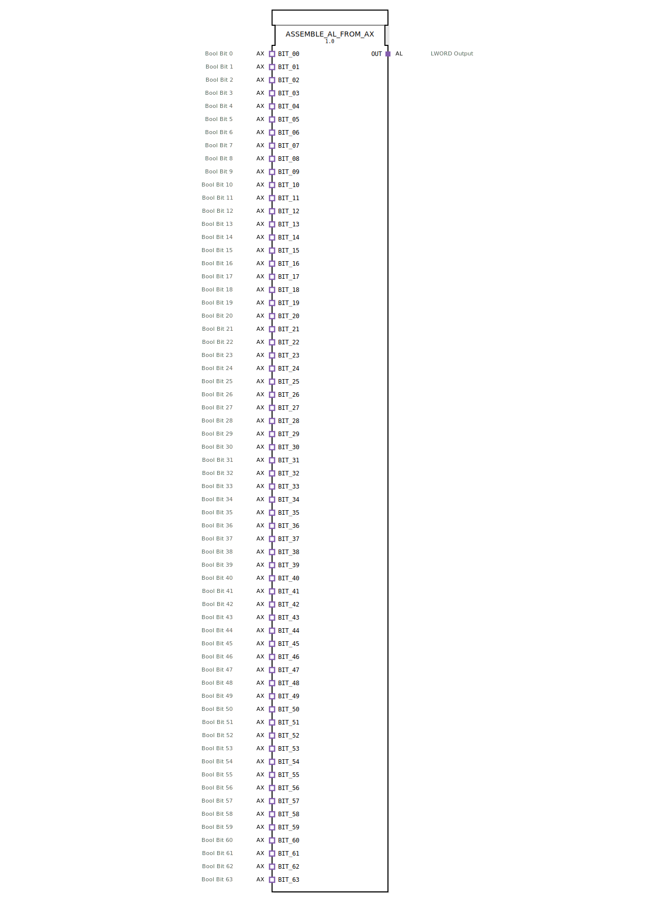

# ASSEMBLE_AL_FROM_AX

(Bild des FB wird hier in der IDE dargestellt – zeigt einen Funktionsblock mit 64 Sockets (links) und einem Plug (rechts))

* * * * * * * * * *

## Einleitung

Der Funktionsblock **ASSEMBLE_AL_FROM_AX** dient dazu, bis zu 64 boolesche Signale von **AX-Adaptern** (Typ: `adapter::types::unidirectional::AX`) zu einem einzigen **LWORD-Wert** zusammenzufassen und über einen **AL-Adapter** (Typ: `adapter::types::unidirectional::AL`) auszugeben. Der Baustein kapselt die Logik zur Bit-Kombination und stellt das Ergebnis stabil zur Verfügung, sobald eines der Eingangsbits ein Ereignis liefert.

## Schnittstellenstruktur

### **Ereignis-Eingänge**

Der FB besitzt keine klassischen Ereignis-Eingänge (EVENT). Die Ereignissteuerung erfolgt indirekt über die **AX-Adapter (Sockets)**. Jeder Socket `BIT_00` … `BIT_63` kann ein auslösendes Ereignis (E1) empfangen.

| Name | Typ | Beschreibung |
|------|-----|--------------|
| `BIT_00` … `BIT_63` | AX-Adapter | Ereignis von einem externen Bool-Quelle, das die Zusammenstellung des LWORD auslöst |

### **Ereignis-Ausgänge**

Keine klassischen Ereignis-Ausgänge. Die Ausgabe des zusammengesetzten LWORD erfolgt ereignisgesteuert über den **AL-Adapter (Plug)** `OUT`.

| Name | Typ | Beschreibung |
|------|-----|--------------|
| `OUT` | AL-Adapter | Stellt das zusammengesetzte LWORD bereit, wenn das interne Flip-Flop getaktet wurde |

### **Daten-Eingänge**

Jeder AX-Adapter führt einen booleschen Datenwert (D1). Diese werden als Eingangsbits für das LWORD verwendet.

| Name | Typ | Beschreibung |
|------|-----|--------------|
| `BIT_00.D1` … `BIT_63.D1` | BOOL (über Adapter) | Boolesches Signal für Bit 0 … Bit 63 |

### **Daten-Ausgänge**

Das zusammengesetzte Ergebnis wird als 64‑Bit‑Wort über den AL-Adapter ausgegeben.

| Name | Typ | Beschreibung |
|------|-----|--------------|
| `OUT.D1` | LWORD (über Adapter) | Kombiniertes LWORD aus den 64 booleschen Eingängen |

### **Adapter**

| Typ | Richtung | Name | Beschreibung |
|-----|----------|------|--------------|
| `adapter::types::unidirectional::AX` | Socket (Eingang) | `BIT_00` … `BIT_63` | Boolesche Eingangsadapter |
| `adapter::types::unidirectional::AL` | Plug (Ausgang) | `OUT` | LWORD-Ausgangsadapter |

## Funktionsweise

1. **Ereignisempfang**: Sobald ein Ereignis an einem der 64 AX-Adapter (Socket) eintrifft (an dessen E1), wird ein internes REQ-Ereignis an den Funktionsblock `ASSEMBLE_LWORD_FROM_BOOLS` gesendet.
2. **Bit‑Zusammenstellung**: Der interne FB `ASSEMBLE_LWORD_FROM_BOOLS` übernimmt die 64 booleschen Werte von den Datenanschlüssen `BIT_00.D1` … `BIT_63.D1` und setzt daraus einen LWORD-Wert zusammen. Jeder Eingang wird dabei einem entsprechenden Bit (0 für BIT_00, 1 für BIT_01, … 63 für BIT_63) zugeordnet.
3. **Zwischenspeicherung (Flip‑Flop)**: Das zusammengestellte LWORD wird an den Daten-Eingang eines **E_D_FF_ANY** (Flip‑Flop) übergeben. Das Ergebnis-Ereignis (CNF) von `ASSEMBLE_LWORD_FROM_BOOLS` taktet das Flip‑Flop. Dadurch wird der aktuelle LWORD-Wert am Ausgang Q des Flip‑Flops übernommen.
4. **Ausgabe**: Der gespeicherte Wert wird über den AL‑Plug `OUT` als LWORD bereitgestellt. Gleichzeitig wird ein Ereignis am Ausgang des Flip‑Flops (EO) erzeugt, das den angeschlossenen AL‑Adapter-Eingang (E1) auslöst.

Die Logik arbeitet **ereignisgesteuert**: Nur bei einer Änderung eines beliebigen Eingangsbits (über das Ereignis) wird der Ausgang aktualisiert. Dadurch wird Rechenleistung gespart und eine stabile Ausgabe gewährleistet.

## Technische Besonderheiten

- **Vollständige Bit‑Zuordnung**: Alle 64 Bits eines LWORD werden aus einzelnen booleschen Adaptern bezogen. Es werden genau 64 Sockets benötigt – keine Lücken.
- **Ereignis‑Synchronisation**: Ein Ereignis von *einem* beliebigen Bit‑Adapter löst die komplette Neuberechnung des LWORD aus. Es ist nicht nötig, alle Eingänge gleichzeitig zu aktualisieren.
- **Flip‑Flop‑Pufferung**: Der zusammengesetzte Wert wird zwischengespeichert, sodass der Ausgang auch dann stabil bleibt, wenn die Eingänge während der Verarbeitung schwanken.
- **Adapterbasierte Schnittstelle**: Die Ein‑ und Ausgänge sind als standardisierte 4diac‑Adapter realisiert, wodurch eine einfache Verkettung mit anderen Adapter‑basierten Bausteinen möglich ist.
- **Packages**: Der FB ist im Package `adapter::assembling` organisiert.

## Zustandsübersicht

Der FB besitzt keinen expliziten Zustandsautomaten. Die interne Logik arbeitet als Kombination von zwei Komponenten:

- **ASSEMBLE_LWORD_FROM_BOOLS**: Zustandslos – führt bei jedem REQ die Zusammenstellung aus.
- **E_D_FF_ANY**: Besitzt zwei Zustände: gespeicherter Wert (Q) und aktueller Daten‑Eingang (D). Der Zustand wechselt bei jeder positiven Flanke am CLK‑Eingang.

Ein ereignisgesteuertes Verhalten:
- **Warten auf Ereignis**: Keine Berechnung, Ausgang bleibt unverändert.
- **Ereignis eingetroffen**: Zusammenstellung + Takten des Flip‑Flops → Ausgang wird aktualisiert.

## Anwendungsszenarien

- **Parallel‑Digital‑Eingänge**: Zusammenfassen von 64 digitalen Sensoren oder Schaltern in ein maschinenlesbares LWORD für einfache Weiterverarbeitung.
- **Bit‑orientierte Steuerungen**: In Anwendungen, bei denen viele binäre Statusmeldungen (z. B. Fehlerbits, Positionsrückmeldungen) gebündelt werden müssen.
- **Kommunikation über Feldbus**: Ein LWORD kann effizient über Profinet, EtherCAT o. ä. übertragen werden; dieser FB wandelt die einzelnen Bits in das kompakte Datenformat um.
- **Adapter‑basierte Modul‑Bibliotheken**: In modularen Steuerungsarchitekturen, die auf standardisierten Adaptern aufbauen, kann dieser Baustein als universeller „Bit‑Sammler“ dienen.

## Vergleich mit ähnlichen Bausteinen

| Baustein | Anzahl Eingänge | Ausgangstyp | Besonderheit |
|----------|----------------|-------------|--------------|
| **ASSEMBLE_AL_FROM_AX** | 64 BOOL (AX) | LWORD (AL) | Adapter‑basiert mit Flip‑Flop‑Pufferung |
| `ASSEMBLE_DWORD_FROM_BOOLS` | 32 BOOL | DWORD | Klassische Daten‑Ein‑/Ausgänge, ohne Adapter |
| `ASSEMBLE_WORD_FROM_BOOLS` | 16 BOOL | WORD | Wie oben, für 16‑Bit‑Wort |
| `DISASSEMBLE_AL_TO_AX` | 1 LWORD (AL) | 64 AX | Gegenstück: Zerlegt ein LWORD in einzelne BOOL‑Adapter |

Der wesentliche Unterschied liegt in der **Adapter‑Schnittstelle** und der **Zwischenspeicherung** durch das Flip‑Flop, was für robustes Verhalten in ereignisgesteuerten Umgebungen sorgt.

## Fazit

Der Funktionsblock **ASSEMBLE_AL_FROM_AX** ist ein leistungsfähiges Werkzeug, um aus 64 dezentralen booleschen Signalen ein kompaktes 64‑Bit‑LWORD zu erzeugen. Durch die adapterbasierte Anbindung und die interne Flip‑Flop‑Pufferung eignet er sich besonders für saubere, ereignisgesteuerte und modulare Automatisierungslösungen. Die vollständige Abdeckung aller Bits ohne Skalierungsprobleme macht ihn zu einer universellen Lösung für Anwendungen, die viele digitale Eingänge bündeln müssen.