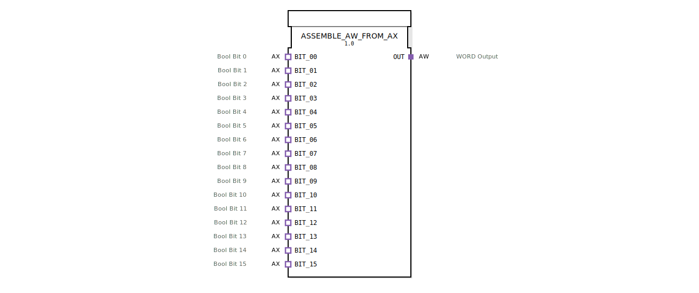

# ASSEMBLE_AW_FROM_AX

* * * * * * * * * *
## Einleitung
Der Funktionsblock `ASSEMBLE_AW_FROM_AX` fasst 16 boolesche Einzelsignale, die von separaten AX-Adaptern bereitgestellt werden, zu einem 16‑Bit‑Wort (WORD) zusammen und gibt dieses über einen AW-Adapter aus. Er ermöglicht die Konvertierung einer diskreten digitalen Signalgruppe in einen einheitlichen Datenwort‑Wert für die weitere Verarbeitung.

## Schnittstellenstruktur
### **Ereignis-Eingänge**
Keine direkten Ereignis-Eingänge. Die Ereignisse werden über die 16 AX-Adapter (Sockets) empfangen: Jeder AX‑Adapter löst bei einer Datenänderung ein Ereignis (`E1`) aus, das die Verarbeitung anstößt.

### **Ereignis-Ausgänge**
Keine direkten Ereignis-Ausgänge. Das zusammengesetzte Wort wird über den AW-Adapter (Plug) ausgegeben. Der Ausgangsadapter gibt den Datenwert frei, sobald er ein Ereignis (`E1`) vom internen Flip‑Flop erhält.

### **Daten-Eingänge**
Keine direkten Daten-Eingänge. Die 16 Einzelwerte (BOOL) werden über die AX-Adapter (Datenausgang `D1`) eingelesen.

### **Daten-Ausgänge**
Keine direkten Daten-Ausgänge. Das resultierende 16‑Bit‑Wort (WORD) wird über den AW-Adapter (Dateneingang `D1`) ausgegeben.

### **Adapter**
| Typ | Name | Beschreibung |
|------|------|--------------|
| **Socket (Eingang)** | `BIT_00` | AX-Adapter, Bool Bit 0 |
| **Socket (Eingang)** | `BIT_01` | AX-Adapter, Bool Bit 1 |
| **Socket (Eingang)** | `BIT_02` | AX-Adapter, Bool Bit 2 |
| **Socket (Eingang)** | `BIT_03` | AX-Adapter, Bool Bit 3 |
| **Socket (Eingang)** | `BIT_04` | AX-Adapter, Bool Bit 4 |
| **Socket (Eingang)** | `BIT_05` | AX-Adapter, Bool Bit 5 |
| **Socket (Eingang)** | `BIT_06` | AX-Adapter, Bool Bit 6 |
| **Socket (Eingang)** | `BIT_07` | AX-Adapter, Bool Bit 7 |
| **Socket (Eingang)** | `BIT_08` | AX-Adapter, Bool Bit 8 |
| **Socket (Eingang)** | `BIT_09` | AX-Adapter, Bool Bit 9 |
| **Socket (Eingang)** | `BIT_10` | AX-Adapter, Bool Bit 10 |
| **Socket (Eingang)** | `BIT_11` | AX-Adapter, Bool Bit 11 |
| **Socket (Eingang)** | `BIT_12` | AX-Adapter, Bool Bit 12 |
| **Socket (Eingang)** | `BIT_13` | AX-Adapter, Bool Bit 13 |
| **Socket (Eingang)** | `BIT_14` | AX-Adapter, Bool Bit 14 |
| **Socket (Eingang)** | `BIT_15` | AX-Adapter, Bool Bit 15 |
| **Plug (Ausgang)** | `OUT` | AW-Adapter, WORD Output |

## Funktionsweise
1. **Eingangssignalerfassung**: Jeder der 16 AX-Adapter (`BIT_00` bis `BIT_15`) stellt einen booleschen Wert über seinen Datenkanal (`D1`) bereit. Sobald sich der Wert eines dieser Adapter ändert, sendet dieser ein Ereignis über seinen Ausgang `E1`.
2. **Zusammenführung**: Die Ereignisse aller 16 Adapter werden auf den Eingang `REQ` eines internen Bausteins `ASSEMBLE_WORD_FROM_BOOLS` geführt. Dieser liest die aktuellen Bool-Werte aller 16 Kanäle ein und setzt sie zu einem 16‑Bit‑Wort (WORD) zusammen.
3. **Synchronisation**: Das fertige Wort wird an einen flankengesteuerten D‑Flip‑Flop (`E_D_FF_ANY`) übergeben. Der Flip‑Flop übernimmt den Wert an seinem D‑Eingang, sobald er ein Taktereignis (vom Ausgang `CNF` des Zusammenführungsbausteins) empfängt.
4. **Ausgabe**: Nach erfolgter Übernahme gibt der Flip‑Flop einen Takt an seinem Ausgang `EO` aus und legt das gespeicherte Wort an seinem Q‑Ausgang an. Dieses Ereignis triggert den AW‑Adapter `OUT`, der das WORD auf seinem Datenkanal (`D1`) zur Verfügung stellt.

## Technische Besonderheiten
- **Verwendung eines Flip‑Flops**: Die Ausgabe erfolgt nur nach einem vollständigen Zyklus der Zusammenführung. Dadurch werden inkonsistente oder flimmernde Daten vermieden – der Ausgang bleibt stabil, bis ein neues Ereignis eintrifft.
- **Kein Zustandsautomat**: Der Baustein ist rein ereignisgesteuert und besitzt keinen eigenen Ablaufzustand; das Verhalten wird durch die internen Bausteine `ASSEMBLE_WORD_FROM_BOOLS` und `E_D_FF_ANY` bestimmt.
- **Adapter‑Schnittstelle**: Sowohl die Eingänge als auch der Ausgang sind als Adapter realisiert. Dies ermöglicht eine flexible Wiederverwendung und Kapselung der Signaltypen.

## Zustandsübersicht
Der Funktionsblock enthält keinen expliziten Zustandsautomaten. Das interne D‑Flip‑Flop `E_D_FF_ANY` besitzt zwei Zustände (`Q = 0` oder `Q = 1`), die den aktuellen Datenwert speichern. Der Ausgang des Flip‑Flops wird nur bei einer positiven Flanke am Takteingang aktualisiert.

## Anwendungsszenarien
- **Bündelung diskreter Signale**: In der Automatisierungstechnik werden oft 16 einzelne digitale Sensoren oder Schalter (z. B. Endschalter, Taster) benötigt. Der Baustein fasst diese zu einem Wort zusammen, das über einen Feldbus oder als Eingang für eine übergeordnete Steuerung dient.
- **Datenvorbereitung für Kommunikation**: Vor der Übertragung über einen Netzwerkadapter (z. B. PROFINET, EtherCAT) müssen mehrere Binärsignale in einem Datenwort gepackt werden.
- **Signalregister**: Der Baustein kann als einfaches 16‑Bit‑Register verwendet werden, das den aktuellen Zustand aller Eingänge zwischenspeichert und nur bei Änderungen aktualisiert.

## Vergleich mit ähnlichen Bausteinen
- **Klassische Bool‑zu‑WORD‑Bausteine**: Standard‑Bausteine kombinieren oft Bool‑Eingänge direkt zu einem ganzzahligen Typ, jedoch ohne Adapter‑Schnittstelle. `ASSEMBLE_AW_FROM_AX` nutzt Adapter, was eine klar getrennte Signal- und Ereignisübertragung ermöglicht und die Wiederverwendung in modularen Architekturen vereinfacht.
- **Adapter‑basierte Alternativen**: Ähnliche Bausteine existieren für andere Wortgrößen (z. B. BYTE, DWORD) oder mit zusätzlicher Filtermöglichkeit. Der vorliegende Baustein beschränkt sich auf das Notwendigste und setzt auf einen Flip‑Flop‑Ausgang für saubere Synchronisation.

## Fazit
Der Funktionsblock `ASSEMBLE_AW_FROM_AX` bietet eine saubere, synchronisierte Möglichkeit, 16 boolesche Signale (über AX‑Adapter) zu einem 16‑Bit‑Wort (über AW‑Adapter) zusammenzuführen. Die Kombination aus Zusammenführungssbaustein und flankengesteuertem Flip‑Flop gewährleistet eine stabile Ausgabe und eignet sich besonders für den Einsatz in zeitkritischen oder signalverarbeitenden Umgebungen.