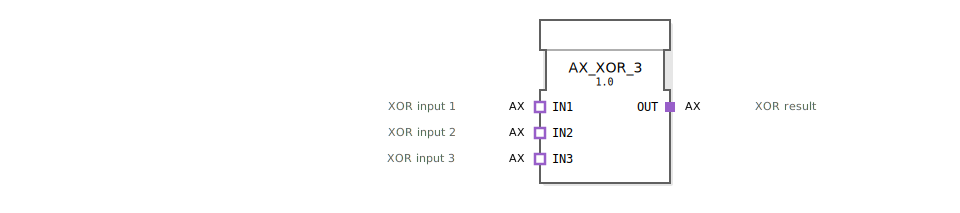

# AX_XOR_3

```{index} single: AX_XOR_3
```


* * * * * * * * * *

## Einleitung
Der AX_XOR_3 Funktionsblock ist ein generischer Baustein zur Berechnung der booleschen XOR-Verknüpfung mit drei Eingängen. Er implementiert die exklusive ODER-Operation für drei binäre Eingangssignale und gibt das entsprechende Ergebnis aus.



## Schnittstellenstruktur

### **Ereignis-Eingänge**
*Keine Ereignis-Eingänge vorhanden*

### **Ereignis-Ausgänge**
*Keine Ereignis-Ausgänge vorhanden*

### **Daten-Eingänge**
*Keine direkten Daten-Eingänge vorhanden*

### **Daten-Ausgänge**
*Keine direkten Daten-Ausgänge vorhanden*

### **Adapter**
**Sockets (Eingänge):**
- **IN1**: XOR-Eingang 1 (Adapter-Typ: unidirectional::AX)
- **IN2**: XOR-Eingang 2 (Adapter-Typ: unidirectional::AX)
- **IN3**: XOR-Eingang 3 (Adapter-Typ: unidirectional::AX)

**Plugs (Ausgänge):**
- **OUT**: XOR-Ergebnis (Adapter-Typ: unidirectional::AX)

## Funktionsweise
Der Funktionsblock berechnet die XOR-Verknüpfung für drei Eingangssignale. Die XOR-Operation gibt genau dann ein "wahr"-Signal (true) aus, wenn eine ungerade Anzahl der Eingänge "wahr" ist. Bei drei Eingängen bedeutet dies:
- Ergebnis ist true, wenn genau einer oder alle drei Eingänge true sind
- Ergebnis ist false, wenn keine oder genau zwei Eingänge true sind

## Technische Besonderheiten
- Generischer Funktionsblock mit der Klassennamen-Kennung 'GEN_AX_XOR'
- Verwendet unidirektionale Adapter für die Kommunikation
- Implementiert nach IEC 61499-2 Standard
- Keine internen Zustände oder Speicherung erforderlich

## Zustandsübersicht
Der Baustein besitzt keine internen Zustände und arbeitet statisch. Die Ausgabe wird ausschließlich auf Basis der aktuellen Eingangswerte berechnet.

## Anwendungsszenarien
- Schaltnetze mit drei Eingängen
- Paritätsprüfungen
- Sicherheitskritische Steuerungen, wo ungerade Aktivierung erforderlich ist
- Logische Verknüpfungen in Automatisierungssystemen

## Vergleich mit ähnlichen Bausteinen
Im Vergleich zu Standard-XOR-Bausteinen mit zwei Eingängen bietet AX_XOR_3 die Erweiterung auf drei Eingänge. Während ein 2-Eingang-XOR nur bei ungleichen Eingängen true liefert, berücksichtigt der 3-Eingang-XOR die Parität aller drei Signale.

Vergleich mit [XOR_3](../../../StandardLibraries/iec61131-3/bitwiseOperators/XOR_3.md)


## Zugehörige Übungen

* [Uebung_002a7_AX](../../../../training1/Ventilsteuerung/4diacIDE-workspace/test_AX/Uebungen_doc/Uebung_002a7_AX.md)

## Fazit
Der AX_XOR_3 Funktionsblock bietet eine zuverlässige und effiziente Lösung für dreifache XOR-Verknüpfungen in IEC 61499-basierten Steuerungssystemen. Durch die Verwendung von Adaptern ermöglicht er eine flexible Integration in verschiedene Systemarchitekturen und ist besonders für Anwendungen geeignet, die eine Paritätsprüfung oder spezielle logische Bedingungen mit drei Eingangssignalen erfordern.