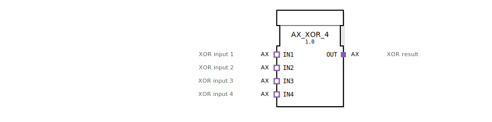

# AX_XOR_4

```{index} single: AX_XOR_4
```


* * * * * * * * * *

## Einleitung
Der AX_XOR_4 Funktionsblock ist ein generischer Baustein zur Berechnung der booleschen XOR-Verknüpfung mit vier Eingängen. Er implementiert die exklusive ODER-Operation für bis zu vier verschiedene Eingangssignale.



## Schnittstellenstruktur

### **Ereignis-Eingänge**
*Keine Ereignis-Eingänge vorhanden*

### **Ereignis-Ausgänge**
*Keine Ereignis-Ausgänge vorhanden*

### **Daten-Eingänge**
*Keine direkten Daten-Eingänge vorhanden*

### **Daten-Ausgänge**
*Keine direkten Daten-Ausgänge vorhanden*

### **Adapter**
**Plug-Adapter:**
- **OUT**: Unidirektionaler Adapter für das XOR-Ergebnis

**Socket-Adapter:**
- **IN1**: Unidirektionaler Adapter für XOR-Eingang 1
- **IN2**: Unidirektionaler Adapter für XOR-Eingang 2
- **IN3**: Unidirektionaler Adapter für XOR-Eingang 3
- **IN4**: Unidirektionaler Adapter für XOR-Eingang 4

## Funktionsweise
Der Funktionsblock berechnet die XOR-Verknüpfung über vier Eingänge. Die XOR-Operation liefert genau dann ein "wahr"-Signal, wenn eine ungerade Anzahl der Eingänge aktiv ist. Bei vier Eingängen bedeutet dies:
- Ergebnis = 1, wenn 1 oder 3 Eingänge aktiv sind
- Ergebnis = 0, wenn 0, 2 oder 4 Eingänge aktiv sind

Die Kommunikation erfolgt ausschließlich über die definierten Adapter-Schnittstellen.

## Technische Besonderheiten
- Generischer Funktionsblock mit der Klasse 'GEN_AX_XOR'
- Verwendet unidirektionale Adapter für alle Ein- und Ausgänge
- Keine direkten Ereignis- oder Datenschnittstellen
- Vollständige Adapter-basierte Architektur

## Zustandsübersicht
Da es sich um einen kombinatorischen Logikbaustein handelt, besitzt der AX_XOR_4 keine internen Zustände. Die Ausgabe wird ausschließlich von den aktuellen Eingangswerten bestimmt.

## Anwendungsszenarien
- Parity-Check in Steuerungssystemen
- Ungerade-Paritätsprüfung
- Sicherheitskritische Schaltungen mit Mehrfacheingängen
- Verteilte Logikoperationen in Automatisierungssystemen

## Vergleich mit ähnlichen Bausteinen
Im Vergleich zu Standard-XOR-Bausteinen bietet AX_XOR_4:
- Vier Eingänge statt der typischen zwei Eingänge
- Rein adapterbasierte Schnittstelle
- Spezialisierung auf unidirektionale AX-Adapter
- Keine Ereignissteuerung, sondern kontinuierliche Operation

Vergleich mit [XOR_4](../../../StandardLibraries/iec61131-3/bitwiseOperators/XOR_4.md)

## Fazit
Der AX_XOR_4 Funktionsblock stellt eine spezialisierte Lösung für XOR-Operationen mit vier Eingängen in adapterbasierten Systemarchitekturen dar. Seine rein adapterbasierte Schnittstelle macht ihn besonders geeignet für modulare Systemdesigns, bei denen die Kommunikation über standardisierte Adapter erfolgt.