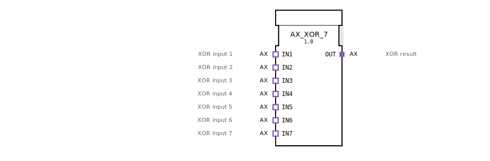

# AX_XOR_7

```{index} single: AX_XOR_7
```


* * * * * * * * * *

## Einleitung
Der AX_XOR_7 Funktionsblock ist ein generischer Baustein zur Berechnung der booleschen XOR-Verknüpfung mit sieben Eingängen. Er ermöglicht die Verarbeitung von bis zu sieben Eingangssignalen und gibt das Ergebnis der XOR-Operation aus.



## Schnittstellenstruktur

### **Ereignis-Eingänge**
Keine Ereigniseingänge vorhanden.

### **Ereignis-Ausgänge**
Keine Ereignisausgänge vorhanden.

### **Daten-Eingänge**
Keine direkten Dateneingänge vorhanden.

### **Daten-Ausgänge**
Keine direkten Datenausgänge vorhanden.

### **Adapter**
**Plug-Adapter:**
- `OUT` - XOR-Ergebnis (Adapter-Typ: `adapter::types::unidirectional::AX`)

**Socket-Adapter:**
- `IN1` - XOR-Eingang 1 (Adapter-Typ: `adapter::types::unidirectional::AX`)
- `IN2` - XOR-Eingang 2 (Adapter-Typ: `adapter::types::unidirectional::AX`)
- `IN3` - XOR-Eingang 3 (Adapter-Typ: `adapter::types::unidirectional::AX`)
- `IN4` - XOR-Eingang 4 (Adapter-Typ: `adapter::types::unidirectional::AX`)
- `IN5` - XOR-Eingang 5 (Adapter-Typ: `adapter::types::unidirectional::AX`)
- `IN6` - XOR-Eingang 6 (Adapter-Typ: `adapter::types::unidirectional::AX`)
- `IN7` - XOR-Eingang 7 (Adapter-Typ: `adapter::types::unidirectional::AX`)

## Funktionsweise
Der Funktionsblock berechnet die XOR-Verknüpfung über alle sieben Eingänge. Die XOR-Operation liefert genau dann ein "wahr"-Signal (TRUE), wenn eine ungerade Anzahl der Eingänge auf "wahr" gesetzt ist. Bei einer geraden Anzahl von "wahr"-Eingängen wird "falsch" (FALSE) ausgegeben.

## Technische Besonderheiten
- Generischer Funktionsblock mit der generischen Klassenbezeichnung `GEN_AX_XOR`
- Verwendet unidirektionale AX-Adapter für Ein- und Ausgänge
- Unterstützt genau sieben Eingänge für die XOR-Berechnung
- Implementiert als Adapter-basierte Lösung ohne direkte Ereignis- oder Datenschnittstellen

## Zustandsübersicht
Der Funktionsblock besitzt keinen internen Zustand und arbeitet stateless. Die Ausgabe wird ausschließlich auf Basis der aktuellen Eingangswerte berechnet.

## Anwendungsszenarien
- Paritätsprüfung in Datenübertragungssystemen
- Sicherheitskritische Steuerungen mit Mehrheitsentscheidung
- Fehlererkennung in binären Signalketten
- Logische Verknüpfungen in industriellen Automatisierungssystemen

## ⚖️ Vergleich mit ähnlichen Bausteinen
Im Vergleich zu Standard-XOR-Bausteinen mit weniger Eingängen bietet AX_XOR_7 die Möglichkeit, XOR-Operationen mit bis zu sieben Eingängen durchzuführen. Während einfache XOR-Blöcke typischerweise nur zwei Eingänge verarbeiten, ermöglicht dieser Baustein komplexere Verknüpfungslogiken in einem einzigen Block.

Vergleich mit [XOR_7](../../../StandardLibraries/iec61131-3/bitwiseOperators/XOR_7.md)

## Fazit
Der AX_XOR_7 Funktionsblock stellt eine effiziente Lösung für XOR-Operationen mit mehreren Eingängen dar. Durch die Adapter-basierte Architektur ermöglicht er eine flexible Integration in verschiedene Steuerungssysteme und eignet sich besonders für Anwendungen, die eine Prüfung auf ungerade Parität über mehrere Signale erfordern.