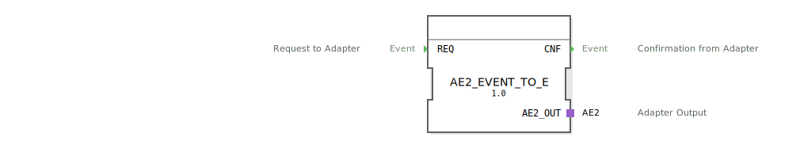

# AE2_EVENT_TO_E

```{index} single: AE2_EVENT_TO_E
```


* * * * * * * * * *

## Einleitung
Der Funktionsblock AE2_EVENT_TO_E ist ein Composite-Funktionsblock, der zur Konvertierung von EVENT-Signalen in das AE2-Adapterformat dient. Er ermöglicht die bidirektionale Kommunikation zwischen Standard-Ereignissen und dem spezifischen AE2-Adapter.



## Schnittstellenstruktur

### **Ereignis-Eingänge**
- **REQ** (Request to Adapter): Startet die Konvertierung und sendet eine Anfrage an den AE2-usgangsadapter

### **Ereignis-Ausgänge**
- **CNF** (Confirmation from Adapter): Bestätigt den erfolgreichen Abschluss der Konvertierung und den Empfang der Antwort vom AE2-Adapter

### **Daten-Eingänge**
Keine Daten-Eingänge vorhanden

### **Daten-Ausgänge**
Keine Daten-Ausgänge vorhanden

### **Adapter**
- **AE2_OUT** (Adapter Output): Bidirektionaler AE2-Ausgangsadapter für die Kommunikation mit AE2-kompatiblen Systemen

## Funktionsweise
Der Funktionsblock leitet eingehende REQ-Ereignisse direkt an den AE2_OUT-Adapter weiter (EO1-Port). Gleichzeitig werden eingehende Bestätigungen vom AE2-Adapter (EI1-Port) als CNF-Ereignis ausgegeben. Dies ermöglicht eine transparente Konvertierung zwischen dem Standard-EVENT-Format und dem spezifischen AE2-Adapterprotokoll.

## Technische Besonderheiten
- Implementiert als Composite-Funktionsblock
- Unterstützt bidirektionale Kommunikation
- Verwendet den AE2-Adaptertyp aus dem adapter::types::bidirectional-Paket
- Positionierte Adapter-Schnittstelle für optimierte Visualisierung

## Zustandsübersicht
Der Funktionsblock verfügt über einen einfachen Zustandsautomaten:
1. **Idle-Zustand**: Wartet auf REQ-Ereignis
2. **Request-Zustand**: Nach REQ-Eingabe, Sendung an AE2_OUT.EO1
3. **Confirmation-Zustand**: Nach Empfang von AE2_OUT.EI1, Ausgabe von CNF

## Anwendungsszenarien
- Integration von EVENT-basierten Systemen in AE2-kompatible Umgebungen
- Protokollkonvertierung in verteilten Automatisierungssystemen
- Bidirektionale Kommunikationsbrücken zwischen verschiedenen Automatisierungskomponenten
- Adapter-basierte Systemintegration

## Vergleich mit ähnlichen Bausteinen
Im Vergleich zu einfachen EVENT-Konvertern bietet AE2_EVENT_TO_E spezifische AE2-Adapterunterstützung mit bidirektionaler Kommunikation. Während Standard-Konverter oft nur unidirektional arbeiten, ermöglicht dieser Baustein vollständige Request-Response-Zyklen mit dem AE2-Protokoll.

## Fazit
Der AE2_EVENT_TO_E Funktionsblock stellt eine zuverlässige Lösung für die Konvertierung zwischen Standard-EVENT-Signalen und dem AE2-Adapterprotokoll dar. Seine bidirektionale Funktionalität und einfache Integration machen ihn besonders geeignet für Systeme, die eine nahtlose Kommunikation zwischen verschiedenen Protokollwelten erfordern.