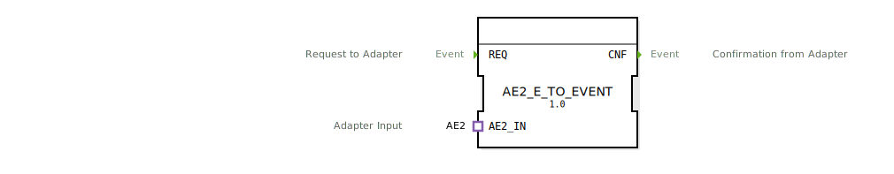

# AE2_E_TO_EVENT

```{index} single: AE2_E_TO_EVENT
```


* * * * * * * * * *
## Einleitung
Der Funktionsblock AE2_E_TO_EVENT ist ein Composite-Funktionsblock, der zur Konvertierung von AE2-Adapter-Signalen in Ereignisse dient. Er ermöglicht die bidirektionale Kommunikation zwischen Adapter-basierten Komponenten und ereignisgesteuerten Funktionsblöcken.



## Schnittstellenstruktur
### **Ereignis-Eingänge**
- **REQ** (Request to Adapter): Startet die Konvertierung und sendet eine Anfrage an den Adapter

### **Ereignis-Ausgänge**
- **CNF** (Confirmation from Adapter): Bestätigt den erfolgreichen Abschluss der Konvertierung

### **Daten-Eingänge**
*Keine Daten-Eingänge vorhanden*

### **Daten-Ausgänge**
*Keine Daten-Ausgänge vorhanden*

### **Adapter**
- **AE2_IN** (Adapter Input): Bidirektionaler AE2-Adapter-Eingang für die Kommunikation mit AE2-kompatiblen Komponenten

## Funktionsweise
Der Funktionsblock arbeitet als einfacher Konverter zwischen dem AE2-Adapter-Protokoll und dem standardmäßigen 4diac-Ereignissystem. Bei Empfang eines REQ-Ereignisses wird eine Anfrage über den AE2-Adapter gesendet. Die Antwort des Adapters wird über das EO1-Signal empfangen und als CNF-Ereignis ausgegeben.

## Technische Besonderheiten
- Implementiert als Composite-Funktionsblock
- Verwendet bidirektionale AE2-Adapter-Kommunikation
- Einfache Ereignisweiterleitung ohne Datenmanipulation
- Position des CNF-Ausgangs ist fest auf Y-Position 46 definiert

## Zustandsübersicht
Der Funktionsblock verfügt über zwei Hauptzustände:
1. **Wartezustand**: Keine aktive Konvertierung
2. **Aktivzustand**: Konvertierung läuft (nach REQ-Eingang bis CNF-Ausgabe)

## Anwendungsszenarien
- Integration von AE2-kompatiblen Geräten in 4diac-Steuerungen
- Bridge-Funktionalität zwischen verschiedenen Kommunikationsprotokollen
- Einfache Ereigniskonvertierung in Automatisierungssystemen
- Protokollumsetzung in verteilten Steuerungssystemen

## Vergleich mit ähnlichen Bausteinen
Im Vergleich zu anderen Adapter-Konvertern zeichnet sich AE2_E_TO_EVENT durch seine spezifische Ausrichtung auf das AE2-Adapter-Protokoll aus. Während allgemeine Adapter-Konverter verschiedene Protokolle unterstützen, ist dieser Baustein speziell für die bidirektionale AE2-Kommunikation optimiert.

## Fazit
Der AE2_E_TO_EVENT Funktionsblock bietet eine zuverlässige und einfache Lösung zur Integration von AE2-Adaptern in ereignisgesteuerte 4diac-Systeme. Seine klare Schnittstellendefinition und direkte Funktionsweise machen ihn zu einem praktischen Werkzeug für Protokollkonvertierungen in industriellen Automatisierungsanwendungen.