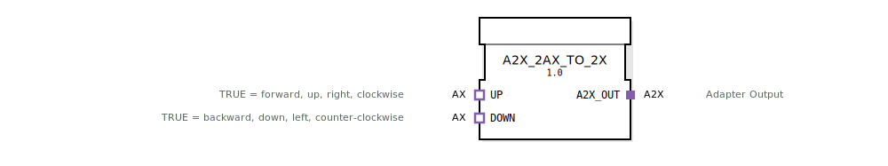

# A2X_2AX_TO_2X

```{index} single: A2X_2AX_TO_2X
```


* * * * * * * * * *
## Einleitung
Der A2X_2AX_TO_2X ist ein Composite-Funktionsblock, der zur Konvertierung von zwei AX-Signalen in ein A2X-Signal dient. Dieser Baustein ermöglicht die Zusammenführung von zwei unidirektionalen AX-Adapter-Signalen in einen einzigen A2X-Adapter-Ausgang.



## Schnittstellenstruktur

### **Ereignis-Eingänge**
Keine direkten Ereignis-Eingänge vorhanden

### **Ereignis-Ausgänge**
Keine direkten Ereignis-Ausgänge vorhanden

### **Daten-Eingänge**
Keine direkten Daten-Eingänge vorhanden

### **Daten-Ausgänge**
Keine direkten Daten-Ausgänge vorhanden

### **Adapter**
**Sockets (Eingänge):**
- **UP**: AX-Adapter für positive Bewegungsrichtung (TRUE = vorwärts, oben, rechts, im Uhrzeigersinn)
- **DOWN**: AX-Adapter für negative Bewegungsrichtung (TRUE = rückwärts, unten, links, gegen den Uhrzeigersinn)

**Plugs (Ausgänge):**
- **A2X_OUT**: A2X-Adapter-Ausgang für die kombinierten Signale

## Funktionsweise
Der Composite-Funktionsblock verbindet die beiden AX-Adapter-Eingänge (UP und DOWN) direkt mit dem A2X-Adapter-Ausgang. Dabei werden sowohl die Ereignis- als auch die Datensignale weitergeleitet:

- UP-Ereignisse und -Daten werden an E_UP und UP des A2X_OUT-Adapters weitergeleitet
- DOWN-Ereignisse und -Daten werden an E_DOWN und DOWN des A2X_OUT-Adapters weitergeleitet

## Technische Besonderheiten
- Implementiert als Composite-FB ohne interne Logik
- Direkte Durchschaltung der Signale ohne Verzögerung
- Verwendet unidirektionale Adapter-Typen
- Keine Zustandsbehaftung oder interne Verarbeitung

## Zustandsübersicht
Der Funktionsblock besitzt keine internen Zustände, da es sich um eine reine Durchschaltung handelt.

## Anwendungsszenarien
- Zusammenführung von zwei separaten Bewegungssteuerungssignalen
- Konvertierung von AX-basierten Steuerungssystemen zu A2X-Schnittstellen
- Integration in größere Steuerungssysteme mit A2X-Schnittstellenanforderungen
- Bidirektionale Bewegungserfassung in Automatisierungssystemen

## ⚖️ Vergleich mit ähnlichen Bausteinen
Im Vergleich zu einfachen AX-Adaptern ermöglicht dieser Baustein die Kombination zweier entgegengesetzter Bewegungsrichtungen in einem einzigen A2X-Signal. Er ersetzt die manuelle Verkabelung von zwei AX-Adaptern zu einem A2X-Adapter.

## Fazit
Der A2X_2AX_TO_2X ist ein einfacher aber effektiver Composite-Funktionsblock, der die Integration von AX-basierten Steuerungskomponenten in Systeme mit A2X-Schnittstellen vereinfacht. Durch die direkte Signalweiterleitung ohne zusätzliche Verarbeitung gewährleistet er eine zuverlässige und verlustfreie Signalübertragung.