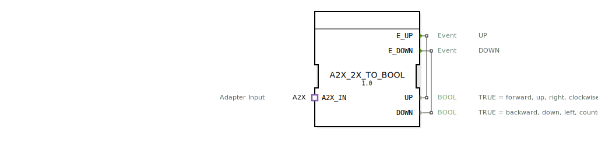

# A2X_2X_TO_BOOL

```{index} single: A2X_2X_TO_BOOL
```


* * * * * * * * * *

## Einleitung
Der Funktionsblock A2X_2X_TO_BOOL ist ein Composite-Funktionsblock, der zur Konvertierung von A2X-Signalen in zwei separate BOOL-Signale dient. Er ermöglicht die Umwandlung von bidirektionalen Steuersignalen in einfache logische Ausgänge für verschiedene Anwendungsfälle.



## Schnittstellenstruktur

### **Ereignis-Eingänge**
Keine direkten Ereignis-Eingänge vorhanden

### **Ereignis-Ausgänge**
- **E_UP**: Wird aktiviert, wenn eine Aufwärts-/Vorwärtsbewegung erkannt wird
- **E_DOWN**: Wird aktiviert, wenn eine Abwärts-/Rückwärtsbewegung erkannt wird

### **Daten-Eingänge**
Keine direkten Daten-Eingänge vorhanden

### **Daten-Ausgänge**
- **UP**: BOOL - TRUE für Vorwärts, Aufwärts, Rechts oder im Uhrzeigersinn
- **DOWN**: BOOL - TRUE für Rückwärts, Abwärts, Links oder gegen den Uhrzeigersinn

### **Adapter**
- **A2X_IN**: Adapter-Eingang vom Typ A2X für unidirektionale Kommunikation

## Funktionsweise
Der Funktionsblock empfängt Signale über den A2X-Adapter und leitet diese direkt an die entsprechenden Ausgänge weiter. Die Ereignisse und Datenwerte werden 1:1 vom Adapter an die Ausgangsschnittstellen durchgereicht, ohne zusätzliche Verarbeitung oder Verzögerung.

## Technische Besonderheiten
- Composite-Funktionsblock ohne interne Logik
- Direkte Durchleitung der Adapter-Signale
- Keine Zustandsbehaftung oder Speicherung
- Echtzeitfähige Signalweiterleitung

## Zustandsübersicht
Der Funktionsblock besitzt keine internen Zustände. Er verhält sich rein kombinatorisch und leitet eingehende Signale sofort an die Ausgänge weiter.

## Anwendungsszenarien
- Steuerung von Bewegungsrichtungen bei Aktoren
- Umwandlung von komplexeren Steuersignalen in einfache Richtungsbefehle
- Anbindung von A2X-kompatiblen Komponenten an BOOL-basierte Steuerungen
- Richtungserkennung in Antriebssystemen

## ⚖️ Vergleich mit ähnlichen Bausteinen
Im Vergleich zu anderen Konvertierungsbausteinen bietet A2X_2X_TO_BOOL eine spezifische Lösung für die Umwandlung von A2X-Signalen in boolesche Richtungssignale. Andere Bausteine könnten zusätzliche Funktionen wie Filterung, Verzögerung oder komplexere Signalverarbeitung bieten.

## Fazit
Der A2X_2X_TO_BOOL Funktionsblock stellt eine einfache und effiziente Lösung zur Konvertierung von A2X-Steuersignalen in boolesche Richtungsausgaben dar. Seine klare Schnittstellendefinition und direkte Signalweiterleitung machen ihn besonders geeignet für Anwendungen, bei denen eine unverfälschte Übertragung der Steuerinformationen erforderlich ist.