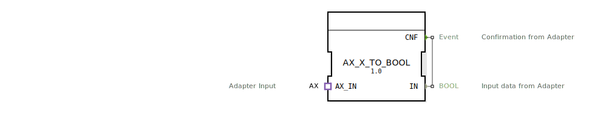

# AX_X_TO_BOOL

```{index} single: AX_X_TO_BOOL
```


* * * * * * * * * *

## Einleitung
Der Funktionsblock AX_X_TO_BOOL ist ein Composite-Funktionsblock, der für die Konvertierung von AX-Daten in den BOOL-Datentyp entwickelt wurde. Dieser Baustein dient als Adapter-Konverter und ermöglicht die unidirektionale Umwandlung von Daten zwischen unterschiedlichen Datentypen in 4diac-Systemen.



## Schnittstellenstruktur

### **Ereignis-Eingänge**
Keine direkten Ereignis-Eingänge vorhanden.

### **Ereignis-Ausgänge**
- **CNF** (Confirmation): Bestätigungsereignis, das vom Adapter ausgegeben wird.

### **Daten-Eingänge**
Keine direkten Daten-Eingänge vorhanden.

### **Daten-Ausgänge**
- **IN** (BOOL): Konvertierte Eingangsdaten vom Adapter.

### **Adapter**
- **AX_IN**: Adapter-Eingang vom Typ AX für unidirektionale Datenübertragung.

## Funktionsweise
Der Funktionsblock empfängt Daten über den AX_IN-Adapter und konvertiert diese in den BOOL-Datentyp. Bei erfolgreicher Konvertierung wird das Bestätigungsereignis CNF ausgelöst und die konvertierten Daten am Ausgang IN bereitgestellt. Die interne Struktur verbindet direkt den Adapter-Ereignisausgang E1 mit dem CNF-Ausgang und den Datenausgang D1 des Adapters mit dem IN-Datenausgang.

## Technische Besonderheiten
- Implementiert als Composite-Funktionsblock
- Verwendet unidirektionale Adapter-Kommunikation
- Direkte Durchschaltung ohne zusätzliche Verarbeitungslogik
- Einfache und effiziente Datenkonvertierung

## Zustandsübersicht
Der Funktionsblock besitzt einen einfachen Zustand:
- **Bereit**: Wartet auf eingehende Daten vom Adapter
- Bei Empfang von Daten erfolgt sofortige Konvertierung und Ausgabe

## Anwendungsszenarien
- Integration von AX-basierten Komponenten in BOOL-orientierte Steuerungen
- Adapter-Konvertierung in heterogenen Automatisierungssystemen
- Schnittstellenanpassung zwischen verschiedenen Gerätetypen
- Protokollumsetzung in verteilten Steuerungssystemen

## ⚖️ Vergleich mit ähnlichen Bausteinen
Im Vergleich zu anderen Konvertierungsbausteinen zeichnet sich AX_X_TO_BOOL durch seine spezifische Fokussierung auf die AX-zu-BOOL-Konvertierung aus. Während universelle Konverter häufig komplexere Parametrierung erfordern, bietet dieser Baustein eine optimierte Lösung für diesen speziellen Anwendungsfall.


## 🛠️ Zugehörige Übungen

* [Uebung_001_AX_b](../../../../../../training1/Ventilsteuerung/4diacIDE-workspace/test_AX/Uebungen_doc/Uebung_001_AX_b.md)
* [Uebung_002a2_AX](../../../../../../training1/Ventilsteuerung/4diacIDE-workspace/test_AX/Uebungen_doc/Uebung_002a2_AX.md)
* [Uebung_004b_AX](../../../../../../training1/Ventilsteuerung/4diacIDE-workspace/test_AX/Uebungen_doc/Uebung_004b_AX.md)
* [Uebung_004b_AX_ASR](../../../../../../training1/Ventilsteuerung/4diacIDE-workspace/test_AX/Uebungen_doc/Uebung_004b_AX_ASR.md)
* [Uebung_004b_AX_ASR_X](../../../../../../training1/Ventilsteuerung/4diacIDE-workspace/test_AX/Uebungen_doc/Uebung_004b_AX_ASR_X.md)
* [Uebung_094a_AX](../../../../../../training1/Ventilsteuerung/4diacIDE-workspace/test_AX/Uebungen_doc/Uebung_094a_AX.md)

## Fazit
AX_X_TO_BOOL ist ein spezialisierter Konvertierungsbaustein, der eine effiziente und zuverlässige Umwandlung von AX-Daten in BOOL-Werte ermöglicht. Seine einfache Struktur und direkte Funktionsweise machen ihn besonders geeignet für Systeme, in denen performante Datentyp-Konvertierung erforderlich ist.