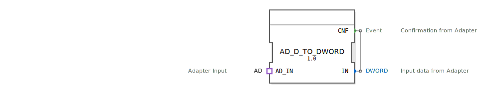

# AD_D_TO_DWORD

```{index} single: AD_D_TO_DWORD
```

## Einleitung
Der AD_D_TO_DWORD Funktionsblock ist ein Composite-Funktionsblock, der zur Konvertierung des AD-Adapterformats in einen DWORD-Wert dient.



## Schnittstellenstruktur

### **Ereignis-Eingänge**
- Keine direkten Ereignis-Eingänge vorhanden

### **Ereignis-Ausgänge**
- **CNF**: Bestätigungs-Event nach erfolgter Konvertierung

### **Daten-Eingänge**
- Keine direkten Daten-Eingänge vorhanden

### **Daten-Ausgänge**
- **IN**: DWORD-Ausgangswert der konvertierten Daten

### **Adapter**
- **AD_IN**: Socket vom Typ `AD`

## Funktionsweise
Der Funktionsblock empfängt Daten über den AD-Adapter-Socket und stellt den enthaltenen DWORD-Wert am Ausgang IN zur Verfügung, sobald ein Ereignis über den Adapter eintrifft (CNF).