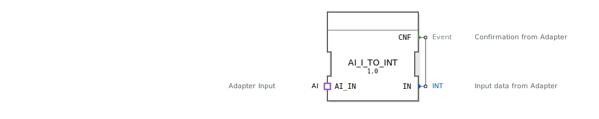

# AI_I_TO_INT

```{index} single: AI_I_TO_INT
```

## Einleitung
Der AI_I_TO_INT Funktionsblock ist ein Composite-Funktionsblock, der zur Konvertierung des AI-Adapterformats in einen INT-Wert dient.



## Schnittstellenstruktur

### **Ereignis-Eingänge**
- Keine direkten Ereignis-Eingänge vorhanden

### **Ereignis-Ausgänge**
- **CNF**: Bestätigungs-Event nach erfolgter Konvertierung

### **Daten-Eingänge**
- Keine direkten Daten-Eingänge vorhanden

### **Daten-Ausgänge**
- **IN**: INT-Ausgangswert der konvertierten Daten

### **Adapter**
- **AI_IN**: Socket vom Typ `AI`

## Funktionsweise
Der Funktionsblock empfängt Daten über den AI-Adapter-Socket und stellt den enthaltenen INT-Wert am Ausgang IN zur Verfügung, sobald ein Ereignis über den Adapter eintrifft (CNF).