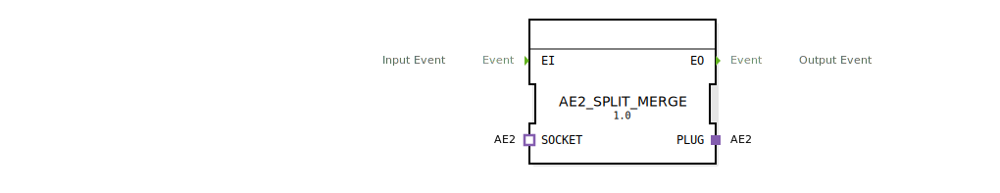

# AE2_SPLIT_MERGE

```{index} single: AE2_SPLIT_MERGE
```


* * * * * * * * * *

## Einleitung
Der AE2_SPLIT_MERGE ist ein bidirektionaler Splitter- und Merger-Funktionsblock, der Ereignisse in beide Richtungen verarbeiten kann. Der Baustein ermöglicht die Verteilung und Zusammenführung von Ereignissen über Adapterschnittstellen, wobei keine direkte Weiterleitung zwischen SOCKET und PLUG erfolgt.



## Schnittstellenstruktur

### **Ereignis-Eingänge**
- **EI**: Haupt-Ereigniseingang für eingehende Ereignisse

### **Ereignis-Ausgänge**
- **EO**: Haupt-Ereignisausgang für ausgehende Ereignisse

### **Daten-Eingänge**
*Keine Daten-Eingänge vorhanden*

### **Daten-Ausgänge**
*Keine Daten-Ausgänge vorhanden*

### **Adapter**
- **PLUG**: Adapter-Schnittstelle vom Typ "adapter::types::bidirectional::AE2"
- **SOCKET**: Adapter-Schnittstelle vom Typ "adapter::types::bidirectional::AE2"

## Funktionsweise
Der Funktionsblock arbeitet nach folgenden Prinzipien:

1. **Ereignis-Verteilung**: Ereignisse am Eingang EI werden gleichzeitig an beide Adapterschnittstellen (PLUG und SOCKET) weitergeleitet
2. **Ereignis-Zusammenführung**: Ereignisse von beiden Adapterschnittstellen (PLUG.EI1 und SOCKET.EO1) werden am Ausgang EO zusammengeführt
3. **Bidirektionale Isolation**: Es findet keine direkte Kommunikation zwischen den Adapterschnittstellen PLUG und SOCKET statt

## Technische Besonderheiten
- Reine Ereignisverarbeitung ohne Datentransfer
- Symmetrische Behandlung beider Adapterrichtungen
- Isolierte Signalwege zwischen den Adapterschnittstellen
- Echtzeitfähige Ereignisverteilung

## Zustandsübersicht
Der Funktionsblock besitzt keinen internen Zustand und arbeitet stateless. Alle eingehenden Ereignisse werden sofort verarbeitet und weitergeleitet.

## Anwendungsszenarien
- Verteilung von Steuerereignissen an mehrere Subsysteme
- Zusammenführung von Statusereignissen aus verschiedenen Quellen
- Bidirektionale Kommunikation in verteilten Steuerungssystemen
- Event-basierte Architekturen mit Adapter-Pattern

## ⚖️ Vergleich mit ähnlichen Bausteinen
Im Vergleich zu einfachen Splitter- oder Merger-Blöcken bietet AE2_SPLIT_MERGE:
- Bidirektionale Funktionalität in einem einzigen Block
- Adapter-basierte Schnittstellen für standardisierte Kommunikation
- Isolierte Signalwege zwischen verschiedenen Adapterrichtungen

## Fazit
Der AE2_SPLIT_MERGE ist ein spezialisierter Funktionsblock für komplexe Ereignisverteilungs- und Zusammenführungsszenarien in bidirektionalen Kommunikationsarchitekturen. Seine Adapter-basierte Struktur ermöglicht flexible und standardisierte Integration in größere Steuerungssysteme.