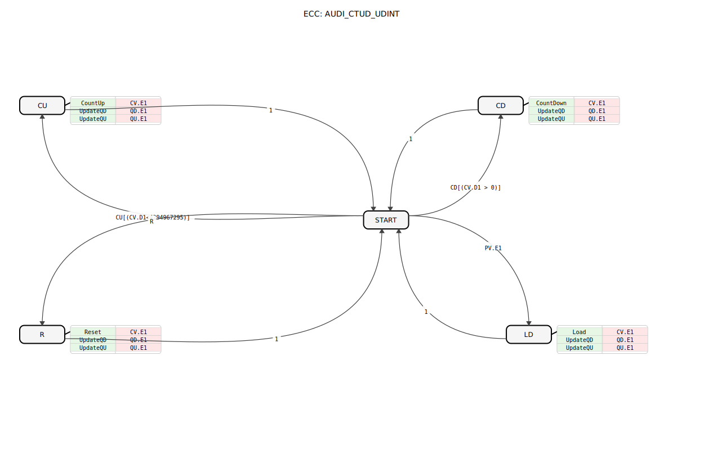

# AUDI_CTUD_UDINT (Adapter-basierter Auf-/Abwärtszähler)

```{index} single: AUDI_CTUD_UDINT (Adapter-basierter Auf-/Abwärtszähler)
```

## Einleitung
Der `AUDI_CTUD_UDINT` ist ein ereignisgesteuerter Auf-/Abwärtszähler (Counter Up/Down) für vorzeichenlose 32-Bit-Ganzzahlen (UDINT), der speziell für die Integration in adapterbasierte Systeme entwickelt wurde. Er nutzt `AUDI`-Adapter für die Übergabe des Zählwerts und des Vorgabewerts, was eine saubere Trennung von Ereignis- und Datenfluss ermöglicht.


## Schnittstellenstruktur




### **Ereignis-Eingänge**
- **CU**: `Event` - Zählt den Wert um eins hoch (`Count Up`).
- **CD**: `Event` - Zählt den Wert um eins herunter (`Count Down`).
- **R**: `Event` - Setzt den Zähler auf Null zurück (`Reset`).

### **Ereignis-Ausgänge**
- **CO**: `Event` - Wird ausgelöst, wenn der Zählerstand den Vorgabewert `PV` erreicht (`Count Output`).
  - Mit Variablen `QU` und `QD` verknüpft.
- **RO**: `Event` - Wird ausgelöst, wenn der Zähler auf Null zurückgesetzt wurde (`Reset Output`).
  - Mit Variablen `QU` und `QD` verknüpft.

### **Output-Variablen**
- **QU**: `BOOL` - `TRUE`, wenn der Zählwert (`CV.D1`) größer oder gleich dem Vorgabewert (`PV.D1`) ist.
- **QD**: `BOOL` - `TRUE`, wenn der Zählwert (`CV.D1`) kleiner oder gleich Null ist.

### **Adapter**
- **CV** (Plug): `AUDI` - Der aktuelle Zählwert (`Counter Value`).
- **PV** (Socket): `AUDI` - Der Vorgabewert (`Preset Value`), gegen den der Zähler geprüft wird (für `QU`).

## Funktionsweise
Der Zähler reagiert auf die Ereignis-Eingänge `CU`, `CD` und `R`. Ein `CU`-Ereignis erhöht `CV.D1` um 1, ein `CD`-Ereignis verringert `CV.D1` um 1. Ein `R`-Ereignis setzt `CV.D1` auf 0.

Das Laden eines Vorgabewertes (`PV.D1`) in den Zähler (`CV.D1`) erfolgt automatisch, wenn am `PV`-Adapter ein Ereignis (`PV.E1`) eintrifft. Dies ersetzt den expliziten `LD`-Eingang des originalen `E_CTUD_UDINT`.

Der Zählwert wird über den `CV`-Adapter als `AUDI`-Signal ausgegeben. Die Ausgänge `CO` und `RO` signalisieren Zustandsänderungen und liefern `QU`/`QD`.

## Technische Besonderheiten
✔ **Adapter-basiert**: Nahtlose Integration in AX-Systeme.
✔ **Ereignisgesteuert**: Keine zyklischen Aufrufe notwendig.
✔ **UDINT-Basis**: Unterstützt den vollen Wertebereich von vorzeichenlosen 32-Bit-Ganzzahlen.
✔ **Vereinfachte Lade-Logik**: Der explizite `LD`-Eingang wurde entfernt und durch die Ereignis-Erkennung am `PV`-Adapter (`PV.E1`) ersetzt. Der `LDO`-Ausgang entfällt. Stattdessen signalisiert `CV.E1` die Wertänderung.

## Anwendungsszenarien
- **Stückzählung**: Zählen von Objekten in Fertigungslinien.
- **Betriebsstundenzähler**: Erfassen von Betriebszeiten (in Kombination mit Timern).
- **Positionsüberwachung**: Einfache Positionszähler in Handling-Systemen.


## 🛠️ Zugehörige Übungen

* [Uebung_009_AX](../../../../../training1/Ventilsteuerung/4diacIDE-workspace/test_AX/Uebungen_doc/Uebung_009_AX.md)
* [Uebung_083_AX](../../../../../training1/Ventilsteuerung/4diacIDE-workspace/test_AX/Uebungen_doc/Uebung_083_AX.md)

