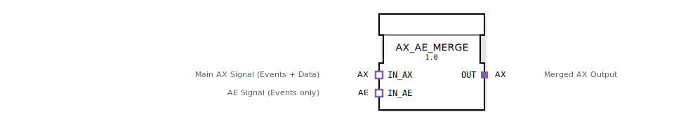

# AX_AE_MERGE

```{index} single: AX_AE_MERGE
```

## Einleitung
Der AX_AE_MERGE Funktionsblock ermöglicht das Zusammenführen eines reinen Ereignis-Signals (**AE**) mit einem kombinierten Ereignis-Daten-Signal (**AX**). Das Ergebnis ist ein AX-Signalfluss, bei dem das Daten-Bit vom AX-Zweig erhalten bleibt, aber von beiden Quellen getriggert werden kann.

Dies ist besonders nützlich, wenn ein zyklisches Ereignis (z.B. von einem `AE_CYCLE`) einen Status-Check oder eine Aktion in einem AX-basierten Datenstrom erzwingen soll, ohne die Daten selbst zu verändern.



## Schnittstellenstruktur

### **Adapter**
- **IN_AX** (Socket): Primärer Eingang (Ereignis `E1` + Daten `D1`).
- **IN_AE** (Socket): Zusätzlicher Ereignis-Eingang (nur Ereignis `E1`).
- **OUT** (Plug): Merged Ausgang (Ereignis von beiden Eingängen, Daten nur von `IN_AX`).

## Funktionsweise
Trifft an `IN_AX` ein Ereignis ein, wird dieses zusammen mit dem aktuellen Wert von `D1` an den Ausgang weitergereicht. Trifft an `IN_AE` ein Ereignis ein, wird am Ausgang ebenfalls ein Ereignis ausgelöst, wobei der *letzte bekannte* Wert von `IN_AX.D1` am Ausgang anliegt.

## ⚖️ Vergleich mit ähnlichen Bausteinen
In vielen Übungen (z. B. beim Blinker in `Uebung_007a3_AX`) wurde bisher fälschlicherweise ein `AX_OR_2` verwendet, um ein `AE`-Ereignis (vom `AE_CYCLE`) in einen `AX`-Datenstrom einzuspeisen.
- **AX_OR_2**: Erwartet zwei vollwertige AX-Adapter. Das Anschließen eines AE-Adapters ist technisch unsauber, da der Datenwert für einen der Eingänge undefiniert bleibt.
- **AX_AE_MERGE**: Ist exakt für diesen Mischbetrieb ausgelegt. Er stellt sicher, dass das Ereignis durchgereicht wird, während die Datenquelle (`IN_AX`) eindeutig definiert bleibt.

## Technische Besonderheiten
✔ **Ereignis-Merge**: Nutzt intern einen `E_MERGE`.
✔ **Datenerhalt**: Keine Datenveränderung, nur zusätzliche Triggerung.
✔ **Saubere Typisierung**: Verhindert das direkte Verbinden von ungleichen Adaptertypen.

## Anwendungsszenarien
- **Blinker-Logik**: Ein `AE_CYCLE` triggert regelmäßig das Senden des aktuellen Zustands eines `AX_SR` Flip-Flops.
- **Status-Auffrischung**: Ein Timer triggert regelmäßig das Senden des aktuellen AX-Zustands.
- **Mehrfach-Trigger**: Ein AX-Signalfluss soll zusätzlich durch externe AE-Ereignisse (z.B. Taster-Clicks) angestoßen werden.


## 🛠️ Zugehörige Übungen

* [Uebung_007a3_AX](../../../../../training1/Ventilsteuerung/4diacIDE-workspace/test_AX/Uebungen_doc/Uebung_007a3_AX.md)
* [Uebung_008_AX](../../../../../training1/Ventilsteuerung/4diacIDE-workspace/test_AX/Uebungen_doc/Uebung_008_AX.md)
* [Uebung_009_AX](../../../../../training1/Ventilsteuerung/4diacIDE-workspace/test_AX/Uebungen_doc/Uebung_009_AX.md)

