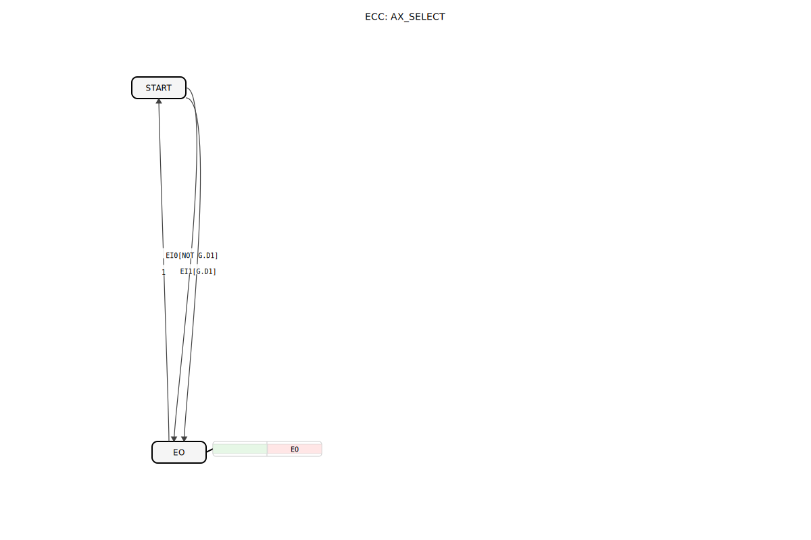

# AX_SELECT

```{index} single: AX_SELECT
```




* * * * * * * * * *
## Einleitung
Der AX_SELECT ist ein Funktionsblock, der basierend auf einem booleschen Eingang einen von zwei AX-Adapter-Eingängen auf den Ausgang schaltet.


## Schnittstellenstruktur

### **Daten-Eingänge**
- **G** (BOOL): Auswahlsignal. FALSE = IN0, TRUE = IN1.

### **Adapter**
**Sockets (Eingänge):**
- **IN0** (adapter::types::unidirectional::AX)
- **IN1** (adapter::types::unidirectional::AX)

**Plugs (Ausgänge):**
- **OUT** (adapter::types::unidirectional::AX)

## Funktionsweise
Wenn G = FALSE, wird IN0 an OUT weitergeleitet.
Wenn G = TRUE, wird IN1 an OUT weitergeleitet.

## Technische Besonderheiten
- Verwendet unidirektionale Adapter.

## Zustandsübersicht
Kombinatorisch.

## Anwendungsszenarien
Auswahl von Signalen.

## ⚖️ Vergleich mit ähnlichen Bausteinen
- **E_SELECT**: Standard Ereignis-Select ohne Adapter.


## 🛠️ Zugehörige Übungen

* [Uebung_095_AX](../../../../../training1/Ventilsteuerung/4diacIDE-workspace/test_AX/Uebungen_doc/Uebung_095_AX.md)

## Fazit
Adapter-basierter Select-Baustein.