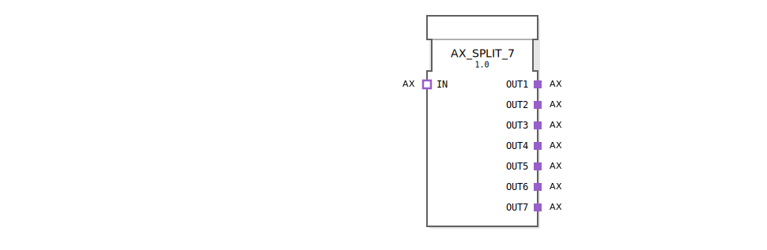

# AX_SPLIT_7

```{index} single: AX_SPLIT_7
```


* * * * * * * * * *

## Einleitung
Der AX_SPLIT_7 Funktionsblock ist ein generischer Baustein, der einen einzelnen AX-Adapter-Eingang auf sieben separate AX-Adapter-Ausgänge aufteilt. Der Baustein dient als Verteiler für unidirektionale AX-Adapter und ermöglicht die Verteilung eines Eingangssignals an mehrere Empfänger.



## Schnittstellenstruktur

### **Ereignis-Eingänge**
Keine direkten Ereignis-Eingänge vorhanden (Adapter-basierte Kommunikation)

### **Ereignis-Ausgänge**
Keine direkten Ereignis-Ausgänge vorhanden (Adapter-basierte Kommunikation)

### **Daten-Eingänge**
Keine direkten Daten-Eingänge vorhanden (Adapter-basierte Kommunikation)

### **Daten-Ausgänge**
Keine direkten Daten-Ausgänge vorhanden (Adapter-basierte Kommunikation)

### **Adapter**

**Eingangsadapter:**
- **IN** (Socket): Unidirektionaler AX-Adapter-Eingang

**Ausgangsadapter:**
- **OUT1** (Plug): Unidirektionaler AX-Adapter-Ausgang 1
- **OUT2** (Plug): Unidirektionaler AX-Adapter-Ausgang 2
- **OUT3** (Plug): Unidirektionaler AX-Adapter-Ausgang 3
- **OUT4** (Plug): Unidirektionaler AX-Adapter-Ausgang 4
- **OUT5** (Plug): Unidirektionaler AX-Adapter-Ausgang 5
- **OUT6** (Plug): Unidirektionaler AX-Adapter-Ausgang 6
- **OUT7** (Plug): Unidirektionaler AX-Adapter-Ausgang 7

## Funktionsweise
Der AX_SPLIT_7 Funktionsblock empfängt Daten über den Eingangsadapter IN und verteilt diese gleichzeitig an alle sieben Ausgangsadapter (OUT1 bis OUT7). Jedes am IN-Adapter eingehende Signal wird parallel an alle sieben Ausgänge weitergeleitet, wodurch eine 1:7-Verteilung realisiert wird.

## Technische Besonderheiten
- Generische Implementierung für maximale Wiederverwendbarkeit
- Verwendet unidirektionale AX-Adapter für die Kommunikation
- Keine internen Verzögerungen bei der Signalverteilung
- Parallele Ausgabe an alle sieben Ausgänge

## Zustandsübersicht
Der Funktionsblock besitzt einen einfachen Zustand: Im aktiven Zustand leitet er eingehende Signale sofort an alle Ausgänge weiter. Es gibt keine komplexen Zustandsübergänge oder interne Verarbeitungslogik.

## Anwendungsszenarien
- Verteilung von Steuersignalen an multiple Aktoren
- Aufteilung von Sensordaten an verschiedene Verarbeitungseinheiten
- Signalverteilung in verzweigten Steuerungsarchitekturen
- Redundante Signalweiterleitung an mehrere Empfänger

## Vergleich mit ähnlichen Bausteinen
Im Vergleich zu einfacheren Splitter-Bausteinen bietet AX_SPLIT_7 eine feste Anzahl von sieben Ausgängen, was für spezifische Anwendungsfälle mit genau sieben Empfängern optimiert ist. Gegenüber variablen Splittern hat dieser Baustein den Vorteil der fest definierten Schnittstellen.

Vergleich mit [E_SPLIT](../../../../StandardLibraries/events/E_SPLIT.md)

## Fazit
Der AX_SPLIT_7 Funktionsblock stellt eine effiziente Lösung für die Verteilung unidirektionaler AX-Signale an sieben Empfänger dar. Seine generische Natur und einfache Funktionsweise machen ihn zu einem robusten und zuverlässigen Baustein für verteilte Steuerungssysteme.