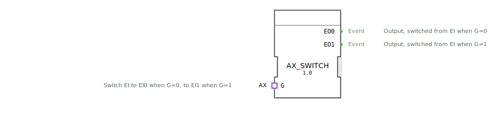

# AX_SWITCH

```{index} single: AX_SWITCH
```


* * * * * * * * * *
## Einleitung
Der AX_SWITCH Funktionsblock dient als Schaltbaustein (Demultiplexer) für Ereignisse basierend auf einem booleschen Eingangswert. Er leitet eingehende Ereignisse je nach Zustand des Steuersignals auf einen von zwei möglichen Ausgängen weiter.



## Schnittstellenstruktur

### **Ereignis-Eingänge**
- Keine direkten Ereigniseingänge - Ereigniseingang erfolgt über Adapter

### **Ereignis-Ausgänge**
- **EO0**: Ausgangsereignis, das aktiviert wird, wenn ein Ereignis bei G=0 eintrifft
- **EO1**: Ausgangsereignis, das aktiviert wird, wenn ein Ereignis bei G=1 eintrifft

### **Daten-Eingänge**
- Keine direkten Dateneingänge - Daten werden über Adapter bereitgestellt

### **Daten-Ausgänge**
- Keine Datenausgänge vorhanden

### **Adapter**
- **G**: Adapter vom Typ `adapter::types::unidirectional::AX`
  - Schaltet eingehende Ereignisse von EI auf EO0, wenn G=0
  - Schaltet eingehende Ereignisse von EI auf EO1, wenn G=1

## Funktionsweise
Der AX_SWITCH Block empfängt Ereignisse und Steuerdaten über den Adapter G. Basierend auf dem booleschen Wert des Steuersignals G wird jedes eingehende Ereignis entweder an Ausgang EO0 (bei G=0) oder an Ausgang EO1 (bei G=1) weitergeleitet. Intern nutzt der Block einen E_SWITCH Baustein zur Realisierung der Schaltfunktion.

## Technische Besonderheiten
- Implementiert als Wrapper um den Standard-E_SWITCH Baustein
- Verwendet unidirektionale Adapter für Ereignis- und Datenkommunikation
- Keine direkten Schnittstellen, alle Kommunikation erfolgt über Adapter

## Zustandsübersicht
Der Block besitzt keine internen Zustände im klassischen Sinne. Er arbeitet rein ereignisgesteuert und leitet jedes eingehende Ereignis sofort basierend auf dem aktuellen Wert von G an den entsprechenden Ausgang weiter.

## Anwendungsszenarien
- Steuerung von alternativen Prozesspfaden
- Umschaltung zwischen Betriebsmodi
- Verteilerfunktionen in ereignisbasierten Steuerungen
- Demultiplexing von Ereignisströmen

## ⚖️ Vergleich mit ähnlichen Bausteinen
Im Vergleich zum Standard-E_SWITCH Block bietet AX_SWITCH eine Adapter-basierte Schnittstelle, was eine bessere Integration in Adapter-basierte Architekturen ermöglicht. Während E_SWITCH direkte Ein- und Ausgänge besitzt, kommuniziert AX_SWITCH ausschließlich über Adapter.

Vergleich mit [E_SWITCH](../../../../StandardLibraries/events/E_SWITCH.md)


## 🛠️ Zugehörige Übungen

* [Uebung_004b_AX](../../../../../training1/Ventilsteuerung/4diacIDE-workspace/test_AX/Uebungen_doc/Uebung_004b_AX.md)
* [Uebung_004b_AX_ASR](../../../../../training1/Ventilsteuerung/4diacIDE-workspace/test_AX/Uebungen_doc/Uebung_004b_AX_ASR.md)
* [Uebung_004b_AX_ASR_X](../../../../../training1/Ventilsteuerung/4diacIDE-workspace/test_AX/Uebungen_doc/Uebung_004b_AX_ASR_X.md)
* [Uebung_005_AX](../../../../../training1/Ventilsteuerung/4diacIDE-workspace/test_AX/Uebungen_doc/Uebung_005_AX.md)
* [Uebung_006a3_sub_AX](../../../../../training1/Ventilsteuerung/4diacIDE-workspace/test_AX/Uebungen_doc/Uebung_006a3_sub_AX.md)
* [Uebung_007a3_AX](../../../../../training1/Ventilsteuerung/4diacIDE-workspace/test_AX/Uebungen_doc/Uebung_007a3_AX.md)
* [Uebung_008_AX](../../../../../training1/Ventilsteuerung/4diacIDE-workspace/test_AX/Uebungen_doc/Uebung_008_AX.md)
* [Uebung_009_AX](../../../../../training1/Ventilsteuerung/4diacIDE-workspace/test_AX/Uebungen_doc/Uebung_009_AX.md)
* [Uebung_020a_AX](../../../../../training1/Ventilsteuerung/4diacIDE-workspace/test_AX/Uebungen_doc/Uebung_020a_AX.md)
* [Uebung_020b_AX](../../../../../training1/Ventilsteuerung/4diacIDE-workspace/test_AX/Uebungen_doc/Uebung_020b_AX.md)
* [Uebung_020c3_AX](../../../../../training1/Ventilsteuerung/4diacIDE-workspace/test_AX/Uebungen_doc/Uebung_020c3_AX.md)
* [Uebung_020d_AX](../../../../../training1/Ventilsteuerung/4diacIDE-workspace/test_AX/Uebungen_doc/Uebung_020d_AX.md)
* [Uebung_020e2_AX](../../../../../training1/Ventilsteuerung/4diacIDE-workspace/test_AX/Uebungen_doc/Uebung_020e2_AX.md)
* [Uebung_020f2_AX](../../../../../training1/Ventilsteuerung/4diacIDE-workspace/test_AX/Uebungen_doc/Uebung_020f2_AX.md)
* [Uebung_020i_AX](../../../../../training1/Ventilsteuerung/4diacIDE-workspace/test_AX/Uebungen_doc/Uebung_020i_AX.md)

## Fazit
AX_SWITCH ist ein spezialisierter Schaltbaustein für ereignisbasierte Systeme, der durch seine Adapter-basierte Architektur eine flexible Integration in komplexere Steuerungssysteme ermöglicht. Die klare Trennung von Ereignis- und Datenfluss über Adapter sorgt für eine übersichtliche Systemstruktur.