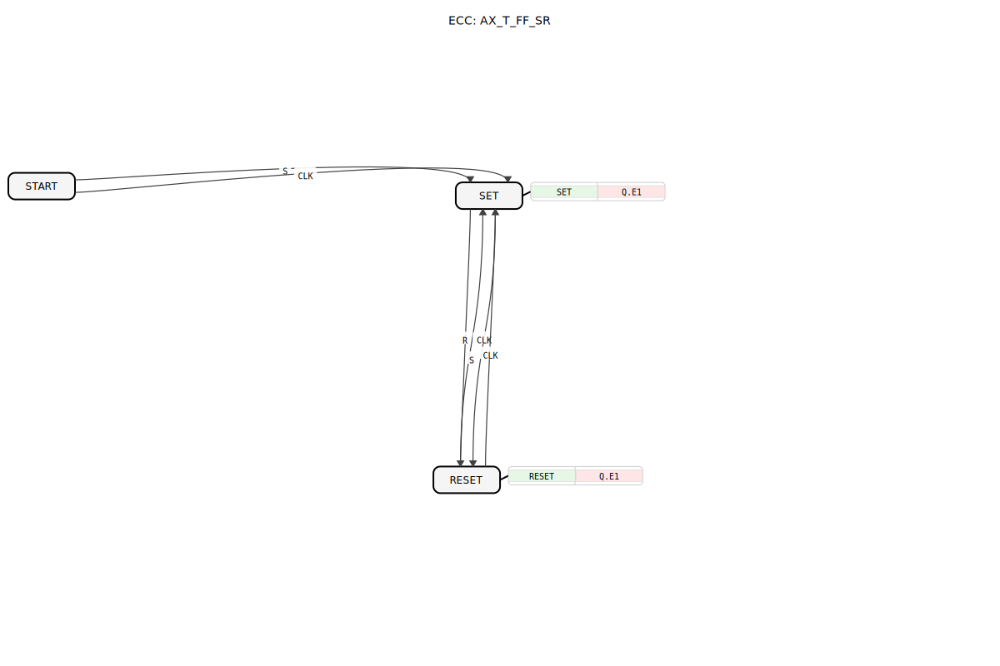

# AX_T_FF_SR

```{index} single: AX_T_FF_SR
```




* * * * * * * * * *

## Einleitung
Der AX_T_FF_SR ist ein ereignisgesteuerter bistabiler Funktionsblock mit Toggle-Funktionalität. Es handelt sich um ein Flip-Flop-Element, das sowohl als Set-Reset-Flipflop als auch als Toggle-Flipflop betrieben werden kann. Der Baustein kombiniert die Eigenschaften eines SR-Flipflops mit zusätzlicher Toggle-Funktionalität über einen Takteingang.


## Schnittstellenstruktur

### **Ereignis-Eingänge**
- **S**: Setzt den Ausgang Q auf TRUE
- **R**: Setzt den Ausgang Q auf FALSE (Reset)
- **CLK**: Takt für das Umschalten (Toggle) des Ausgangs

### **Ereignis-Ausgänge**
- Keine direkten Ereignisausgänge vorhanden

### **Daten-Eingänge**
- Keine Dateneingänge vorhanden

### **Daten-Ausgänge**
- Keine direkten Datenausgänge vorhanden

### **Adapter**
- **Q**: Unidirektionaler Adapter vom Typ AX, der den Wert des Flipflops bereitstellt

## Funktionsweise
Der AX_T_FF_SR verfügt über drei Betriebszustände:
- **START**: Initialzustand
- **SET**: Ausgang Q ist TRUE
- **RESET**: Ausgang Q ist FALSE

Die Zustandsübergänge werden durch die Ereigniseingänge gesteuert:
- S-Ereignis führt von jedem Zustand in den SET-Zustand
- R-Ereignis führt von jedem Zustand in den RESET-Zustand
- CLK-Ereignis toggelt den aktuellen Zustand (SET → RESET oder RESET → SET)

Bei jedem Zustandswechsel wird der entsprechende Algorithmus ausgeführt, der den Adapterwert Q.D1 entsprechend setzt.

## Technische Besonderheiten
- Kombiniert SR-Flipflop- und T-Flipflop-Funktionalität
- Verwendet Adapter-Schnittstelle für die Datenausgabe
- Unidirektionale Kommunikation über den Q-Adapter
- Initialzustand ist START, von wo aus direkt in SET oder durch CLK in SET gewechselt werden kann

## Zustandsübersicht
```
START (Initialzustand)
    │
    ├── S ───→ SET (Q.D1 = TRUE)
    │
    └── CLK ─→ SET (Q.D1 = TRUE)

SET (Q.D1 = TRUE)
    │
    ├── R ────→ RESET (Q.D1 = FALSE)
    │
    └── CLK ─→ RESET (Q.D1 = FALSE)

RESET (Q.D1 = FALSE)
    │
    ├── S ────→ SET (Q.D1 = TRUE)
    │
    └── CLK ─→ SET (Q.D1 = TRUE)
```

## Anwendungsszenarien
- Zustandsspeicherung in Steuerungsanwendungen
- Taktteilung und Frequenzteilung
- Ereigniszählung
- Zustandsautomaten mit Speicherfunktion
- Schaltnetze mit Rückkopplung

## ⚖️ Vergleich mit ähnlichen Bausteinen
Im Vergleich zu einem einfachen E_SR-Flipflop bietet der AX_T_FF_SR zusätzliche Toggle-Funktionalität durch den CLK-Eingang. Während ein reines SR-Flipflop nur über Set- und Reset-Eingänge verfügt, ermöglicht dieser Baustein zusätzlich das taktgesteuerte Umschalten des Ausgangszustands.

Vergleich mit [E_T_FF_SR](../../../../StandardLibraries/events/E_T_FF_SR.md)


## 🛠️ Zugehörige Übungen

* [Uebung_004a7_AX](../../../../../training1/Ventilsteuerung/4diacIDE-workspace/test_AX/Uebungen_doc/Uebung_004a7_AX.md)
* [Uebung_006a2_AX](../../../../../training1/Ventilsteuerung/4diacIDE-workspace/test_AX/Uebungen_doc/Uebung_006a2_AX.md)
* [Uebung_006a3_AX](../../../../../training1/Ventilsteuerung/4diacIDE-workspace/test_AX/Uebungen_doc/Uebung_006a3_AX.md)
* [Uebung_006a4_AX](../../../../../training1/Ventilsteuerung/4diacIDE-workspace/test_AX/Uebungen_doc/Uebung_006a4_AX.md)
* [Uebung_006a_AX](../../../../../training1/Ventilsteuerung/4diacIDE-workspace/test_AX/Uebungen_doc/Uebung_006a_AX.md)

## Fazit
Der AX_T_FF_SR ist ein vielseitiger bistabiler Speicherbaustein, der die Vorteile von SR- und T-Flipflops kombiniert. Durch die Adapter-basierte Schnittstelle ermöglicht er eine flexible Integration in größere Steuerungssysteme und eignet sich besonders für Anwendungen, die sowohl direkte Zustandssetzung als auch taktgesteuertes Umschalten erfordern.