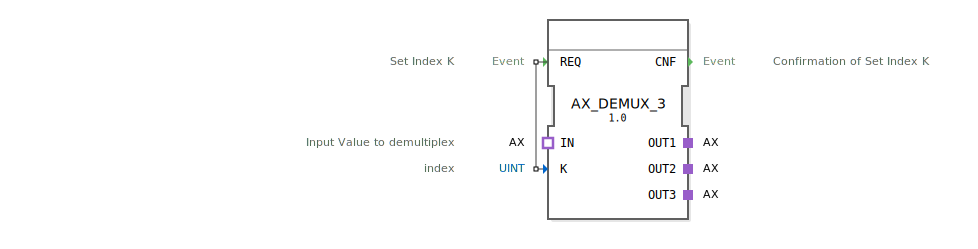

# AX_DEMUX_3

```{index} single: AX_DEMUX_3
```


* * * * * * * * * *
## Einleitung
Der AX_DEMUX_3 ist ein generischer Demultiplexer-Funktionsblock, der Eingangsdaten basierend auf einem Indexwert auf einen von drei möglichen Ausgängen verteilt. Der Baustein dient zur selektiven Weiterleitung von Datenströmen in verteilten Automatisierungssystemen.



## Schnittstellenstruktur

### **Ereignis-Eingänge**
- **REQ**: Setzt den Index K und initiiert den Demultiplex-Vorgang

### **Ereignis-Ausgänge**
- **CNF**: Bestätigung der Index-Setzung und erfolgreiche Demultiplex-Operation

### **Daten-Eingänge**
- **K** (UINT): Indexwert zur Auswahl des Zielausgangs (0, 1 oder 2)

### **Daten-Ausgänge**
*Keine direkten Datenausgänge vorhanden*

### **Adapter**

#### **Sockets**
- **IN** (adapter::types::unidirectional::AX): Eingangswert für die Demultiplex-Operation

#### **Plugs**
- **OUT1** (adapter::types::unidirectional::AX): Erster Ausgangskanal
- **OUT2** (adapter::types::unidirectional::AX): Zweiter Ausgangskanal
- **OUT3** (adapter::types::unidirectional::AX): Dritter Ausgangskanal

## Funktionsweise
Der AX_DEMUX_3 empfängt über den IN-Adapter einen Datenwert und leitet diesen basierend auf dem Indexwert K an einen der drei Ausgangsadapter weiter. Bei Aktivierung des REQ-Ereignisses wird der aktuelle K-Wert ausgewertet und der Eingangswert an den entsprechenden Ausgangskanal (OUT1, OUT2 oder OUT3) weitergeleitet. Nach erfolgreicher Operation wird das CNF-Ereignis ausgelöst.

## Technische Besonderheiten
- Generische Implementierung für flexible Wiederverwendung
- Unidirektionale Adapter-Schnittstellen für klare Datenflussrichtung
- Index-basierte Auswahl mit UINT-Datentyp
- Drei feste Ausgangskanäle

## Zustandsübersicht
Der Funktionsblock arbeitet zustandslos - jede REQ-Anfrage wird unabhängig verarbeitet und mit CNF quittiert. Der interne Zustand beschränkt sich auf die temporäre Speicherung des Indexwertes K während der Verarbeitung.

## Anwendungsszenarien
- Verteilung von Sensordaten an verschiedene Verarbeitungseinheiten
- Lastverteilung in parallelen Verarbeitungspfaden
- Selektive Aktivierung von Subsystemen basierend auf Betriebszuständen
- Routing von Steuerbefehlen an verschiedene Aktoren

## Vergleich mit ähnlichen Bausteinen
Im Vergleich zu einfachen Demultiplexern bietet AX_DEMUX_3:
- Standardisierte Adapter-Schnittstellen für bessere Integration
- Drei statt zwei Ausgangskanäle für erweiterte Flexibilität
- Explizite Bestätigungsereignisse für zuverlässige Operationen
- Generische Implementierung für Typunabhängigkeit

Vergleich mit [E_DEMUX](../../../../../StandardLibraries/events/E_DEMUX.md)


## Zugehörige Übungen

* [Uebung_103](../../../../../../training1/Ventilsteuerung/4diacIDE-workspace/test_B/Uebungen_doc/Uebung_103.md)
* [Uebung_103c](../../../../../../training1/Ventilsteuerung/4diacIDE-workspace/test_B/Uebungen_doc/Uebung_103c.md)
* [Uebung_103c2](../../../../../../training1/Ventilsteuerung/4diacIDE-workspace/test_B/Uebungen_doc/Uebung_103c2.md)

## Fazit
Der AX_DEMUX_3 stellt einen robusten und flexiblen Demultiplexer für verteilte Automatisierungssysteme dar. Durch die Verwendung standardisierter Adapter und die klare Ereignissteuerung eignet er sich besonders für komplexe Datenfluss-Steuerungen in industriellen Anwendungen.