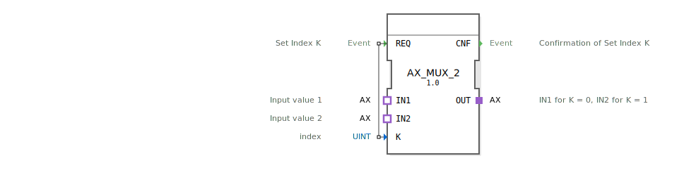

# AX_MUX_2

```{index} single: AX_MUX_2
```


* * * * * * * * * *
## Einleitung
Der AX_MUX_2 ist ein generischer Multiplexer-Funktionsblock, der zwei Eingangssignale über einen Indexwert selektiert und an einen Ausgang weiterleitet. Der Baustein dient zur dynamischen Auswahl zwischen zwei verschiedenen Eingangssignalen basierend auf einem Steuerindex.



## Schnittstellenstruktur

### **Ereignis-Eingänge**
- **REQ**: Setzt den Indexwert K und startet den Multiplexvorgang

### **Ereignis-Ausgänge**
- **CNF**: Bestätigt die erfolgreiche Setzung des Index K

### **Daten-Eingänge**
- **K** (UINT): Indexwert zur Auswahl des Eingangssignals (0 oder 1)

### **Daten-Ausgänge**
*Keine direkten Datenausgänge vorhanden*

### **Adapter**
- **IN1** (Socket): Eingabewert 1 (wird bei K=0 ausgewählt)
- **IN2** (Socket): Eingabewert 2 (wird bei K=1 ausgewählt)
- **OUT** (Plug): Ausgabesignal (leitet den selektierten Eingang weiter)

## Funktionsweise
Der AX_MUX_2 arbeitet als 2:1-Multiplexer. Bei Empfang eines REQ-Ereignisses wird der anliegende Indexwert K ausgewertet:
- Bei K=0 wird der Eingang IN1 an den Ausgang OUT weitergeleitet
- Bei K=1 wird der Eingang IN2 an den Ausgang OUT weitergeleitet
Nach erfolgreicher Verarbeitung wird ein CNF-Ereignis generiert.

## Technische Besonderheiten
- Verwendet unidirektionale AX-Adapter für die Signalübertragung
- Unterstützt den generischen Funktionsblockmechanismus
- Arbeitet mit UINT-Datentyp für den Indexparameter
- Bietet klare Ereignisbestätigung durch CNF-Ausgang

## Zustandsübersicht
Der Funktionsblock verfügt über einen einfachen Zustandsautomaten:
1. Wartezustand auf REQ-Ereignis
2. Verarbeitungszustand bei Indexauswertung und Signalweiterleitung
3. Bestätigungszustand mit CNF-Ausgabe

## Anwendungsszenarien
- Signalrouting in Steuerungssystemen
- Umschaltung zwischen verschiedenen Sensoreingängen
- Dynamische Auswahl von Aktorsteuerungen
- Modulare Systemarchitekturen mit konfigurierbaren Signalpfaden

## ⚖️ Vergleich mit ähnlichen Bausteinen
Im Vergleich zu einfachen Multiplexern bietet AX_MUX_2:
- Adapter-basierte Schnittstellen für bessere Modularität
- Ereignisgesteuerte Verarbeitung mit Bestätigungsmechanismus
- Generische Implementierung für Wiederverwendbarkeit

Vergleich mit [F_MUX_2](../../../../../StandardLibraries/iec61131-3/selection/F_MUX_2.md)


## 🛠️ Zugehörige Übungen

* [Uebung_090a1_AX](../../../../../../training1/Ventilsteuerung/4diacIDE-workspace/test_AX/Uebungen_doc/Uebung_090a1_AX.md)

## Fazit
Der AX_MUX_2 ist ein effizienter und flexibler Multiplexer-Baustein, der sich ideal für modulare Steuerungssysteme eignet. Seine Adapter-basierte Architektur ermöglicht einfache Integration in bestehende Systeme, während der Ereignismechanismus eine zuverlässige und nachvollziehbare Signalverarbeitung gewährleistet.