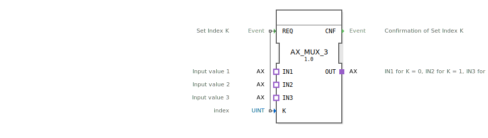

# AX_MUX_3

```{index} single: AX_MUX_3
```


* * * * * * * * * *
## Einleitung
Der AX_MUX_3 ist ein generischer Multiplexer-Funktionsblock, der drei Eingangssignale auf einen Ausgang umschalten kann. Der Baustein ermöglicht die Auswahl eines von drei Eingangssignalen basierend auf einem Indexwert und leitet das entsprechende Signal weiter.



## Schnittstellenstruktur

### **Ereignis-Eingänge**
- **REQ**: Setzt den Index K und startet den Multiplexing-Vorgang

### **Ereignis-Ausgänge**
- **CNF**: Bestätigt die erfolgreiche Setzung des Index K

### **Daten-Eingänge**
- **K** (UINT): Indexwert zur Auswahl des Eingangssignals (0, 1 oder 2)

### **Daten-Ausgänge**
- Keine direkten Datenausgänge vorhanden

### **Adapter**
- **IN1**: Eingangswert 1 (wird bei K=0 ausgewählt)
- **IN2**: Eingangswert 2 (wird bei K=1 ausgewählt)
- **IN3**: Eingangswert 3 (wird bei K=2 ausgewählt)
- **OUT**: Ausgangssignal (unidirektionaler AX-Adapter)

## Funktionsweise
Der AX_MUX_3 arbeitet als 3:1-Multiplexer. Bei Empfang eines REQ-Ereignisses wird der Indexwert K ausgewertet und entsprechend einer der drei Eingänge (IN1, IN2 oder IN3) mit dem Ausgang OUT verbunden:
- K=0: Verbindung IN1 → OUT
- K=1: Verbindung IN2 → OUT
- K=2: Verbindung IN3 → OUT

Nach erfolgreicher Umschaltung wird ein CNF-Ereignis ausgegeben.

## Technische Besonderheiten
- Verwendet unidirektionale AX-Adapter für die Signalübertragung
- Unterstützt den Datentyp UINT für den Index
- Generische Implementierung für flexible Wiederverwendung

## Zustandsübersicht
1. **Bereit**: Wartet auf REQ-Ereignis
2. **Verarbeitung**: Wertet Index K aus und schaltet entsprechend um
3. **Bestätigung**: Sendet CNF-Ereignis nach erfolgreicher Umschaltung

## Anwendungsszenarien
- Signalrouting in Steuerungssystemen
- Auswahl zwischen verschiedenen Sensoreingängen
- Umschaltung zwischen Betriebsmodi
- Redundante Systeme mit mehreren Eingangsquellen

## Vergleich mit ähnlichen Bausteinen
Im Vergleich zu einfacheren Multiplexern bietet AX_MUX_3 drei Eingänge statt der üblichen zwei und verwendet Adapter-basierte Schnittstellen für eine standardisierte Signalübertragung. Die unidirektionale AX-Adapter-Schnittstelle gewährleistet eine klare Signalflussrichtung.

Vergleich mit [F_MUX_3](../../../../../StandardLibraries/iec61131-3/selection/F_MUX_3.md)


## Zugehörige Übungen

* [Uebung_090a2_AX](../../../../../../training1/Ventilsteuerung/4diacIDE-workspace/test_AX/Uebungen_doc/Uebung_090a2_AX.md)
* [Uebung_103](../../../../../../training1/Ventilsteuerung/4diacIDE-workspace/test_B/Uebungen_doc/Uebung_103.md)
* [Uebung_103c](../../../../../../training1/Ventilsteuerung/4diacIDE-workspace/test_B/Uebungen_doc/Uebung_103c.md)
* [Uebung_103c2](../../../../../../training1/Ventilsteuerung/4diacIDE-workspace/test_B/Uebungen_doc/Uebung_103c2.md)

## Fazit
Der AX_MUX_3 ist ein vielseitiger und zuverlässiger Multiplexer-Baustein für Steuerungsanwendungen, der durch seine drei Eingänge und standardisierte Adapter-Schnittstellen eine flexible Signalauswahl ermöglicht. Die klare Ereignissteuerung und Bestätigungsmechanismen machen ihn besonders geeignet für sicherheitskritische Anwendungen.