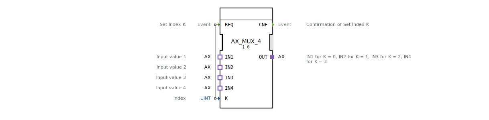

# AX_MUX_4

* * * * * * * * * *
## Einleitung
Der Funktionsblock **AX_MUX_4** ist ein generischer Multiplexer für Adapter vom Typ `adapter::types::unidirectional::AX`. Er ermöglicht es, einen von vier Adaptereingängen (IN1 … IN4) auf einen Ausgang (OUT) durchzuschalten. Die Auswahl des aktiven Eingangs erfolgt über den Index **K**, der bei einem Ereignis am Eingang **REQ** ausgewertet wird.

## Schnittstellenstruktur
### **Ereignis-Eingänge**
| Name | Typ   | Beschreibung                       |
|------|-------|------------------------------------|
| REQ  | Event | Auslösen der Umschaltung auf den durch K definierten Eingang. |

### **Ereignis-Ausgänge**
| Name | Typ   | Beschreibung                                    |
|------|-------|-------------------------------------------------|
| CNF  | Event | Bestätigung, dass die Umschaltung erfolgt ist. |

### **Daten-Eingänge**
| Name | Typ  | Beschreibung                     |
|------|------|----------------------------------|
| K    | UINT | Index des gewünschten Eingangs (0 … 3). |

### **Daten-Ausgänge**
Keine.

### **Adapter**
| Typ                                      | Richtung | Name | Beschreibung                                                                 |
|------------------------------------------|----------|------|-----------------------------------------------------------------------------|
| `adapter::types::unidirectional::AX`     | Plug     | OUT  | Ausgang: liefert die Daten des durch K ausgewählten Eingangs.               |
| `adapter::types::unidirectional::AX`     | Socket   | IN1  | Erster Eingang (K = 0).                                                      |
| `adapter::types::unidirectional::AX`     | Socket   | IN2  | Zweiter Eingang (K = 1).                                                     |
| `adapter::types::unidirectional::AX`     | Socket   | IN3  | Dritter Eingang (K = 2).                                                     |
| `adapter::types::unidirectional::AX`     | Socket   | IN4  | Vierter Eingang (K = 3).                                                     |

## Funktionsweise
Der Baustein wartet auf ein Ereignis am **REQ**-Eingang. Bei Eintreffen wird der Wert des Dateneingangs **K** (0 … 3) ausgewertet. Der entsprechende Socket-Adapter (**IN1** für K=0, **IN2** für K=1, **IN3** für K=2, **IN4** für K=3) wird auf den Plug-Adapter **OUT** durchgeschaltet. Anschließend wird das Ereignis **CNF** ausgegeben, um den erfolgreichen Abschluss zu signalisieren.

Die Durchschaltung erfolgt sofort – es gibt keine internen Zustände oder Verzögerungen. Der FB arbeitet rein ereignisgesteuert.

## Technische Besonderheiten
- **Generischer Typ:** Der Baustein ist als generischer Funktionsblock (`GEN_AX_MUX`) ausgelegt. Er kann daher in verschiedenen Kontexten wiederverwendet werden, solange die verwendeten Adapter dem `AX`-Typ entsprechen.
- **Lizenz:** Der Baustein steht unter der **Eclipse Public License 2.0** (EPL-2.0). Copyright © 2026 HR Agrartechnik GmbH.
- **Typ-Hash:** Zur Identifikation wird ein Typ-Hash (`TypeHash`) verwendet, der bei der Integration in die 4diac-IDE automatisch berechnet wird.

## Zustandsübersicht
Der **AX_MUX_4** besitzt keine eigenen Zustände. Die Umschaltung erfolgt kausal bei jedem **REQ**-Ereignis. Eine interne Zustandsmaschine ist nicht erforderlich.

## Anwendungsszenarien
- **Signalauswahl:** Auswahl eines von vier analogen oder diskreten AX-Signalen, z. B. in Steuerungen für Landmaschinen.
- **Modusumschaltung:** Wechsel zwischen verschiedenen Sensor- oder Aktorwerten, die über AX-Adapter angebunden sind.
- **Redundanz:** Umschalten auf Ersatzsignale im Fehlerfall (z. B. IN1 primär, IN2 Backup).

## Vergleich mit ähnlichen Bausteinen
Im Gegensatz zu klassischen Multiplexern, die auf einfachen Datentypen (INT, BOOL etc.) arbeiten, operiert der **AX_MUX_4** auf **Adapterebene**. Dies ermöglicht die Durchschaltung komplexer, zusammengesetzter Datenstrukturen, die durch den `AX`-Adapter definiert werden. Vorteil: Die Schnittstelle bleibt in der grafischen 4diac-Umgebung klar strukturiert, ohne dass einzelne Datenleitungen manuell verbunden werden müssen.

## Fazit
Der **AX_MUX_4** ist ein einfacher, aber flexibler Multiplexer für AX-Adapter. Er eignet sich für alle Anwendungen, bei denen zur Laufzeit zwischen mehreren Adapterquellen umgeschaltet werden muss. Aufgrund seiner generischen Natur und der klaren Ereignissteuerung kann er in viele Automatisierungslösungen integriert werden.