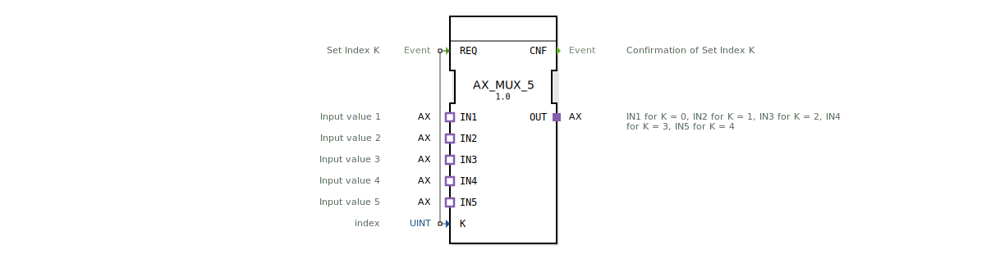

# AX_MUX_5

* * * * * * * * * *
## Einleitung

Der Funktionsblock `AX_MUX_5` ist ein generischer Multiplexer für Adapter vom Typ `AX`. Er wählt aus fünf unidirektionalen Eingangsadaptern (`IN1`–`IN5`) einen anhand des Index `K` aus und leitet dessen Daten an den Ausgangsadapter `OUT` weiter. Der Baustein wird über das Ereignis `REQ` gesteuert.

## Schnittstellenstruktur

### **Ereignis-Eingänge**

| Name | Typ   | Beschreibung      |
|------|-------|-------------------|
| REQ  | Event | Auslöser für die Auswahl des Index `K` |

### **Ereignis-Ausgänge**

| Name | Typ   | Beschreibung              |
|------|-------|---------------------------|
| CNF  | Event | Bestätigung der erfolgten Umschaltung |

### **Daten-Eingänge**

| Name | Typ  | Beschreibung                                    |
|------|------|-------------------------------------------------|
| K    | UINT | Index (0–4) des auszuwählenden Eingangsadapters |

### **Daten-Ausgänge**

Keine eigenständigen Datenausgänge – die Ausgabe erfolgt über den Adapter `OUT`.

### **Adapter**

| Name | Typ                                | Richtung | Beschreibung                                                     |
|------|-------------------------------------|----------|------------------------------------------------------------------|
| IN1  | `adapter::types::unidirectional::AX` | SOCKET   | 1. Eingangswert (wird aktiv bei `K = 0`)                        |
| IN2  | `adapter::types::unidirectional::AX` | SOCKET   | 2. Eingangswert (wird aktiv bei `K = 1`)                        |
| IN3  | `adapter::types::unidirectional::AX` | SOCKET   | 3. Eingangswert (wird aktiv bei `K = 2`)                        |
| IN4  | `adapter::types::unidirectional::AX` | SOCKET   | 4. Eingangswert (wird aktiv bei `K = 3`)                        |
| IN5  | `adapter::types::unidirectional::AX` | SOCKET   | 5. Eingangswert (wird aktiv bei `K = 4`)                        |
| OUT  | `adapter::types::unidirectional::AX` | PLUG     | Ausgang, der die Daten des durch `K` ausgewählten Eingangs liefert |

## Funktionsweise

Der Baustein arbeitet nach dem Prinzip eines 5‑zu‑1‑Adapter‑Multiplexers. Triggert das Ereignis `REQ`, wird der aktuelle Wert des Eingangs `K` ausgelesen. Anschließend wird der Verbindungspfad von einem der Sockets `IN1`–`IN5` zum Plug `OUT` dynamisch umgeschaltet:

- `K = 0` → `IN1` wird mit `OUT` verbunden.
- `K = 1` → `IN2` wird mit `OUT` verbunden.
- `K = 2` → `IN3` wird mit `OUT` verbunden.
- `K = 3` → `IN4` wird mit `OUT` verbunden.
- `K = 4` → `IN5` wird mit `OUT` verbunden.

Nach erfolgter Umschaltung wird das Bestätigungsereignis `CNF` ausgegeben. Die Daten des ausgewählten Adapters werden unverzögert an den Ausgangsadapter übernommen.

## Technische Besonderheiten

- **Generischer Baustein**: Der FB ist als generischer Typ deklariert (`GEN_AX_MUX`). Die konkrete Adapter‑Implementierung von `AX` wird erst zur Laufzeit bestimmt.
- **Unidirektionale Adapter**: Sowohl die Eingänge als auch der Ausgang sind als unidirektionale Schnittstellen definiert – die Daten fließen nur in eine Richtung (vom Socket zum Plug).
- **Indexbereich**: Der Index `K` ist als `UINT` deklariert. Werte außerhalb des Bereichs 0..4 führen zu undefiniertem Verhalten; dies muss durch die Anwendung sichergestellt werden.
- **Keine Zwischenspeicherung**: Die Durchschaltung erfolgt direkt bei Verarbeitung des `REQ`‑Ereignisses, ohne Pufferung der Adapterdaten.

## Zustandsübersicht

Der Baustein besitzt keine sichtbaren Zustände; die Logik beschränkt sich auf eine ereignisgesteuerte Umschaltung. In der folgenden Tabelle ist das Verhalten in Abhängigkeit von `K` dargestellt:

| Auslöser | Bedingung | Aktion                     | Ausgabe |
|----------|-----------|----------------------------|---------|
| `REQ`    | `K = 0`   | Verbinde `IN1` → `OUT`     | `CNF`   |
| `REQ`    | `K = 1`   | Verbinde `IN2` → `OUT`     | `CNF`   |
| `REQ`    | `K = 2`   | Verbinde `IN3` → `OUT`     | `CNF`   |
| `REQ`    | `K = 3`   | Verbinde `IN4` → `OUT`     | `CNF`   |
| `REQ`    | `K = 4`   | Verbinde `IN5` → `OUT`     | `CNF`   |
| Sonstige | `K > 4`   | Keine gültige Verbindung   | undefiniert |

## Anwendungsszenarien

- **Sensor‑Auswahl**: In einer Maschinensteuerung können fünf verschiedene Sensorwerte (z. B. Temperatur, Druck, Position) über einheitliche AX‑Adapter bereitgestellt werden. Der Multiplexer wählt je nach Betriebsmodus den aktuellen Sensor aus.
- **Signalrouting**: In einer Testumgebung werden mehrere Prüfsignale an einem zentralen Ausgang benötigt. Durch Umschalten des Index können verschiedene Testquellen an das Messgerät geführt werden.
- **Konfigurierbare Aktor‑Ansteuerung**: Fünf Aktoren teilen sich eine einzige Steuerleitung. Der FB erlaubt es, sequenziell einen der Aktoren auszuwählen und mit Steuerdaten zu versorgen.

## Vergleich mit ähnlichen Bausteinen

| Baustein          | Anzahl Eingänge | Ausgang          | Besonderheit                                 |
|-------------------|-----------------|------------------|----------------------------------------------|
| AX_MUX_2          | 2               | 1 (AX‑Adapter)   | Zweifach‑Multiplexer                         |
| AX_MUX_5          | 5               | 1 (AX‑Adapter)   | Fünffach‑Multiplexer (dieser Baustein)       |
| AX_MUX_N (generisch) | beliebig       | 1 (AX‑Adapter)   | Parametrierbare Anzahl (falls verfügbar)     |

Im Vergleich zu einem fest verdrahteten Selektionsbaustein bietet `AX_MUX_5` eine flexible, ereignisgesteuerte Umschaltung und ist speziell für die Verwendung mit unidirektionalen AX‑Adaptern optimiert.

## Fazit

Der `AX_MUX_5` ist ein kompakter, generischer Multiplexer für bis zu fünf AX‑Adaptereingänge. Er eignet sich besonders für Anwendungen, in denen mehrere gleichartige Datenquellen dynamisch ausgewählt werden müssen. Durch die klare Ereignisschnittstelle und die einfache Indexsteuerung lässt er sich leicht in größere Steuerungsarchitekturen integrieren. Die fehlende Bereichsprüfung für `K` erfordert eine korrekte Indexierung durch die aufrufende Logik.