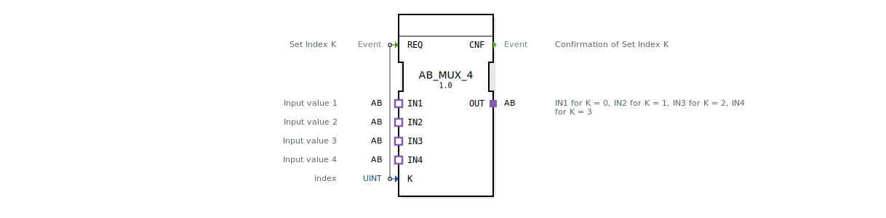

# AB_MUX_4

* * * * * * * * * *
## Einleitung
Der Funktionsblock **AB_MUX_4** ist ein generischer Multiplexer für vier Adapter-Eingänge vom Typ `adapter::types::unidirectional::AB`. Er wählt anhand des Index-Wertes `K` (0 bis 3) einen der vier Eingänge (`IN1` … `IN4`) aus und leitet dessen Signal an den Ausgang `OUT` weiter. Der Baustein ist als generischer FB (GenericClassName: `GEN_AB_MUX`) realisiert und kann daher in verschiedenen Kontexten eingesetzt werden, sofern die Adapter-Schnittstelle übereinstimmt.

## Schnittstellenstruktur
### **Ereignis-Eingänge**
| Name | Typ | Kommentar |
|------|-----|-----------|
| REQ | Event | Setzt den Index K und löst die Multiplexer-Aktion aus. |

### **Ereignis-Ausgänge**
| Name | Typ | Kommentar |
|------|-----|-----------|
| CNF | Event | Bestätigung, dass der Index K übernommen und die Auswahl aktualisiert wurde. |

### **Daten-Eingänge**
| Name | Typ | Kommentar |
|------|-----|-----------|
| K | UINT | Index (0 … 3) zur Auswahl des aktiven Eingangs. |

### **Daten-Ausgänge**
Keine eigenen Daten-Ausgänge. Die Ausgabe erfolgt über den Adapter-Ausgang `OUT`.

### **Adapter**
| Typ | Name | Richtung | Kommentar |
|-----|------|----------|-----------|
| adapter::types::unidirectional::AB | OUT | Plug | Ausgang, der den ausgewählten Eingang widerspiegelt. |
| adapter::types::unidirectional::AB | IN1 | Socket | Erster Eingang (Index 0) |
| adapter::types::unidirectional::AB | IN2 | Socket | Zweiter Eingang (Index 1) |
| adapter::types::unidirectional::AB | IN3 | Socket | Dritter Eingang (Index 2) |
| adapter::types::unidirectional::AB | IN4 | Socket | Vierter Eingang (Index 3) |

## Funktionsweise
Der `AB_MUX_4` arbeitet rein ereignisgesteuert. Sobald ein `REQ`-Ereignis eintrifft, wird der über `K` angegebene Index ausgewertet. Ist `K` kleiner als 4, wird der entsprechende Eingangsadapter (`IN1` für K=0, `IN2` für K=1, `IN3` für K=2, `IN4` für K=3) auf den Ausgangsadapter `OUT` durchgeschaltet. Anschließend wird das Bestätigungsereignis `CNF` ausgegeben. Die Werte der Adapter-Signale (z. B. AB – meist ein analoger oder binärer Wert) werden dabei unverändert von der Quelle zur Senke kopiert.

## Technische Besonderheiten
- **Generischer Baustein**: Die XML deklariert `eclipse4diac::core::GenericClassName` als `'GEN_AB_MUX'`. Dadurch kann der FB in der IDE als Vorlage verwendet und auf unterschiedliche Ausprägungen (z. B. Anzahl der Eingänge) angepasst werden.
- **Adapter-basierte Schnittstelle**: Die Daten werden nicht über einfache Variablen, sondern über Adapter (`adapter::types::unidirectional::AB`) übertragen. Dies ermöglicht den Austausch komplexer Datenstrukturen oder Busprotokolle.
- **Fehlerbehandlung**: Der Index `K` sollte im Bereich 0…3 liegen. Ein Wert außerhalb dieses Bereichs kann zu undefiniertem Verhalten führen. Die aktuelle Implementierung definiert kein Default-Verhalten für ungültige Indizes.
- **Copyright**: Der FB wurde von der HR Agrartechnik GmbH entwickelt (Eclipse Public License 2.0).

## Zustandsübersicht
Der FB besitzt keine explizite Zustandsmaschine (ECC). Er führt nach jedem `REQ` sofort die Multiplexer-Funktion aus und sendet `CNF`. Es gibt keinen internen Zustand außer der aktuellen Verbindung, die durch K bestimmt wird.

## Anwendungsszenarien
- **Sensorumschaltung**: Auswahl eines von vier analogen Sensoren (z. B. Temperatur, Druck) zur weiteren Verarbeitung.
- **Signalrouting**: Umschalten zwischen verschiedenen Kommunikationskanälen, die über den Adapter `AB` definiert sind.
- **Test- und Diagnosemodule**: In Prüfständen kann der Baustein verwendet werden, um nacheinander verschiedene Prüflinge an ein gemeinsames Messgerät anzuschließen.

## Vergleich mit ähnlichen Bausteinen
- **AB_MUX_2**: Ein einfacherer Multiplexer mit zwei Eingängen, der nur die Indizes 0 und 1 verarbeitet.
- **AB_MUX_8**: Ein erweiterter Multiplexer für acht Eingänge. Der `AB_MUX_4` liegt dazwischen und bietet einen guten Kompromiss zwischen Flexibilität und Ressourcenverbrauch.
- **Demultiplexer (AB_DMUX)**: Verteilt ein Signal auf mehrere Ausgänge; der `AB_MUX_4` arbeitet in die entgegengesetzte Richtung.

## Fazit
Der `AB_MUX_4` ist ein kompakter, generischer Multiplexer-Baustein für die Adapter-Schnittstelle `unidirectional::AB`. Aufgrund seiner generischen Natur und der einfachen Ereignissteuerung eignet er sich hervorragend für den Aufbau modularer Automatisierungslösungen mit einer begrenzten Anzahl wählbarer Signalquellen.